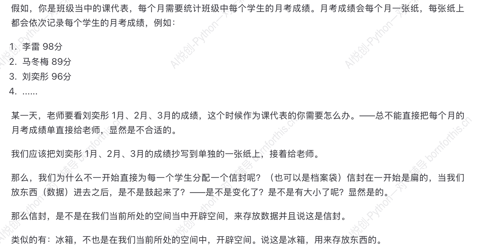

## 1. 什么是 Python 的虚拟环境

### 1.1 虚拟环境定义

什么是虚拟环境：在一个大的系统空间中，以该空间为资源，切分成无数分小的虚拟环境，并使其互不干扰

### 1.2 虚拟环境应用原因

为什么用虚拟环境：在同一个系统环境下，不同版本的同一软件是互斥的，就是说，同一个系统环境只能容纳一个版本存在，而部分软件是你所创造的项目的基础所在，但由于时间的推进，版本不断更新，而每个项目所适应的版本是固定的，这就会导致同一系统环境只能同时开启一个项目，为解决这一问题，就创造虚拟环境来实现一台电脑同时运行多个版本，这个过程只需人工提供关联即可

## 2. 理解变量——生活中的例子

### 2.1 从字面意思去理解

- 变：变化
- 量：大小

### 2.2 举个例子

——所以，**变量就是在计算机的内存中开辟空间，来储存数据**

### 2.3 变量的特点

特点：变量的值会被覆盖，只会记得最后一个值
