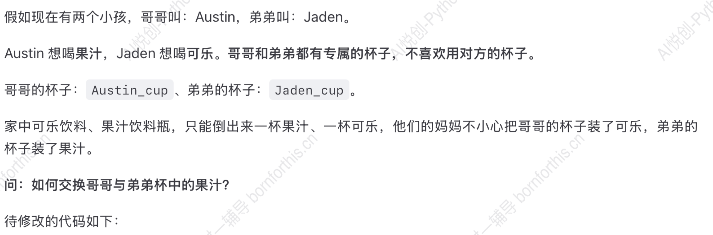

## 1. 什么是 Python 的虚拟环境

### 1.1 虚拟环境定义

什么是虚拟环境：在一个大的系统空间中，以该空间为资源，切分成无数分小的虚拟环境，并使其互不干扰

### 1.2 虚拟环境应用原因

为什么用虚拟环境：在同一个系统环境下，不同版本的同一软件是互斥的，就是说，同一个系统环境只能容纳一个版本存在，而部分软件是你所创造的项目的基础所在，但由于时间的推进，版本不断更新，而每个项目所适应的版本是固定的，这就会导致同一系统环境只能同时开启一个项目，为解决这一问题，就创造虚拟环境来实现一台电脑同时运行多个版本，这个过程只需人工提供关联即可

## 2. 理解变量——生活中的例子

### 2.1 从字面意思去理解

- 变：变化
- 量：大小

### 2.2 举个例子


——所以，**<span style="color:orange">变量就是在计算机的内存中开辟空间，来储存数据</span>**

### 2.3 变量的特点

特点：

1. 变量的值会被覆盖，只会记得最后一个值
2. 变量是一个值，不能带引号，引号是字符串

## 3. 如何创建变量——赋值语句

1. 变量：通过变量名代表或引用某个值
2. 初始化赋值语句： 变量名=表达式（其中的等号是赋值运算符，即将等号左边的东西赋予右边东西的意义，如此时就是令变量名具有表达式的意义)
3. 等号左右可以放n个等量的变量名和表达式，其每个由逗号隔开，这些赋值过程具有**等时性**，由此可详见本文章4.3中的方法三

**例**：1. x=3，自此之后所有x就都与3由相同含义

- 变量名：就是这个空间，我们叫他什么名字
- 表达式：类似数学表达

3. 程序的运行逻辑：从上到下，从右到左（这里的右，指的是先执行右边的整体），最后才是赋值
4. 代码示例

```pyhon
x=1 # 1 赋值给了 x，x 代表1
x=x+10 # x + 10 等价于 1 + 10 最后得出 11，11 赋值给 x
print(x) # print 打印，输出
# 井号是用来注释，注解，解释某一行代码的功能及作用
```

注意，由程序从上至下，从右往左的了逻辑，最后出现的变量x是第二行最左侧的x，又由于变量的值会被覆盖这一特点，故只会输出最后一个出现的x所代表的值，故结果为

```python
/Users/yhy/Coder/.venv/bin/python /Users/yhy/Coder/experiment/01.py 
11

Process finished with exit code 0

```

再来一次

```python
name1 = "lilei"
name2 = name1
print(name2)
```

结果是

```python
/Users/yhy/Coder/.venv/bin/python /Users/yhy/Coder/experiment/02.py 
lilei

Process finished with exit code 0
```

这说明了**在等号两侧都为变量时，左侧变量会继承右侧变量的意义**

继续

```python
name1 = "lilei"
name1 = "hanmeiemi"
print(name1)
```

结果是

```python
/Users/yhy/Coder/.venv/bin/python /Users/yhy/Coder/experiment/02.py 
hanmeiemi

Process finished with exit code 0

```

这说明了**在同一变量的情况下，程序只会记忆该变量的最后一次赋值**

## 3. 探究 print

### 3.1 同时输出多个数据

```python
a = 1
b = 2
c = 3
print(a,b,c)
```

结果是

```python
/Users/yhy/Coder/.venv/bin/python /Users/yhy/Coder/experiment/02.py 
1 2 3

Process finished with exit code 0
```

### 3.2 sep 修改多个变量同时输出的间隔

```python
a = 1
b = 2
c = 3
print(a,b,c, sep='')
```

我们就可用sep语言来修改间隔，其中单括号内的内容便是间隔内容，**注意**：空格键也算内容，且未输入sep默认有一个空格，如上图结果为

```python
/Users/yhy/Coder/.venv/bin/python /Users/yhy/Coder/experiment/02.py 
123

Process finished with exit code 0

```

如果加上空格

```python
a = 1
b = 2
c = 3
print(a,b,c, sep=' ')
```

那结果就是

```python
/Users/yhy/Coder/.venv/bin/python /Users/yhy/Coder/experiment/02.py 
1 2 3

Process finished with exit code 0

```

同理，加上文字

```python
a = 1
b = 2
c = 3
print(a,b,c, sep='你好')
```

结果是

```python
/Users/yhy/Coder/.venv/bin/python /Users/yhy/Coder/experiment/02.py 
1你好2你好3

Process finished with exit code 0

```

### 3.3 end 修改print输出结尾方式

```python
a = 1
b = 2
c = 3
print(a, end="\n") # \n newline
print(b, end="\n\n")
print(c)
```

1. `\n`表示newline的意思，即将下一个输出放在下一行
2. `end=""`中的双引号里的内容即为此输出与下一个输出的间隔内容
3. `\n`可以多次叠加，一个就是不在同一行，两个就是隔开一行，三个就是隔开两行，以此类推
4. 当不输入end时，默认为`end="\n"`
5. end会出现在该print输出的后面，如果一个print包含了a，b，c，那只会在结尾出现end内容

如

```python
a = 1
b = 1
c = 1
print(a,b,c, end="love Python")
```

结果为

```python
/Users/yhy/Coder/.venv/bin/python /Users/yhy/Coder/experiment/02.py 
1 1 1love Python
Process finished with exit code 0
```

6. end只会在多变量输出的情况生效，单变量输出无效

故，以下为输出结果

```python
/Users/yhy/Coder/.venv/bin/python /Users/yhy/Coder/experiment/02.py 
1
2

3

Process finished with exit code 0

```

换一个更明显的例子

```python
a = 1
b = 2
print(a, end="你好") # \n newline
print(b)
```

结果为

```python
/Users/yhy/Coder/.venv/bin/python /Users/yhy/Coder/experiment/02.py 
1你好2

Process finished with exit code 0

```

### 3.4 end 和 sep 可以同时使用

```python
a = 1
b = 1
c = 1
print(a,b,c, sep="~", end="love Python")
```

1. 区别：sep是间隔，对同一个print中的多变量生效，end只表示该print与下一个print中间隔了什么，或是该print后面跟什么

结果是

```python
/Users/yhy/Coder/.venv/bin/python /Users/yhy/Coder/experiment/02.py 
1~1~1love Python
Process finished with exit code 0
```

2. 注意：单变量print也可运行sep，但不会有任何效果，即sep不生效，但可运行，同理，当命令行只有一个变量时，sep也可运行，但不会有任何效果,但end会出现在print的尾部，无论何种情况都会正常执行

来看以下例子

```python
a = 1
b = 2
c = 3
print(a,b,c, sep="-",end=" 哈哈哈哈 ")
print(b, sep="呵呵", end="")
print(c)
```

结果是

```python
/Users/yhy/Coder/.venv/bin/python /Users/yhy/Coder/experiment/02.py 
1-2-3 哈哈哈哈 23

Process finished with exit code 0
```

注意到，此时的sep未生效

### 3.5 print 输出可以有提示

在输出端，通过以上实例能发现：输出的信息往往缺失了主体，只是单纯的数字，无法让人类读懂，那如何做到实现以下效果呢

```python
/Users/yhy/Coder/.venv/bin/python /Users/yhy/Coder/experiment/02.py 
a 的值是: 1

Process finished with exit code 0
```

有一种利用多变量同时输出的方法

```python
a = 1
b = "a 的值是:"
print(b,a)
```

即可达到以上效果

## 4. 进阶的赋值方法

以往我们想把多个变量赋予相同的值，只能如下操作

```python
a = 1
b = 1
c = 1
print(a,b,c)
```

但这种方法可以优化，以下是优化方式

### 4.1 多个变量同时赋予相同的值

```python
a = b = c = 1
print(a,b,c)
```

### 4.2 多个变量同时赋予不同的值

```python
a, b, c = 1, 2, 3
print(a,b,c)
```

### 4.3 小试牛刀



```python
Austin_cup = "Coke"  # 该赋值可以理解为从饮料瓶倒果汁的过程
Jaden_cup = "juice"  # 该赋值可以理解为从饮料瓶倒果汁的过程
print("Austin 杯子现在装的饮料", Austin_cup)
print("Jaden 杯子现在装的饮料", Jaden_cup)
# ---------------
# 这里编写什么代码才能使上下相同输出的 print 代码，输出的结果是交换过来的。
# ---------------
print("交换之后......")
print("Austin 杯子现在装的饮料", Austin_cup)
print("Jaden 杯子现在装的饮料", Jaden_cup)

# ---目标输出结果---
Austin 杯子现在装的饮料 Coke
Jaden 杯子现在装的饮料 juice
交换之后......
Austin 杯子现在装的饮料 juice
Jaden 杯子现在装的饮料 Coke
```

::: code-tabs

@tab 方法一

```python
Austin_cup = "Coke"  # 该赋值可以理解为从饮料瓶倒果汁的过程  
Jaden_cup = "juice"  # 该赋值可以理解为从饮料瓶倒果汁的过程  
print("Austin 杯子现在装的饮料", Austin_cup)       
print("Jaden 杯子现在装的饮料", Jaden_cup)         
cup1 = Austin_cup                          
cup2 = Jaden_cup                           
Austin_cup = cup2                          
Jaden_cup = cup1                           
print("交换之后")                              
print("Austin 杯子现在装的饮料", Austin_cup)       
print("Jaden 杯子现在装的饮料", Jaden_cup)         
```

@tab 方法二

```python
Austin_cup = "Coke"  # 该赋值可以理解为从饮料瓶倒果汁的过程 
Jaden_cup = "juice"  # 该赋值可以理解为从饮料瓶倒果汁的过程 
print("Austin 杯子现在装的饮料", Austin_cup)      
print("Jaden 杯子现在装的饮料", Jaden_cup)        
cup = Austin_cup                          
Austin_cup = Jaden_cup                    
Jaden_cup = cup                           
print("交换之后")                             
print("Austin 杯子现在装的饮料", Austin_cup)      
print("Jaden 杯子现在装的饮料", Jaden_cup)        
```

@tab 方法三

```python
Austin_cup = "Coke"  # 该赋值可以理解为从饮料瓶倒果汁的过程     
Jaden_cup = "juice"  # 该赋值可以理解为从饮料瓶倒果汁的过程     
print("Austin 杯子现在装的饮料", Austin_cup)          
print("Jaden 杯子现在装的饮料", Jaden_cup)            
Austin_cup, Jaden_cup = Jaden_cup, Austin_cup 
print("交换之后")                                 
print("Austin 杯子现在装的饮料", Austin_cup)          
print("Jaden 杯子现在装的饮料", Jaden_cup)            
```

:::

观察上述方法我们可以知道，代码语言的逻辑与现实行为的逻辑具有**极高的相似性**

例如：

1. 方法一的现实理解：取额外的两个被子，将 Austin 杯子中的饮料倒入 cup1 中，再将 Jaden 的饮料倒入 cup2 中，随后将 cup2 中的饮料倒入 Austin 的杯子，cup1 的饮料倒入 Jaden 的杯子即可完成交换
2. 方法二的现实理解：取一个额外的杯子，先将 Austin 的饮料倒入 cup 中，再把 Jaden 的饮料倒入 Austin_cup 中，最后把 cup 中的饮料倒入 Jaden 的杯子中
3. 方法三无现实实现的可能，这种方法来源于同一等号下赋值的**等时性**，算是 python 的机制

> **注**：print 中的引号内容是增加输出前端的描述，如引号内写的是交换之后，那输出端就会输出交换之后这四个字

## 5. 变量命名规则

- 大小写英文、数字和__的结合，且不能用数字开头
- 系统关键词不能做变量名使用
    - 获取关键字列表：help(‘keywords’)
- Python 中的变量名区分大小写
- 变量名不能包含空格，但可使用下划线来分隔其中的单词
- 不要使用 python 的内置函数名称做变量名

如何证明这些规则呢，我们拿区分大小写举例

在证明一个正向证明数会趋于无穷的事例时，我们一般用反证法证明

```python
n = 100
N = 200
print(n)
```

如果说不区分大小写，那输出结果应为 200

如果区分，那应为 100

我们来看结果

```python
/Users/yhy/Coder/.venv/bin/python /Users/yhy/Coder/experiment/02.py 
100

Process finished with exit code 0

```

区分大小写得证

