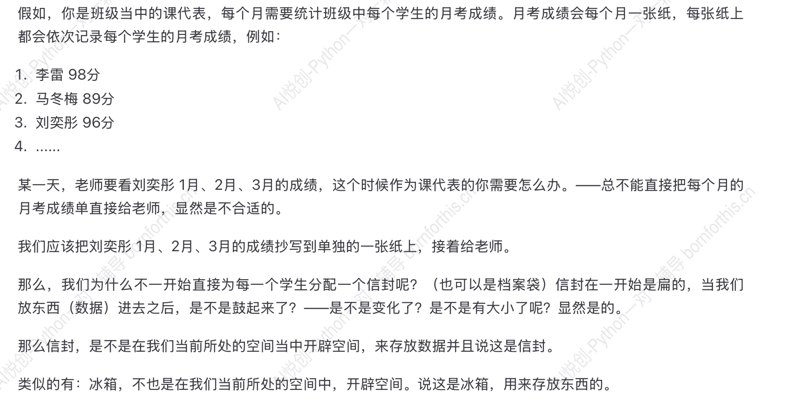
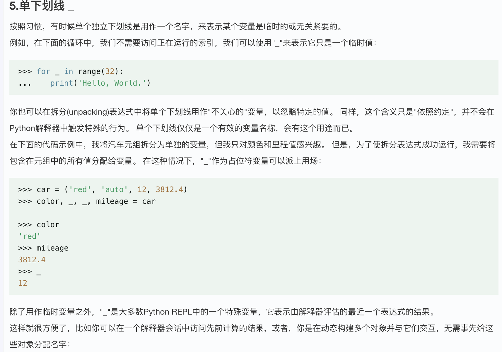
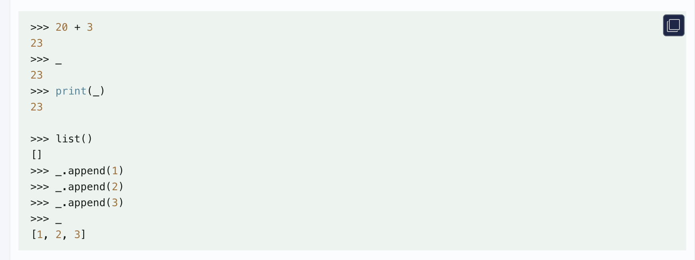
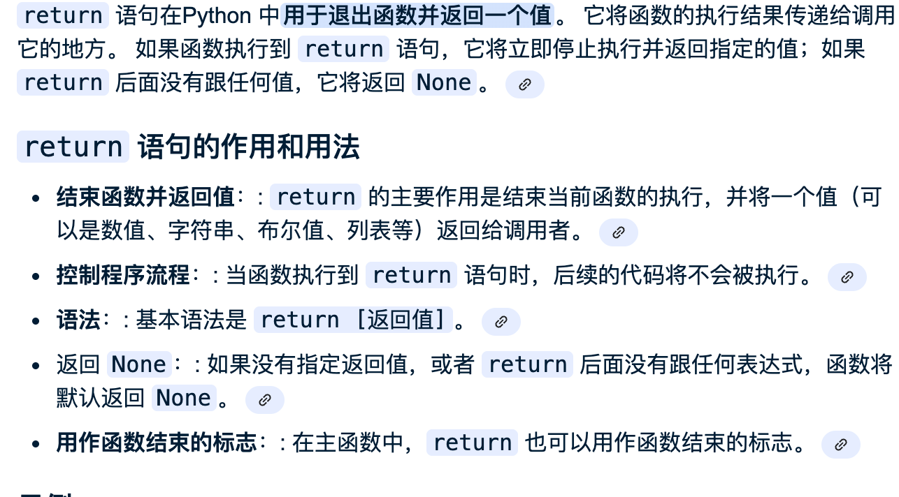
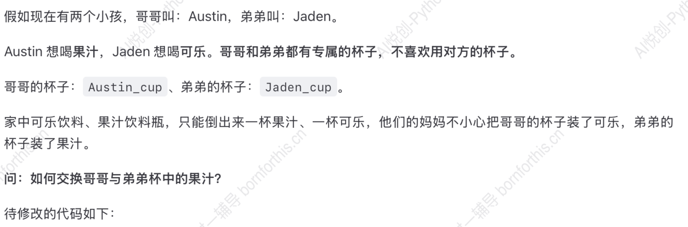

前言，python等高级语言分为两种，为编译型和解释型，编译型比解释型处理速度更快，但解释型会运行到错误处才会报错，而编译型检测到有错会直接报错而不运行，python属于解释型

## 1. 什么是 Python 的虚拟环境

### 1.1 虚拟环境定义

什么是虚拟环境：在一个大的系统空间中，以该空间为资源，切分成无数分小的虚拟环境，并使其互不干扰

### 1.2 虚拟环境应用原因

为什么用虚拟环境：在同一个系统环境下，不同版本的同一软件是互斥的，就是说，同一个系统环境只能容纳一个版本存在，而部分软件是你所创造的项目的基础所在，但由于时间的推进，版本不断更新，而每个项目所适应的版本是固定的，这就会导致同一系统环境只能同时开启一个项目，为解决这一问题，就创造虚拟环境来实现一台电脑同时运行多个版本，这个过程只需人工提供关联即可

## 2. 理解变量——生活中的例子

### 2.1 从字面意思去理解

- 变：变化
- 量：大小

### 2.2 举个例子



——所以，**<span style="color:orange">变量就是在计算机的内存中开辟空间，来储存数据</span>**

### 2.3 变量的特点

特点：

1. 变量的值会被覆盖，只会记得最后一个值
2. 变量是一个值，不能带引号，引号是字符串

### 2.4 临时变量`__`





## 3. 如何创建变量——赋值语句

1. 变量：通过变量名代表或引用某个值
2. 初始化赋值语句： 变量名=表达式（其中的等号是赋值运算符，即将等号左边的东西赋予右边东西的意义，如此时就是令变量名具有表达式的意义)，注意：当赋值发生时，该变量名的性质也与表达式相同，如x = 1 那此时的x就具有数字型的所有性质
3. 等号左右可以放n个等量的变量名和表达式，其每个由逗号隔开，这些赋值过程具有**等时性**，由此可详见本文章4.3中的方法三

**例**：1. x=3，自此之后所有x就都与3由相同含义

- 变量名：就是这个空间，我们叫他什么名字
- 表达式：类似数学表达

3. 程序的运行逻辑：从上到下，从右到左（这里的右，指的是先执行右边的整体），最后才是赋值
4. 代码示例

```python
x=1 # 1 赋值给了 x，x 代表1
x=x+10 # x + 10 等价于 1 + 10 最后得出 11，11 赋值给 x
print(x) # print 打印，输出
# 井号是用来注释，注解，解释某一行代码的功能及作用
```

当然你也可以选择提前声明变量的代码类型

可以写成：
```python
x : int = 1
```

但一定注意，该声明只是为了方便查看，后续赋值的代码不是int也是不会报错的

注意，由程序从上至下，从右往左的了逻辑，最后出现的变量x是第二行最左侧的x，又由于变量的值会被覆盖这一特点，故只会输出最后一个出现的x所代表的值，故结果为

```python
/Users/yhy/Coder/.venv/bin/python /Users/yhy/Coder/experiment/01.py 
11

Process finished with exit code 0

```

再来一次

```python
name1 = "lilei"
name2 = name1
print(name2)
```

结果是

```python
/Users/yhy/Coder/.venv/bin/python /Users/yhy/Coder/experiment/02.py 
lilei

Process finished with exit code 0
```

这说明了**在等号两侧都为变量时，左侧变量会继承右侧变量的意义**

继续

```python
name1 = "lilei"
name1 = "hanmeiemi"
print(name1)
```

结果是

```python
/Users/yhy/Coder/.venv/bin/python /Users/yhy/Coder/experiment/02.py 
hanmeiemi

Process finished with exit code 0

```

这说明了**在同一变量的情况下，程序只会记忆该变量的最后一次赋值**

Python中的赋值语句记得不要放在同一行，会报错

注意当多个赋值符号同时出现在一行时，如：

```python
x, y = 8, 9
y, x = x, y = x, y = y, x = x, y = x + 1, y + 1
```

此时优先执行最右方的代值，执行后再从做左往右依次执行相对最右方的赋值过程

即：

```python
temp1, temp2 = x + 1, y + 1
y, x = temp1, temp2
x, y = temp1, temp2
x, y = temp1, temp2
y, x = temp1, temp2
x, y = temp1, temp2
```

如上依次执行，也就是说，仅最右方的为 value ，其余全是变量，而变量只会被 value 赋值，互相之间不会影响

值得注意的是，仅只有最右边的赋值运算符的右边，即如上的x+1和y+1才能用表达式表达，而其它部分均只能存放一个变量

如：

```python
x, y = 6, 7
x = y - 1 = x + 1
```

就会出现SyntaxError

## 3. 探究 print

### 3.1 同时输出多个数据

```python
a = 1
b = 2
c = 3
print(a,b,c)
```

结果是

```python
/Users/yhy/Coder/.venv/bin/python /Users/yhy/Coder/experiment/02.py 
1 2 3

Process finished with exit code 0
```

### 3.2 sep 修改多个变量同时输出的间隔

```python
a = 1
b = 2
c = 3
print(a,b,c, sep='')
```

我们就可用sep语言来修改间隔，其中单括号内的内容便是间隔内容，**注意**：空格键也算内容，且未输入sep默认有一个空格，如上图结果为

```python
/Users/yhy/Coder/.venv/bin/python /Users/yhy/Coder/experiment/02.py 
123

Process finished with exit code 0

```

如果加上空格

```python
a = 1
b = 2
c = 3
print(a,b,c, sep=' ')
```

那结果就是

```python
/Users/yhy/Coder/.venv/bin/python /Users/yhy/Coder/experiment/02.py 
1 2 3

Process finished with exit code 0

```

同理，加上文字

```python
a = 1
b = 2
c = 3
print(a,b,c, sep='你好')
```

结果是

```python
/Users/yhy/Coder/.venv/bin/python /Users/yhy/Coder/experiment/02.py 
1你好2你好3

Process finished with exit code 0

```

### 3.3 end 修改print输出结尾方式

```python
a = 1
b = 2
c = 3
print(a, end="\n") # \n newline
print(b, end="\n\n")
print(c)
```

1. `\n`表示newline的意思，即将下一个输出放在下一行
2. `end=""`中的双引号里的内容即为此输出与下一个输出的间隔内容
3. `\n`可以多次叠加，一个就是不在同一行，两个就是隔开一行，三个就是隔开两行，以此类推
4. 当不输入end时，默认为`end="\n"`
5. end会出现在该print输出的后面，如果一个print包含了a，b，c，那只会在结尾出现end内容

如

```python
a = 1
b = 1
c = 1
print(a,b,c, end="love Python")
```

结果为

```python
/Users/yhy/Coder/.venv/bin/python /Users/yhy/Coder/experiment/02.py 
1 1 1love Python
Process finished with exit code 0
```

6. end只会在多变量输出的情况生效，单变量输出无效

故，以下为输出结果

```python
/Users/yhy/Coder/.venv/bin/python /Users/yhy/Coder/experiment/02.py 
1
2

3

Process finished with exit code 0

```

换一个更明显的例子

```python
a = 1
b = 2
print(a, end="你好") # \n newline
print(b)
```

结果为

```python
/Users/yhy/Coder/.venv/bin/python /Users/yhy/Coder/experiment/02.py 
1你好2

Process finished with exit code 0

```

### 3.4 end 和 sep 可以同时使用

```python
a = 1
b = 1
c = 1
print(a,b,c, sep="~", end="love Python")
```

1. 区别：sep是间隔，对同一个print中的多变量生效，end只表示该print与下一个print中间隔了什么，或是该print后面跟什么

结果是

```python
/Users/yhy/Coder/.venv/bin/python /Users/yhy/Coder/experiment/02.py 
1~1~1love Python
Process finished with exit code 0
```

2. 注意：单变量print也可运行sep，但不会有任何效果，即sep不生效，但可运行，同理，当命令行只有一个变量时，sep也可运行，但不会有任何效果,但end会出现在print的尾部，无论何种情况都会正常执行

来看以下例子

```python
a = 1
b = 2
c = 3
print(a,b,c, sep="-",end=" 哈哈哈哈 ")
print(b, sep="呵呵", end="")
print(c)
```

结果是

```python
/Users/yhy/Coder/.venv/bin/python /Users/yhy/Coder/experiment/02.py 
1-2-3 哈哈哈哈 23

Process finished with exit code 0
```

注意到，此时的sep未生效

### 3.5 print 输出可以有提示

在输出端，通过以上实例能发现：输出的信息往往缺失了主体，只是单纯的数字，无法让人类读懂，那如何做到实现以下效果呢

```python
/Users/yhy/Coder/.venv/bin/python /Users/yhy/Coder/experiment/02.py 
a 的值是: 1

Process finished with exit code 0
```

有一种利用多变量同时输出的方法

```python
a = 1
b = "a 的值是:"
print(b,a)
```

即可达到以上效果

> **注**：print 前不能放空格，在python中空格是有意义的

::: important

Return 也是一种返还结果的方法，其形式为：

```python
return 变量
```

注意：return 返还函数，但不显示输出结果，而print只显示结果，不生成实际的代码函数

同时：return生效时，会直接停止此段代码的执行，同一个def 文件后面的所有代码都不会执行



`return` 的终止限度是**当前函数或方法**的执行。一旦执行到 `return` 语句，当前函数的所有代码执行就会立即停止，并且会将指定的值返回给调用者（如果函数有返回值的话）。`return` 语句之后的任何代码都不会再执行。 

### 3.6 return 和 print 的区别

return 可以返回值，但不输出

print 可以输出值，但不返回值

那么输出和返回有什么区别呢，输出是表示值，而不记录，返回是记录而不表示

比方说，赋值这一行为是一定要有右侧有效值存在才能赋值成功，不然就会默认变为None

有些函数会返回值，而不会输出，而有些函数会直接修改原有变量，而不返回，此时如果创造一个新变量被存在该函数的代码赋值，那么会返回值的函数会让那个新变量等于返回的值，而不返回的则只会默认为None

```python
a = [1,2,3,2]
b = a.sort()
print(b)
```

结果只为：
```python
/Users/yhy/Coder/.venv/bin/python /Users/yhy/Coder/experiment/07.py 
None

Process finished with exit code 0

```

因为其不会返回值

又如：

```python
a = [1,2,3,2]
b = a.pop()
print(b)
```

结果就为：

```python
/Users/yhy/Coder/.venv/bin/python /Users/yhy/Coder/experiment/07.py 
2

Process finished with exit code 0

```

因为pop会返回值

:::

## 4. 进阶的赋值方法

以往我们想把多个变量赋予相同的值，只能如下操作

```python
a = 1
b = 1
c = 1
print(a,b,c)
```

但这种方法可以优化，以下是优化方式

### 4.1 多个变量同时赋予相同的值

```python
a = b = c = 1
print(a,b,c)
```

### 4.2 多个变量同时赋予不同的值

```python
a, b, c = 1, 2, 3
print(a,b,c)
```

### 4.3 小试牛刀



```python
Austin_cup = "Coke"  # 该赋值可以理解为从饮料瓶倒果汁的过程
Jaden_cup = "juice"  # 该赋值可以理解为从饮料瓶倒果汁的过程
print("Austin 杯子现在装的饮料", Austin_cup)
print("Jaden 杯子现在装的饮料", Jaden_cup)
# ---------------
# 这里编写什么代码才能使上下相同输出的 print 代码，输出的结果是交换过来的。
# ---------------
print("交换之后......")
print("Austin 杯子现在装的饮料", Austin_cup)
print("Jaden 杯子现在装的饮料", Jaden_cup)

# ---目标输出结果---
Austin 杯子现在装的饮料 Coke
Jaden 杯子现在装的饮料 juice
交换之后......
Austin 杯子现在装的饮料 juice
Jaden 杯子现在装的饮料 Coke
```

::: code-tabs

@tab 方法一

```python
Austin_cup = "Coke"  # 该赋值可以理解为从饮料瓶倒果汁的过程  
Jaden_cup = "juice"  # 该赋值可以理解为从饮料瓶倒果汁的过程  
print("Austin 杯子现在装的饮料", Austin_cup)       
print("Jaden 杯子现在装的饮料", Jaden_cup)         
cup1 = Austin_cup                          
cup2 = Jaden_cup                           
Austin_cup = cup2                          
Jaden_cup = cup1                           
print("交换之后")                              
print("Austin 杯子现在装的饮料", Austin_cup)       
print("Jaden 杯子现在装的饮料", Jaden_cup)         
```

@tab 方法二

```python
Austin_cup = "Coke"  # 该赋值可以理解为从饮料瓶倒果汁的过程 
Jaden_cup = "juice"  # 该赋值可以理解为从饮料瓶倒果汁的过程 
print("Austin 杯子现在装的饮料", Austin_cup)      
print("Jaden 杯子现在装的饮料", Jaden_cup)        
cup = Austin_cup                          
Austin_cup = Jaden_cup                    
Jaden_cup = cup                           
print("交换之后")                             
print("Austin 杯子现在装的饮料", Austin_cup)      
print("Jaden 杯子现在装的饮料", Jaden_cup)        
```

@tab 方法三

```python
Austin_cup = "Coke"  # 该赋值可以理解为从饮料瓶倒果汁的过程     
Jaden_cup = "juice"  # 该赋值可以理解为从饮料瓶倒果汁的过程     
print("Austin 杯子现在装的饮料", Austin_cup)          
print("Jaden 杯子现在装的饮料", Jaden_cup)            
Austin_cup, Jaden_cup = Jaden_cup, Austin_cup 
print("交换之后")                                 
print("Austin 杯子现在装的饮料", Austin_cup)          
print("Jaden 杯子现在装的饮料", Jaden_cup)            
```

:::

观察上述方法我们可以知道，代码语言的逻辑与现实行为的逻辑具有**极高的相似性**

例如：

1. 方法一的现实理解：取额外的两个被子，将 Austin 杯子中的饮料倒入 cup1 中，再将 Jaden 的饮料倒入 cup2 中，随后将 cup2 中的饮料倒入 Austin 的杯子，cup1 的饮料倒入 Jaden 的杯子即可完成交换
2. 方法二的现实理解：取一个额外的杯子，先将 Austin 的饮料倒入 cup 中，再把 Jaden 的饮料倒入 Austin_cup 中，最后把 cup 中的饮料倒入 Jaden 的杯子中
3. 方法三无现实实现的可能，这种方法来源于同一等号下赋值的**等时性**，算是 python 的机制

> **注**：print 中的引号内容是增加输出前端的描述，如引号内写的是交换之后，那输出端就会输出交换之后这四个字

## 5. 变量命名规则

- 大小写英文、数字和__的结合，且不能用数字开头,但可以放除开头外的任意位置(不能用`-`或空格间隔了)
- 系统关键词不能做变量名使用(可用大写字母替代，因为变量名区分大小写)
    - 获取关键字列表：help(‘keywords’)
- Python 中的变量名区分大小写
- 变量名不能包含空格，但可使用下划线来分隔其中的单词
- 不要使用 python 的内置函数名称做变量名(全程未被使用该函数时，此函数做变量名不会报错，但一旦过程中出现一个该函数的语法，系统无法辨别其性质，那么就会报错)

如何证明这些规则呢，我们拿区分大小写举例

在证明一个正向证明数会趋于无穷的事例时，我们一般用反证法证明

```python
n = 100
N = 200
print(n)
```

如果说不区分大小写，那输出结果应为 200

如果区分，那应为 100

我们来看结果

```python
/Users/yhy/Coder/.venv/bin/python /Users/yhy/Coder/experiment/02.py 
100

Process finished with exit code 0

```

区分大小写得证

## 6. 临时调用变量

我们知道：变量在赋值之前一般无法调用，但def函数则使得能生成临时的未赋值可调用变量，且该变量可随时在后台赋值以解除其临时性。

```python
def is_valid_move(game_board, current_shape, current_location, current_rotation):
```

此时括号内的变量即可直接调用

注意：此时未赋值的变量仍然无法正常运行，仅仅可以调用，只有后台赋值后才可正常运行

## 7. 创造函数

对于def函数，其可以直接给予其右侧的变量（is_valid_move)给予函数的意义，方式为创造一个独立的区域（即def is_valid_move)部分，一般结尾标识为：`if_name_=='_变量_'`表示，也可以用`return`取代，这中间的所有代码就是该函数的执行区域，在此之后，任何调用该变量的时候都会执行一次此段区域的代码，故在此之后可直接将此变量当作函数对待。bu

不输入 return 内容的话输出会返回`None`(当然如果代码类型不符合函数内部的运算的话会优先判定为报错)

注意def 括号内无变量也不会变错，其本质就是简化赋值过程，故不是必须项

示例：

```python
def a(n: int):
    return n*n
print(a(168))
```

结果为：

```python
/Users/yhy/Coder/.venv/bin/python /Users/yhy/Coder/experiment/05.py 
28224

Process finished with exit code 0
```

注意到在此时直接使用 `a()`可以直接调用 a 函数了，注意要将括号内的变量值输入在括号之中

值得注意的是，函数内的标定变量，一定要按照冒号后输入的代码类型来赋值，一旦不符合默认代码类型，就会报错

在已有的函数端中标定的值被称为函数参数的默认值（default values），如：

```python
def my_function(name, greeting="你好"):
    print(f"{greeting}, {name}!")

# 调用时未提供 greeting 参数，将使用默认值 "你好"
my_function("张三")
# 输出：你好, 张三!

# 调用时提供了 greeting 参数，将使用提供的 "晚上好"
my_function("李四", "晚上好")
# 输出：晚上好, 李四!
```

其中你好就是默认值

当非默认值输入时，默认值不会输出，而是会输出非默认值（晚上好），当且仅当无非默认值输出时才会输出默认值

注意：在多个参数存在时，一定要把非默认的参数（即未直接赋值）放在前面，在放默认参数，这是因为python的判定原则，不然会直接报错

```python
def add():
    x = 1
    print(x)
add()
```

结果为：

```python
/Users/yhy/Coder/.venv/bin/python /Users/yhy/Coder/experiment/03.py 
1

Process finished with exit code 0

```

这意味着直接输入函数会直接执行函数内容

我们进行略微修改：

```python
def add():
    x = 1
    print(x)
print(add())
```

结果为：

```python
/Users/yhy/Coder/.venv/bin/python /Users/yhy/Coder/experiment/03.py 
1
None

Process finished with exit code 0
```

这就证明这是是先执行add函数再执行print，这也变相证明从右向左的执行过程

同时add()这个代码本质上就是None，无实际意义

```python
def add(x: int):
    print(x)

print(add(1))
```

结果仍为：

```python
/Users/yhy/Coder/.venv/bin/python /Users/yhy/Coder/experiment/03.py 
1
None

Process finished with exit code 0

```

这证明了不是因为括号内没变量而出现None，是函数代码本身（即add）的输出结果就是None

注意:

```python
def mystery(a, b=1, mode="add"):
```

如果出现以上情况，注意a,b = 1 等效于a = 1, b =1,如果直接输入`mystery(8)`那么只会将a赋值为8，b仍保持默认值不变

注意：return 如果返回多个内容，会自动返回由这些内容组成的元组

如：`return 1,2`会自动返回：`(1,2)`

> **注意**：创建的函数内部代码也可以使用该函数，这就叫递归
>
> 函数内部还能再嵌套函数，这就叫嵌套函数

### 问题：是否一定要运用`if_name_=='_变量_'`呢？

不需要。`if __name__ == '__main__':` 语句是可选的，它用于区分脚本是作为主程序运行还是作为模块被导入。如果在脚本中定义了函数，并希望在其他脚本导入该模块时阻止某些代码执行，就需要使用这个条件判断。 


- **定义函数**：使用 `def` 关键字来定义一个函数。这是创建函数的基本语法，并且是必需的。
- **`if __name__ == '__main__':` 的作用**：
    - `__name__` 是 Python 中的一个内置变量。
    - 当一个 Python 文件被直接运行时，`__name__` 的值为 `'__main__'`。
    - 当这个文件被作为模块导入到另一个文件中时，`__name__` 的值就是该模块的名称。
    - 因此，`if __name__ == '__main__':` 块中的代码只会在该文件被直接执行时运行，而在被导入时不会运行。
- **何时使用**：如果你希望在脚本中包含可以直接运行的测试代码或示例，而又不希望这些代码在模块被导入时被执行，就可以使用 `if __name__ == '__main__':`。 


**总结**：`def` 是定义函数的语法，**是必需的**；而 `if __name__ == '__main__':` 是一个可选的条件判断，用于控制脚本的执行流程，在某些情况下很有用，但不是定义函数的必要条件。 

但要注意的是，如果不输出或返还值，默认返回`None`

## 8. pass

Pass 函数无任何实际意义，是为了保证程序结构的完整性

## 9. global，local

注意：仅适用于def函数分割了一部分独立出来的情况，if while 类的不存在局部变量之说，故无需运用

### 9.1global 函数

在Python 中，`global` 关键字用于在函数内部声明一个变量为全局变量，这样你就可以在函数内部修改这个函数外部的变量。 如果没有 `global` 关键字，在函数内部对同名变量的赋值会创建一个新的局部变量，而不会改变外部的全局变量

```python
	# 在函数外部定义一个全局变量
    count = 10

    def update_count():
        # 使用 global 声明 count 是一个全局变量
        global count
        count = 20
        print(f"函数内部的 count: {count}")

    update_count()
    print(f"函数外部的 count: {count}")

```

结果为：

```python
    函数内部的 count: 20
    函数外部的 count: 20
```

`global` 的语法:

- 使用 `global` 关键字后跟要声明的变量名。 

- 一个 `global` 语句可以同时声明多个变量，例如 `global x, y, z`

- `global` 的作用和注意事项

    - **作用**: 

        `global` 关键字允许你在函数内部修改外部作用域（全局）的变量。

        

    - **优先局部变量**: 

        在函数中，如果没有使用 `global` 声明，对一个同名变量的赋值操作会创建一个新的局部变量，不会影响到全局变量。

        

    - `global` 必须在赋值前使用: 

        如果你尝试在函数内部先赋值再使用 `global` 声明，Python 可能会抛出错误，因为在赋值时该变量会被认为是局部变量。

        

    - 区分 `global` 和 `globals()`: 

        `global` 是一个关键字，用于声明变量。 `globals()` 是一个内置函数，它返回一个字典，表示当前全局命名空间中的所有变量和函数。 

注意：局域变量仅对def存在，if while 等循环不存在局域变量，无需global

### 9.2 local 函数

在 Python 中，“local” 通常指**局部作用域**（local scope）或 **`locals()` 函数**。局部作用域是指在函数内部声明的变量，只在该函数内部有效。`locals()` 函数则是一个内置函数，它以字典形式返回当前作用域（包括函数内部）的所有局部变量。 


局部作用域（Local Scope）

- **作用**: 局部作用域是为了管理函数内部的变量，避免与全局变量混淆。
- **变量**: 在函数内部定义的变量，除非使用 `global` 关键字声明，否则默认是局部变量。
- **生命周期**: 局部作用域是一个临时的空间，当函数被调用时创建，函数执行完毕后就会销毁。
- **例子**: 在函数中定义一个变量 `x`，它只在函数内部有效，其他函数无法直接访问。 


`locals()` 函数

- **作用**: 返回一个字典，其中包含当前作用域内所有的局部变量名及其对应的值。
- **应用场景**:
    - 检查当前作用域内的变量。
    - 在某些情况下用于动态地操作局部变量。
- **对比**: 可以与 `globals()` 函数对比学习，`globals()` 函数用于获取全局作用域的变量。 


总结

- “local” 在 Python 中最常见的含义是**局部作用域**，用于限定变量的可见范围在函数内部。
- **`locals()` 函数** 则是一个工具，用来获取并以字典形式展示当前作用域的局部变量。 

值得注意的是：全局变量和局部变量即使使用同一个字符表示也是不同的变量，不会互相覆盖或影响,同时，在哪个部分输出决定了输出哪个变量

```python
a = 1
def b():
    a = 2
b()
print(a)
```

结果为：

```python
/Users/yhy/Coder/.venv/bin/python /Users/yhy/Coder/experiment/02.py 
1

Process finished with exit code 0

```

## 10.Python lambda（匿名函数）

Python 使用 **lambda** 来创建匿名函数。

lambda 函数是一种小型、匿名的、内联函数，它可以具有任意数量的参数，但只能有一个表达式。

匿名n函数不需要使用 **def** 关键字定义完整函数。

lambda 函数通常用于编写简单的、单行的函数，通常在需要函数作为参数传递的情况下使用，例如在 map()、filter()、reduce() 等函数中。

**lambda 函数特点：**

- lambda 函数是匿名的，它们没有函数名称，只能通过赋值给变量或作为参数传递给其他函数来使用。
- lambda 函数通常只包含一行代码，这使得它们适用于编写简单的函数。

**lambda 语法格式：**

```
lambda arguments: expression
```

- `lambda`是 Python 的关键字，用于定义 lambda 函数。
- `arguments` 是参数列表，可以包含零个或多个参数，但必须在冒号(`:`)前指定。
- `expression` 是一个表达式，用于计算并返回函数的结果。

以下的 lambda 函数没有参数：

### 实例

```python
f = lambda: "Hello, world!"
print(f())  # 输出: Hello, world!
```

输出结果为：

```
Hello, world!
```

以下实例使用 lambda 创建匿名函数，设置一个函数参数 a，函数计算参数 a 加 10，并返回结果：

### 实例

```python
x = lambda a : a + 10
print(x(5))
```

输出结果为：

```
15
```

lambda 函数也可以设置多个参数，参数使用逗号 **,** 隔开：

以下实例使用 lambda 创建匿名函数，函数参数 a 与 b 相乘，并返回结果：

### 实例

```python
x = lambda a, b : a * b
print(x(5, 6))
```

输出结果为：

```
30
```

以下实例使用 lambda 创建匿名函数，函数参数 a、b 与 c 相加，并返回结果：

### 实例

```python
x = lambda a, b, c : a + b + c
print(x(5, 6, 2))
```

输出结果为：

```
13
```

lambda 函数通常与内置函数如 map()、filter() 和 reduce() 一起使用，以便在集合上执行操作。例如：

### 实例

```python
numbers = [1, 2, 3, 4, 5]
squared = list(map(lambda x: x**2, numbers))
print(squared)  # 输出: [1, 4, 9, 16, 25]
```

输出结果为：

```
[1, 4, 9, 16, 25]
```

使用 lambda 函数与 filter() 一起，筛选偶数：

### 实例

```python
numbers = [1, 2, 3, 4, 5, 6, 7, 8]
even_numbers = list(filter(lambda x: x % 2 == 0, numbers))
print(even_numbers)  # 输出：[2, 4, 6, 8]
```

输出结果为：

```
[2, 4, 6, 8]
```

下面是一个使用 reduce() 和 lambda 表达式演示如何计算一个序列的累积乘积：

### 实例

```python
from functools import reduce
 
numbers = [1, 2, 3, 4, 5]
 
# 使用 reduce() 和 lambda 函数计算乘积
product = reduce(lambda x, y: x * y, numbers)
 
print(product)  # 输出：120
```

输出结果为：

```
120
```

在上面的实例中，reduce() 函数通过遍历 numbers 列表，并使用 lambda 函数将累积的结果不断更新，最终得到了 **1 \* 2 \* 3 \* 4 \* 5 = 120** 的结果。

## 11. Python map() 函数

### 描述

**map()** 会根据提供的函数对指定序列做映射。

第一个参数 function 以参数序列中的每一个元素调用 function 函数，返回包含每次 function 函数返回值的新列表。

### 语法

map() 函数语法：

```
map(function, iterable, ...)
```

### 参数

- function -- 函数
- iterable -- 一个或多个序列

### 返回值

Python 2.x 返回列表。

Python 3.x 返回迭代器。

### 实例

以下实例展示了 map() 的使用方法：

### Python3.x 实例

```python
>>> def square(x) :         # 计算平方数
...     return x ** 2
...
>>> map(square, [1,2,3,4,5])    # 计算列表各个元素的平方
<map object at 0x100d3d550>     # 返回迭代器
>>> list(map(square, [1,2,3,4,5]))   # 使用 list() 转换为列表
[1, 4, 9, 16, 25]
>>> list(map(lambda x: x ** 2, [1, 2, 3, 4, 5]))   # 使用 lambda 匿名函数
[1, 4, 9, 16, 25]
>>>
```

## 12. Python filter() 函数

### 描述

**filter()** 函数用于过滤序列，过滤掉不符合条件的元素，返回由符合条件元素组成的新列表。

该接收两个参数，第一个为函数，第二个为序列，序列的每个元素作为参数传递给函数进行判断，然后返回 True 或 False，最后将返回 True 的元素放到新列表中。

### 语法

以下是 filter() 方法的语法:

```
filter(function, iterable)
```

### 参数

- function -- 判断函数。
- iterable -- 可迭代对象。

### 返回值

返回列表。

### 实例

以下展示了使用 filter 函数的实例：

### 过滤出列表中的所有奇数：

```python
#!/usr/bin/python
# -*- coding: UTF-8 -*-
 
def is_odd(n):
    return n % 2 == 1
 
newlist = filter(is_odd, [1, 2, 3, 4, 5, 6, 7, 8, 9, 10])
print(newlist)
```

输出结果 ：

```
[1, 3, 5, 7, 9]
```

### 过滤出1~100中平方根是整数的数：

```python
#!/usr/bin/python
# -*- coding: UTF-8 -*-
 
import math
def is_sqr(x):
    return math.sqrt(x) % 1 == 0 #math.sqrt()表示取根数
 
newlist = filter(is_sqr, range(1, 101))
print(newlist)
```

输出结果 ：

```
[1, 4, 9, 16, 25, 36, 49, 64, 81, 100]
```

## 13.Python reduce() 函数

### 描述

**reduce()** 函数会对参数序列中元素进行累积。

函数将一个数据集合（列表，元组等）中的所有数据进行下列操作：用传给 reduce 中的函数 function（有两个参数）先对集合中的第 1、2 个元素进行操作，得到的结果再与第三个数据用 function 函数运算，最后得到一个结果。

> **注意：**Python3.x reduce() 已经被移到 functools 模块里，如果我们要使用，需要引入 functools 模块来调用 reduce() 函数：
>
> ```python
> from functools import reduce
> ```

### 语法

reduce() 函数语法：

```
reduce(function, iterable[, initializer])
```

### 参数

- function -- 函数，有两个参数
- iterable -- 可迭代对象(一般用列表)
- initializer -- 可选，初始参数

### 返回值

返回函数计算结果。

### 实例

以下实例展示了 reduce() 的使用方法

```python
#!/usr/bin/python
from functools import reduce

def add(x, y) :            # 两数相加
    return x + y
sum1 = reduce(add, [1,2,3,4,5])   # 计算列表和：1+2+3+4+5
sum2 = reduce(lambda x, y: x+y, [1,2,3,4,5])  # 使用 lambda 匿名函数
print(sum1)
print(sum2)
```

结果均为15

## 14.map 与 reduce 区别：

`map` 函数将一个函数作用于序列的**每个元素**，返回一个包含新元素的序列；而 `reduce` 函数将一个函数累积地作用于序列中的元素，最终将整个序列**归纳**为一个单一的返回值。`map` 的结果是多个元素的序列，`reduce` 的结果是单个值。 


| 特征         | `map`                                                        | `reduce`                                                 |
| :----------- | :----------------------------------------------------------- | :------------------------------------------------------- |
| **功能**     | 映射（Mapping）                                              | 归纳/折叠（Reduction）                                   |
| **作用对象** | 序列中的**每个元素**（独立处理）                             | 序列中的元素**累积**在一起（串行处理）                   |
| **返回值**   | 一个新的序列，长度与原序列相同                               | 一个单一的值                                             |
| **函数参数** | 第一个参数是一个函数，可以接受一个或多个参数；第二个参数是一个或多个序列 | 第一个参数是一个接受两个参数的函数；第二个参数是一个序列 |

因此注意使用lambda和reduce配合时，一定要创造两个变量并表达两者关系（如相加），reduce才能正常运行，如果只用一个变量或大于两个的变量数，由于reduce无法处理变量与实际值的关系，故会直接报错

## 15. 递归

```python
def factorial(n: int) -> int:
	if n == 0: 	# Base case
        return 1
	return n * factorial(n - 1) 	# General case
```

如上所示，在函数内部再次使用相同函数就是递归，他会一直执行到不满足条件                                                                                                                                                                                                                                                                                                                                                                                                                                                                                                                                                                                                                                                                                                                                                                                                                                                                                                                                                                                                                                                                                                                                                                                                                                                                                                                                                                                                                                                                                                                                                                                               
