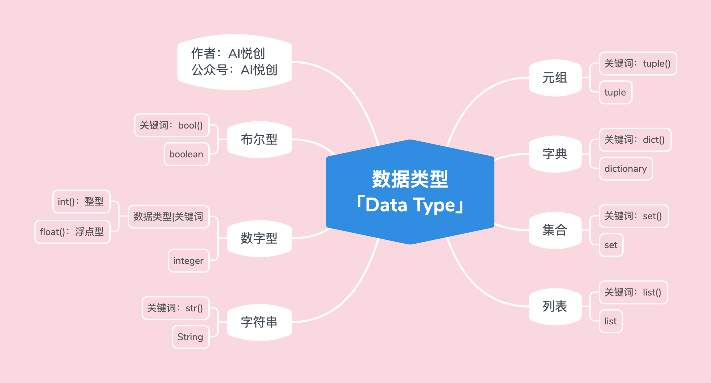

## 1. 数字型

### 1.1 代码示例

1. 整型(没小数就是)：

    ```python
    int_num = 1
    t = type(int_num)  # type 用来检测变量的数据类型
    print(int_num)
    print("int num type is:", t)
    print("直接检测数据类型，并输出:>>>", type(int_num))
    ```

    演示结果为：

    ```python
    /Users/yhy/Coder/.venv/bin/python /Users/yhy/Coder/experiment/03.py 
    1
    int num type is: <class 'int'>
    直接检测数据类型，并输出:>>> <class 'int'>
    
    Process finished with exit code 0
    ```

2. 浮点数(有小数就是)：

    ```python
    float_num = 1.5
    t = type(float_num)
    print(float_num)
    print("float num type is:>>>", t)
    print("直接检测数据类型，并输出:.>>>", type(float_num))
    ```

    演示结果为：

    ```python
    /Users/yhy/Coder/.venv/bin/python /Users/yhy/Coder/experiment/03.py 
    1.5
    float num type is:>>> <class 'float'>
    直接检测数据类型，并输出:.>>> <class 'float'>
    
    Process finished with exit code 0
    ```

## 2. 字符串


### 2.1 代码示例

```python
string = "Hello Bornforthis"
t = type(string)
print(string)
print("string type is:>>>", t)
print("直接检测数据类型，并输出:>>>", type(string))
```

演示结果为：

```python
/Users/yhy/Coder/.venv/bin/python /Users/yhy/Coder/experiment/03.py 
Hello Bornforthis
string type is:>>> <class 'str'>
直接检测数据类型，并输出:>>> <class 'str'>

Process finished with exit code 0
```

### 2.2 字符串三大特性

1. 有序性

    1. 从左往右，下标是从 0 开始
    2. 从右往左，下标是从 -1 开始
    3. 引号内出现的每个字符都算一个下标

2. 不可变性

    1. 不同的编程语言处理字符串的方式可能不同，但在大多数语言中，字符串是不可变的，这意味着一旦创建，字符串的内容就不能改变

    > **注**：我们所说的不可变，是指在代码运行的过程中，不能有对字符串修改、添加、删除之类的操作

3. 任意字符：

    键盘上可以输入的字符，都可以是字符串的元素；

    字符放到字符串中，都将成为字符串类型。（也就是说里面的每一个元素都可以称为：子字符（子字符串））

## 3. 列表

中括号内的内容就是列表

### 3.1 列表演示

```python
lst = ["Hello Bornforthis", 1, 1.1, ("look", "book", 11), [12, "汉堡包"], True, False]
t = type(lst)
print(lst)
print("lst type is:>>>", t)
print("直接检测数据类型，并输出", type(lst))
```

输出结果为：

```python
/Users/yhy/Coder/.venv/bin/python /Users/yhy/Coder/experiment/03.py 
['Hello Bornforthis', 1, 1.1, ('look', 'book', 11), [12, '汉堡包'], True, False]
lst type is:>>> <class 'list'>
直接检测数据类型，并输出 <class 'list'>

Process finished with exit code 0
```

### 3.2 列表的三大特性

1. 有序性

    1. 从左到右，下标是从 0 开始；

    2. 从右到左，下标是从 -1 开始；

    3. 列表里的每一个元素算一个(元素间用逗号隔开）；

        比如：``lst = [“aiyuechuang”, 12];``

        上面 lst 有两个元素，下标分别是:

        1. aiyuechuang 是下标 0 （从左到右），也是下标 -2 （从右到左）；
        2. 12 是下标 1 （从左到右），也是下标 -1 （从右到左）

2. 可变性：在程序运行过程中，列表可以改变、添加、删除、修改
3. 任意数据类型：注意，这里所说的任意数据类型，指的是 Python 所拥有的数据类型；

::: important

列表里的元素与字符串里的元素不同：列表中的元素是指每一个整体，元素以逗号隔开；字符串里的元素是指每个字符，一个字母就是一个元素

:::

## 4. 元组

小括号内的内容就是元组

### 4.1 元组演示

```python
tup = (1, 2, 3, 4, "aivc", 1.1, [1, 2, 3, 4])
t = type(tup)
print(tup)
print("tup type is:>>>", t)
print("直接检测数据类型，并输出:>>>", type(tup))
```

输出结果为：

```python
/Users/yhy/Coder/.venv/bin/python /Users/yhy/Coder/experiment/03.py 
(1, 2, 3, 4, 'aivc', 1.1, [1, 2, 3, 4])
tup type is:>>> <class 'tuple'>
直接检测数据类型，并输出:>>> <class 'tuple'>

Process finished with exit code 0

```

### 4.2 元组的三大特性

1. 有序性

    1. 从左到右，下标是从 0 开始；

    2. 从右到左，下标是从 -1 开始

    3. 元组里的每个元素算一个

        比如：tup = (“aiyuechuang”, 12);

        上面的 tup 有两个元素，下标分别是：

        ​	aiyuechuang 是下标 0 (从左到右) ，也是下标 -2 (从右到左) ；

        ​	12 是下标1（从左到右），也是下标 -1 （从右到左）

2. 不可变性：同字符串

3. 任意数据类型：同列表

## 5. 探究： 列表&元组

::: important 为什么有列表后，还需要元组

列表和元组到底用哪个呢？

:::

从理论上：列表和元组的最大区别在于可变不可变，也就是说：列表是一个可变的容器，可以实时储存与删改，元组更为稳定不可变

由此：从实际事例里：变动与更新的事物我们一般用列表，一定时间内无明显变化的事物我们用元组

比如：记录客观现象作为档案保存一般用元组，互联网朋友圈更新，评论区更新一般用列表

同时：元组的不可变性决定了它在系统运行过程中占用的资源是不会改变的，而列表由于其可变性决定了它在系统运行过程中占用的资源会随其内容增加与减少而增加与减少，而且由于其需要实时检测，在相同内容情况下，列表占用的资源是多于元组的

我们来看示例：

```python
lst = [1, 2, 3, 4, 5, 6, 7]
print(lst.__sizeof__())

lst = [1]
print(lst.__sizeof__())

print("_____________")
lst = [1, 2, 3, 4, 5, 6, 7]
lst.pop()
print(lst.__sizeof__())
lst.pop()
print(lst.__sizeof__())
lst.pop()
print(lst.__sizeof__())
lst.pop()
print(lst.__sizeof__())
lst.pop()
print(lst.__sizeof__())
lst.pop()
print(lst.__sizeof__())
lst.pop()
print(lst.__sizeof__())
lst = (1, 2, 3, 4, 5, 6, 7)
print(lst.__sizeof__())
```

其中 sizeof 语法功能是展示该列表或元组的占用字节（资源）情况

pop 是删除该列表或元组的最后一个元素

来看结果：

```python
/Users/yhy/Coder/.venv/bin/python /Users/yhy/Coder/experiment/03.py 
104
48
_____________
104
104
104
104
104
72
40
80

Process finished with exit code 0
```

我们发现：

1. 元素越多，占用资源越多
2. 删除最初几个元素时，占用字节并未发生变化
3. 相同元素组成时，元组占用资源明显少于列表

## 6. 字典（dictionary）

大括号包含的，存在键值对的内容就是dictionary

### 6.1 字典演示

```python
d = {"name": "aivc", "age": 18, 1: "int", 1.1: 1, "tup": (1,2,3)}
t = type(d)
print(d)
print("d type is:>>>", type(d))
```

结果：

```python
/Users/yhy/Coder/.venv/bin/python /Users/yhy/Coder/experiment/03.py 
{'name': 'aivc', 'age': 18, 1: 'int', 1.1: 1, 'tup': (1, 2, 3)}
d type is:>>> <class 'dict'>

Process finished with exit code 0

```

### 6.2 字典特性

1. 无序性「Python 3.6+ 之后有序」
    1. 先以无序理解即可；
    2. 字典的有序，并不是上面（字符串、列表、元组······）那种常规有序；
    3. 字典的有序是指：字典中的键值对（键：key，值：value）是有序的，有序前期基本无用；（在同一个代码运行过程中，字典的键值对顺序是固定的）
2. 字典的组成：是由一系列的 key 和 value 组成。`d={"key1": "value1", "key2": "value2"·······}`
3. Key:
    1. 不可变的数据类型，才能当字典的 key(数字，字符串，元组，布尔)
4. value：任意数据类型，Python所拥有的数据类型
5. 可变性：可以添加、修改、删除键值对

## 7. 集合

大括号包含的，无键值对的就是集合

### 7.1 集合演示

```python
set1 = {1, 2, "aivc", 1.1, "book", (1,2,3), False}
t = type(set1)
print(set1)
print("set1 type is:>>>", t)
print("直接检测数据类型，并输出:>>>", type(set1))
```

结果是：

```python
/Users/yhy/Coder/.venv/bin/python /Users/yhy/Coder/experiment/03.py 
{False, 1, 2, 1.1, (1, 2, 3), 'book', 'aivc'}
set1 type is:>>> <class 'set'>
直接检测数据类型，并输出:>>> <class 'set'>

Process finished with exit code 0

```

### 7.2 集合特性

1. 无序性：集合是没有顺序的，也就是：没有下标；（发现输出顺序与输入顺序不一致，多次改变位置后可证明）（输出顺序会随着不断运行而改变），现实中概率相关的事物都体现出无序性，连投100次骰子都是6点并不代表其具备有序性

2. 确定性：集合内每个元素都是确定的（也就是需要不可变的数据类型）

    1. 例如：数字型、布尔、元组、字符串

    2. 举个例子：列表为什么不行——列表可变，所以造成不确定性

        ```python
        set1 = {[1,2]}
        print(set1)
        ```

        该集合就含有列表

        结果就会：

        ```python
        /Users/yhy/Coder/.venv/bin/python /Users/yhy/Coder/experiment/03.py 
        Traceback (most recent call last):
          File "/Users/yhy/Coder/experiment/03.py", line 1, in <module>
            set1 = {[1,2]}
                   ^^^^^^^
        TypeError: unhashable type: 'list'
        
        Process finished with exit code 1
        
        ```

3. 互异性：集合内不存在重复的元素(在代码语言中，集合中出现重复元素输出时不会报错，但会去除重复的元素)

```python
set1 = {1,2,3,1,2,3,1,2,4}
print(set1)
```

结果为：

```python
/Users/yhy/Coder/.venv/bin/python /Users/yhy/Coder/experiment/03.py 
{1, 2, 3, 4}

Process finished with exit code 0
```

4. 可变性：可以对集合添加、删除数据，但不能修改数据

​	::: warning

​	删除特定元素需要下标，但集合无序，无法指定下标来删除特定元素

​	:::

## 8. 布尔

True 和 False 两个函数即为布尔

### 8.1 布尔演示

```python
condition = True
print(condition)
print(type(condition))
```

结果为：

```python
/Users/yhy/Coder/.venv/bin/python /Users/yhy/Coder/experiment/03.py 
True
<class 'bool'>

Process finished with exit code 0
```

