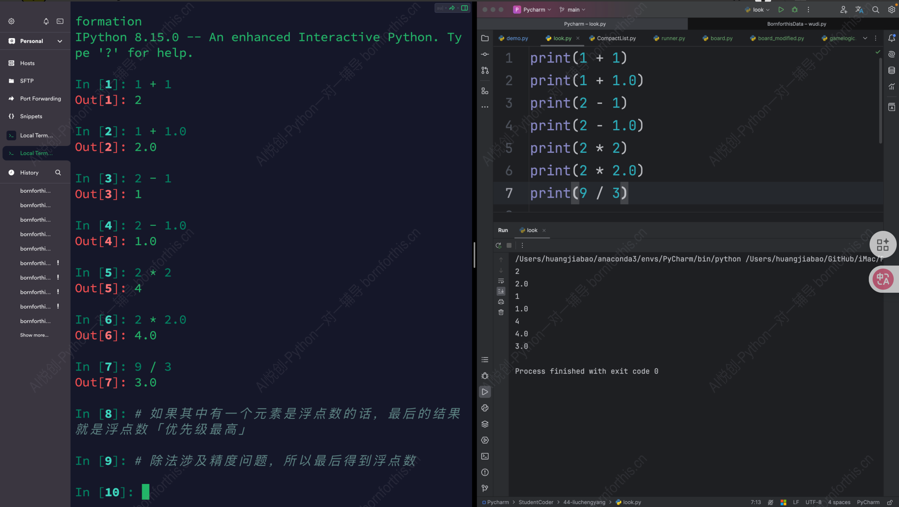
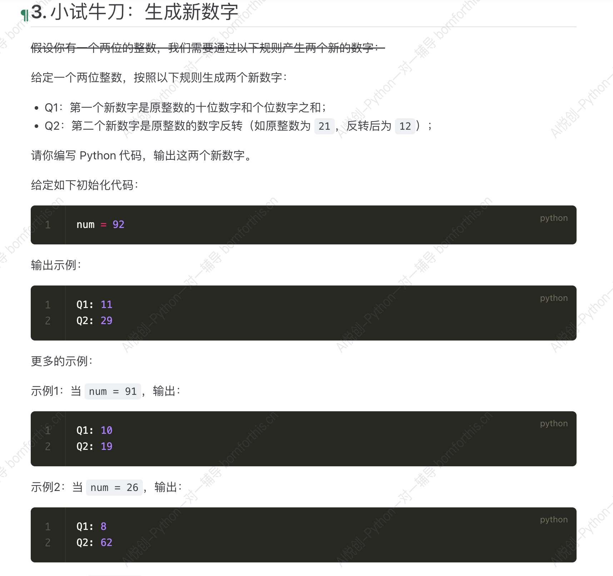

## 1. ipython 数字型规律引入

### 1.1 实例演示

```markdown
In [1]: 1 + 1
Out[1]: 2

In [2]: 1 + 1.0
Out[2]: 2.0

In [3]: 2 - 1
Out[3]: 1

In [4]: 2 - 1.0
Out[4]: 1.0

In [5]: 2 * 2
Out[5]: 4

In [6]: 2 * 2.0
Out[6]: 4.0

In [7]: 9/3
Out[7]: 3.0

In [8]: 9/3.0
Out[8]: 3.0

In [9]: 9.0/3
Out[9]: 3.0

In [10]: 9.0/3.0
Out[10]: 3.0

In [11]: 3.0*3.0
Out[11]: 9.0

In [12]: 9.00/3
Out[12]: 3.0

In [13]: 9.00/3.00
Out[13]: 3.0

In [14]: 2 * 2.00
Out[14]: 4.0

In [15]: 2.00 * 2.00
Out[15]: 4.0

In [16]: 1.00 + 1
Out[16]: 2.0

```

通过上述示例，我们能总结出两处结论：

1. 非除法（整除和取余也是非除法）运算式如果其中含有一个浮点数，就会得到浮点数「优先级最高」，且结果的浮点数一定是只保留一位小数，若无浮点数则结果无小数

2. 除法计算式中涉及精度问题，结果必为浮点数，在能除尽且小数不超过1位的情况下结果必定保留一位小数，在除不尽的情况下保留16位小数

### 1.2 ipython 数学计算较 pycharm的优势

1. ipython 较 pycharm 运算便捷的多

2. ipython 能很好的保存之前的输出记录

3. ipython 能有很好的对比性，方便找出规律

    

> 但 ipython 保存代码能力很弱，故需要代码参与时用pycharm

## 2. 算数运算符

用于计算

| 运算符 | 描述                                   | 例子          |
| ------ | -------------------------------------- | ------------- |
| `+`    | 加法运算符                             | `1 + 1 = 2`   |
| `-`    | 减法运算符                             | `2 - 1 = 1`   |
| `*`    | 乘法运算符                             | `2 * 3 = 6`   |
| `/`    | 除法运算符                             | `9 / 3 = 3.0` |
| `**`   | 指数运算符                             | `2 ** 3 = 8 ` |
| `%`(%) | 取余运算符，计算余数                   | `9 % 2 = 1`   |
| `//`   | 除法取整运算符，计算商并去除其小数部分 | `9 // 2 = 4`  |



我们可输入：

```python
num = 92
a = num % 10
b = num // 10
Q1 = a + b
Q2 = a * 10 + b
print("Q1:",Q1)
print("Q2:",Q2)
```

来使该规律对任意二位整数生效

## 4. 比较运算符：比较值的大小

对于比较运算符，你只需知道运行结果会得到布尔类型即可。(大小判断正确就会显示ture，错误就会显示false)

| 运算符 | 描述                                           | 例子            |
| ------ | ---------------------------------------------- | --------------- |
| `>`    | 判断第一个运算对象是否大于第二个运算对象       | `Print(1 > 2)`  |
| `<`    | 判断第一个运算对象是否小于第二个运算对象       | `print(1 < 2)`  |
| `>=`   | 判断第一个运算对象是否大于或等于第二个运算对象 | `print(3 >= 3)` |
| `<=`   | 判断第一个运算对象是否小于或等于第二个运算对象 | `print(3 <= 4)` |
| `==`   | 判断两个运算对象是否相同                       | `print(2 == 2)` |
| `!=`   | 判断两个运算对象是否不相同                     | `print(2 != 1)` |

## 5. 赋值运算符

接下来是赋值运算符，表格如下：

| 运算符 | 描述                                 | 例子       |
| ------ | ------------------------------------ | ---------- |
| `=`    | 把右边的运算对象赋值给左边的运算对象 | `a=1`      |
| `+=`   | `a += b`等同于`a = a + b`            | `a += 10`  |
| `-=`   | `a -= b`等同于`a = a - b`            | `a -= 10`  |
| `*=`   | `a *= b`等同于`a = a*b`              | `a *= 10`  |
| `/=`   | `a /= b`等同于`a = a/b`              | `a /= 10`  |
| `**=`  | `a **= b`等同于`a = a ** b`          | `a **= 10` |
| `//=`  | `a //= b`等同于`a = a // b`          | `a //= 10` |
| `%=`   | `a %= b`等同于`a = a % b`            | `a %= 10`  |

用途：在代码输入时能省大量时间：

```python
a = 1
a = a+10
print(a)
```

```python
a = 1
a += 10
print(a)
```

两者效果相同

利用了变量的覆盖特性

训练：

```python
a = 1
a += 10
a -= 10
a *= 10
a /= 10
a **= 10
a //= 10
print(a)
```

结果不是0，是0.0

因为第五步出现了除法运算，导致从此之后的运算都会出现浮点数，导致输出结果为0.0

## 6. 为什么需要赋值运算符

- 基础运算符：通常不会直接修改操作数本身，而是返回一个新的结果
- 赋值运算符：将某个值赋予某个变量，分为普通赋值运算符(`=`)和复合赋值运算符(`+=`,`-=`等)，它们结合了基础运算符和赋值的功能

赋值运算符的引入简化代码，提高代码的可读性和可维护性，能减少出错概率

总结：基础运算符用于数学计算，赋值运算符用于在执行运算过程中将结果赋值给变量
