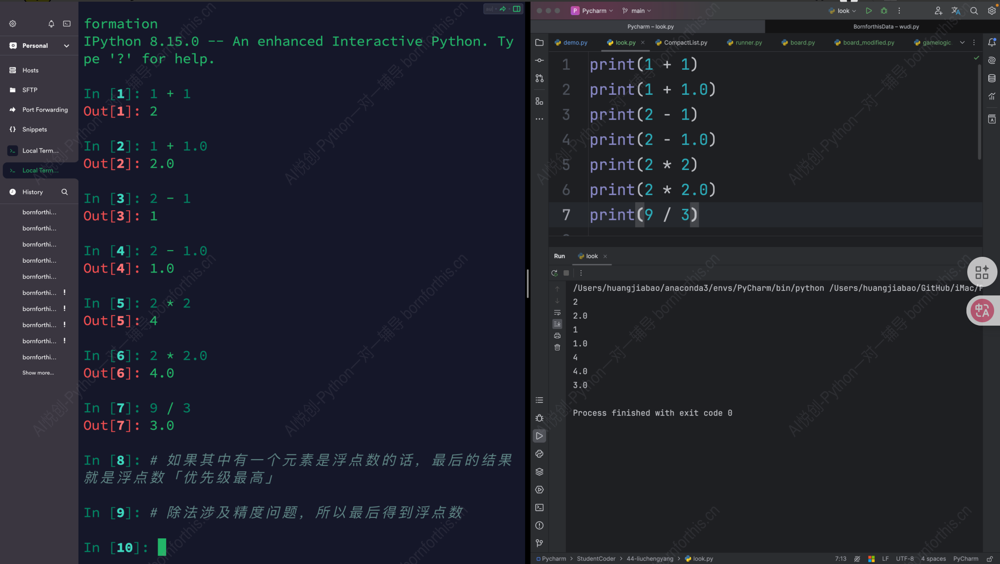
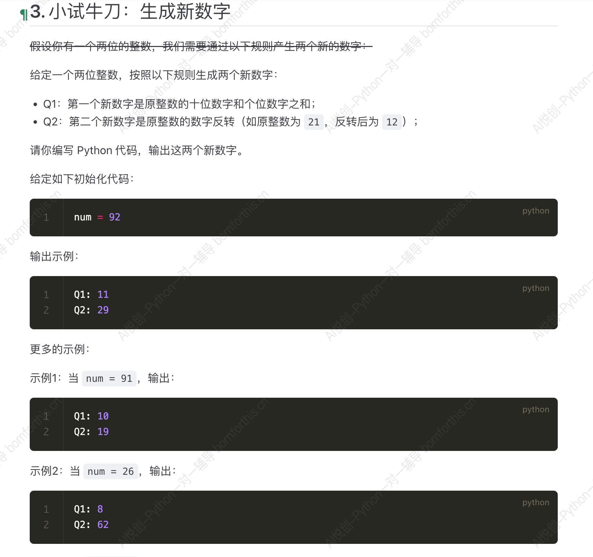
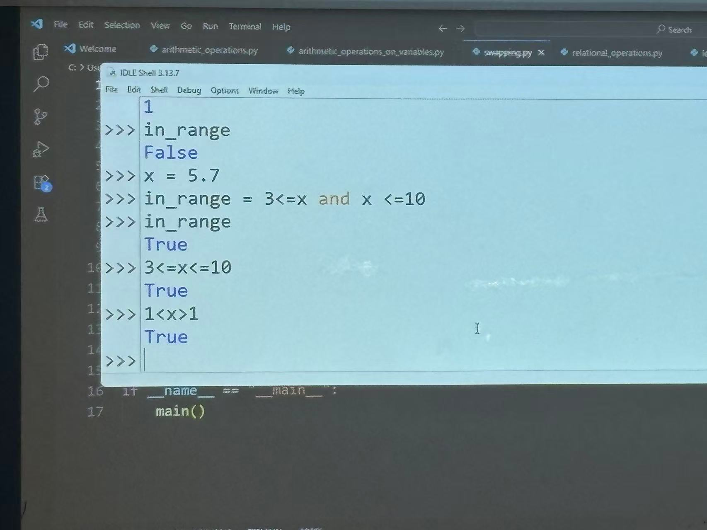
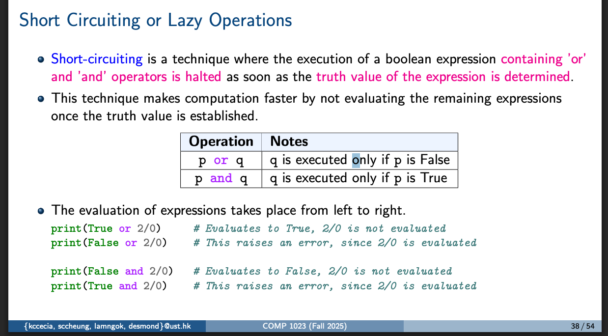
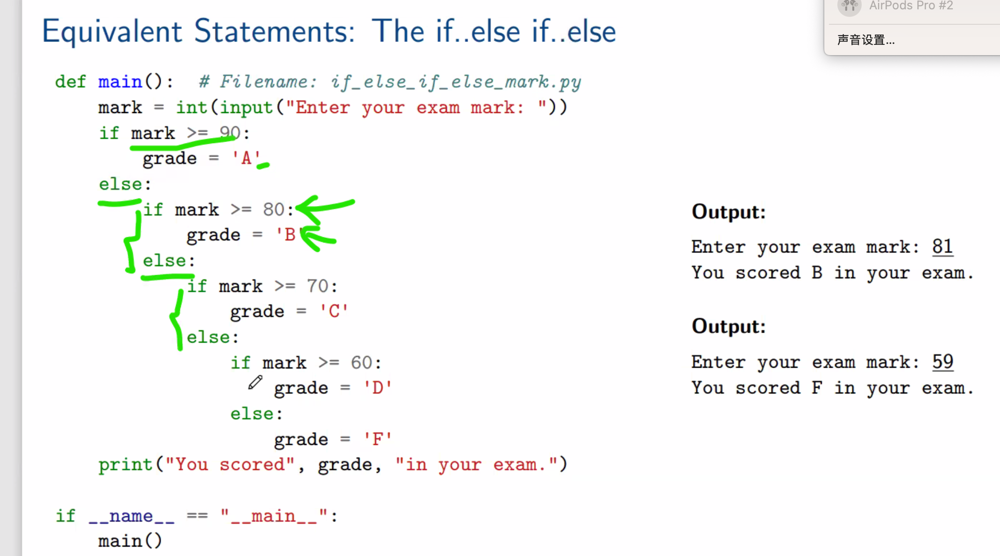
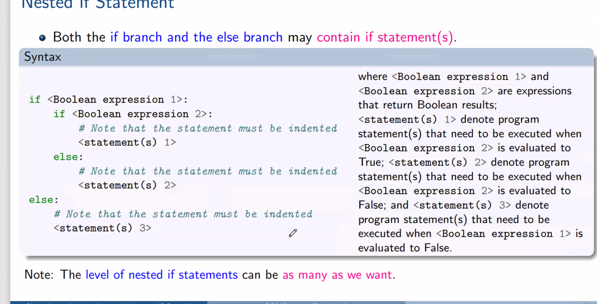
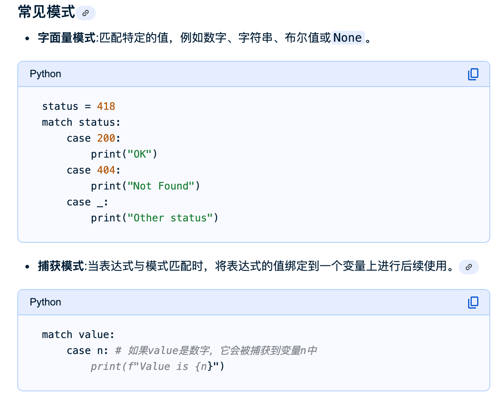
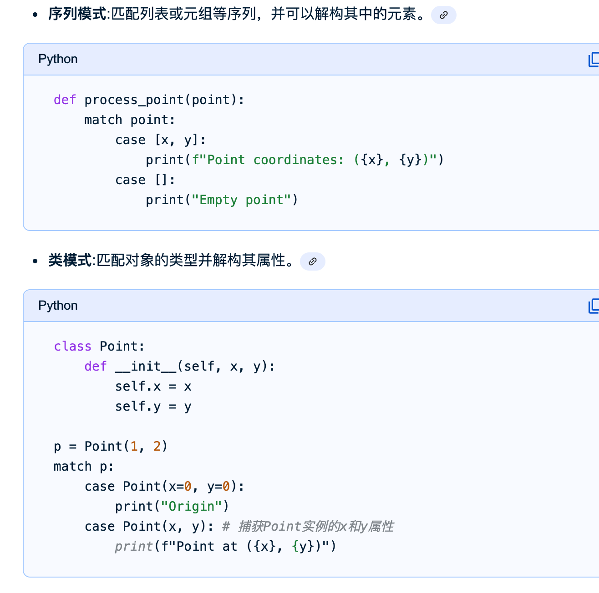
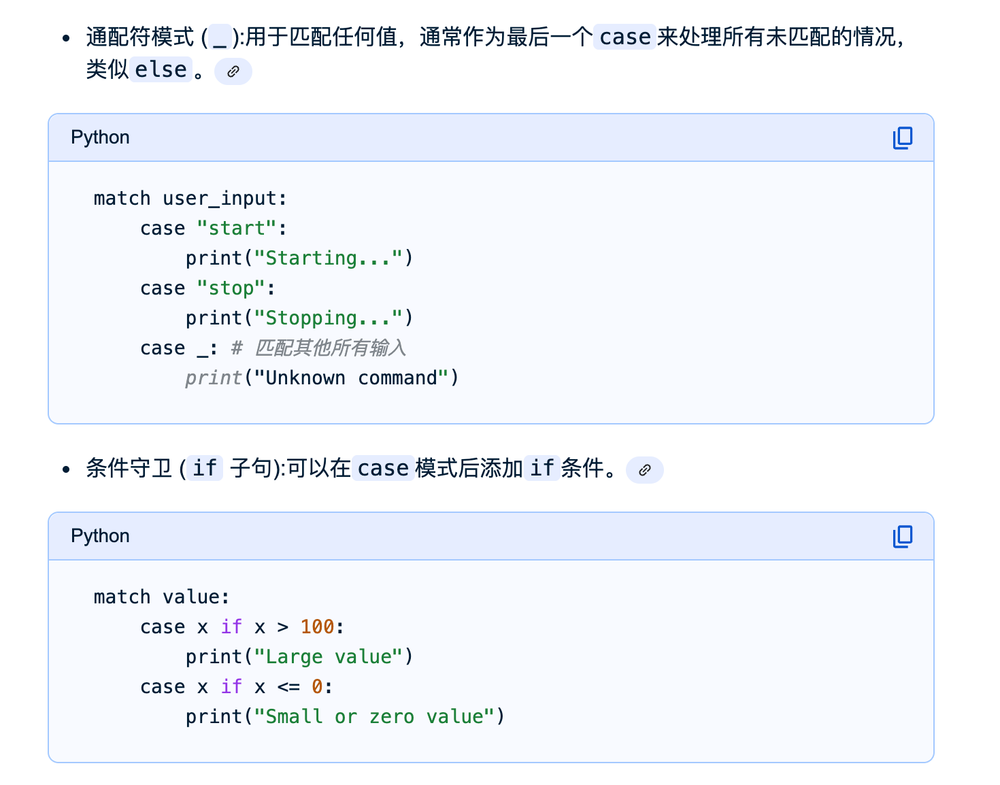

## 1. ipython 数字型规律引入

### 1.1 实例演示

```markdown
In [1]: 1 + 1
Out[1]: 2

In [2]: 1 + 1.0
Out[2]: 2.0

In [3]: 2 - 1
Out[3]: 1

In [4]: 2 - 1.0
Out[4]: 1.0

In [5]: 2 * 2
Out[5]: 4

In [6]: 2 * 2.0
Out[6]: 4.0

In [7]: 9/3
Out[7]: 3.0

In [8]: 9/3.0
Out[8]: 3.0

In [9]: 9.0/3
Out[9]: 3.0

In [10]: 9.0/3.0
Out[10]: 3.0

In [11]: 3.0*3.0
Out[11]: 9.0

In [12]: 9.00/3
Out[12]: 3.0

In [13]: 9.00/3.00
Out[13]: 3.0

In [14]: 2 * 2.00
Out[14]: 4.0

In [15]: 2.00 * 2.00
Out[15]: 4.0

In [16]: 1.00 + 1
Out[16]: 2.0

```

通过上述示例，我们能总结出两处结论：

1. 非除法（整除和取余也是非除法）运算式如果其中含有一个浮点数，就会得到浮点数「优先级最高」，且结果的浮点数一定是只保留一位小数，若无浮点数则结果无小数

2. 除法计算式中涉及精度问题，结果必为浮点数，在能除尽且小数不超过1位的情况下结果必定保留一位小数，在除不尽的情况下保留16位小数

### 1.2 ipython 数学计算较 pycharm的优势

1. ipython 较 pycharm 运算便捷的多

2. ipython 能很好的保存之前的输出记录

3. ipython 能有很好的对比性，方便找出规律

    

> 但 ipython 保存代码能力很弱，故需要代码参与时用pycharm

## 2. 算数运算符

用于计算

| 运算符 | 描述                                                         | 例子          |
| ------ | ------------------------------------------------------------ | ------------- |
| `+`    | 加法运算符                                                   | `1 + 1 = 2`   |
| `-`    | 减法运算符                                                   | `2 - 1 = 1`   |
| `*`    | 乘法运算符                                                   | `2 * 3 = 6`   |
| `/`    | 除法运算符                                                   | `9 / 3 = 3.0` |
| `**`   | 指数运算符(注意0**0被规定为1，数学规定)，`2**3**2=512`       | `2 ** 3 = 8 ` |
| `%`(%) | 取余运算符，计算余数                                         | `9 % 2 = 1`   |
| `//`   | 除法取整运算符，计算商并去除其小数部分（注意，整除的去除小数不是四舍五入，而是全部取小，`5.5//2`是2.0，`5.5//-2`就变成了-3.0了） | `9 // 2 = 4`  |



我们可输入：

```python
num = 92
a = num % 10
b = num // 10
Q1 = a + b
Q2 = a * 10 + b
print("Q1:",Q1)
print("Q2:",Q2)
```

来使该规律对任意二位整数生效

## 4. 比较运算符：比较值的大小

对于比较运算符，你只需知道运行结果会得到布尔类型即可。(大小判断正确就会显示ture，错误就会显示false)

注意：布尔型可以破例与数字型比较，且True视为无穷大，False视为无穷小，其它情况只能同类型代码比较

| 运算符       | 描述                                           | 例子                         |
| ------------ | ---------------------------------------------- | ---------------------------- |
| `>`          | 判断第一个运算对象是否大于第二个运算对象       | `Print(1 > 2)`               |
| `<`          | 判断第一个运算对象是否小于第二个运算对象       | `print(1 < 2)`               |
| `>=`         | 判断第一个运算对象是否大于或等于第二个运算对象 | `print(3 >= 3)`              |
| `<=`         | 判断第一个运算对象是否小于或等于第二个运算对象 | `print(3 <= 4)`              |
| `==`         | 判断两个运算对象是否相等                       | `print(2 == 2)`              |
| `!=`         | 判断两个运算对象是否不相同                     | `print(2 != 1)`              |
| `is, is not` | 判断两个运算对象是否等效                       | `print(a is b)`              |
| `in,not in`  | 判断第一个运算对象是否属于第二个运算对象       | `print("as" in ["as","ad"])` |
|              |                                                |                              |

> **注意**：字符串之间也可以比大小，其比大小的方式就是取字符串的第一个字符进行比较,具体比较规则如下：
>
> 字符串内第一个字符均为数字时，直接比较字符串的大小，第一个字符均为字母时，根据字母表顺序排列比较，`“a”<"d"`,特殊字符时中文字符比英文字符大，当不同字符型比较时，一定有 ： 数字<字母<特殊字符



注意只要符合条件范围，python不会在意数学错误



当使用 or 时，python会先判定第一个是不是对的，如果对就直接true，不对再看后续，and 与之相反

原因：or是并集的意思，对python来说只要第一个正确那么结果就一定可以存在第一个的情况，那么就是true，而and是交集，只要有一个元素不正确，那整体就不正确，所以只要第一个是 False 那就是 False

> **注意**：比较运算符的计算优先级永远高于逻辑运算符（and ，or，not，其中优先度not>and>or)

## 5. 赋值运算符

接下来是赋值运算符，表格如下：

| 运算符 | 描述                                 | 例子       |
| ------ | ------------------------------------ | ---------- |
| `=`    | 把右边的运算对象赋值给左边的运算对象 | `a=1`      |
| `+=`   | `a += b`等同于`a = a + b`            | `a += 10`  |
| `-=`   | `a -= b`等同于`a = a - b`            | `a -= 10`  |
| `*=`   | `a *= b`等同于`a = a*b`              | `a *= 10`  |
| `/=`   | `a /= b`等同于`a = a/b`              | `a /= 10`  |
| `**=`  | `a **= b`等同于`a = a ** b`          | `a **= 10` |
| `//=`  | `a //= b`等同于`a = a // b`          | `a //= 10` |
| `%=`   | `a %= b`等同于`a = a % b`            | `a %= 10`  |

用途：在代码输入时能省大量时间：

```python
a = 1
a = a+10
print(a)
```

```python
a = 1
a += 10
print(a)
```

两者效果相同

利用了变量的覆盖特性

训练：

```python
a = 1
a += 10
a -= 10
a *= 10
a /= 10
a **= 10
a //= 10
print(a)
```

结果不是0，是0.0

因为第五步出现了除法运算，导致从此之后的运算都会出现浮点数，导致输出结果为0.0

另外：在python中 0.0 == -0.0

## 6. 为什么需要赋值运算符

- 基础运算符：通常不会直接修改操作数本身，而是返回一个新的结果
- 赋值运算符：将某个值赋予某个变量，分为普通赋值运算符(`=`)和复合赋值运算符(`+=`,`-=`等)，它们结合了基础运算符和赋值的功能

赋值运算符的引入简化代码，提高代码的可读性和可维护性，能减少出错概率

总结：基础运算符用于数学计算，赋值运算符用于在执行运算过程中将结果赋值给变量

## 7. 小试牛刀

```python
x = 4.5
y = 2
print(x // y)
```

结果是：

2.0


```python
x = 4
y = 2
print(x // y)
```

结果是：

2

## 8. Float,int 和 complex 函数

### 8.1 Float()

示例1: int 变float

```python
a = 10
print(float(a))
```

结果为：

```python
/usr/local/bin/python3.14 /Users/yhy/Coder/experiment/07.py 
10.0

进程已结束，退出代码为 0
```

示例2: complex 变float

```python
a = 10+1j
print(float(a))
```

结果为：

```python
/usr/local/bin/python3.14 /Users/yhy/Coder/experiment/07.py 
Traceback (most recent call last):
  File "/Users/yhy/Coder/experiment/07.py", line 2, in <module>
    print(float(a))
          ~~~~~^^^
TypeError: float() argument must be a string or a real number, not 'complex'

进程已结束，退出代码为 1
```

发现报错，这也就是说float函数和int函数都**只能运行实数**

### 8.2 int()

示例：float 变int

```python
a = 10.9
print(int(a))
```

结果为：

```python
/usr/local/bin/python3.14 /Users/yhy/Coder/experiment/07.py 
10

进程已结束，退出代码为 0
```

观察发现：python化整不会进行四舍五入，而是直接输出其整数段

### 8.3 complex()

示例1: int变complex

```python
a = 10
print(complex(a))
```

结果为：

```python
/usr/local/bin/python3.14 /Users/yhy/Coder/experiment/07.py 
(10+0j)

进程已结束，退出代码为 0
```

示例2: float变complex（小数点后为0）

```python
a = 10.0
print(complex(a))
```

结果为：

```python
/usr/local/bin/python3.14 /Users/yhy/Coder/experiment/07.py 
(10+0j)

进程已结束，退出代码为 0
```

发现其实数段小数点后为0会**直接变成整数**

示例3: float变complex（小数点后不为0）

```python
a = 10.9
print(complex(a))
```

结果为：

```python
/usr/local/bin/python3.14 /Users/yhy/Coder/experiment/07.py 
(10.9+0j)

进程已结束，退出代码为 0
```

发现实数段仍为float

## 9. 简单的逻辑演示-if-else

```python
mark = int(input("输入你的成绩"))
if mark>= 80:
    print("Good")
else:
    print("bad")
```

复杂一点：

```
mark = int(input("输入你的成绩"))
if mark>= 80:
    print("Good")
elif mark >= 70:
    print("normal")
else:
    print("bad")
```

注意：elif 是既有else 也就 if的一种简写，也就是说在此处的范围仅在70到80直接才会触发第二个

同时：我们可以利用不同级别的if 和else构造相同结果



也可以：



注意这里用的都是运算符号，千万不要用`=`赋值符号

## 10. 判断的优化-match-case

示例：

```python
match 表达式:
    case 模式1:
        # 执行代码块1
    case 模式2 | 模式3: # 支持多个模式用 | 连接
        # 执行代码块2
    case 变量 as 别名: # 捕获变量
        # 执行代码块3
    case _: # 通配符模式，匹配任何值
        # 执行默认代码块
```

如：

 ```python
   status = 418
   match status:
       case 200:
           print("OK")
       case 404:
           print("Not Found")
       case _:
           print("Other status")
 ```

这里的`__`就是else的意思，只要是其它情况就会输出这个结果





本质上，这种语法是从上而下检索，而`__`实际上是任意结果都会匹配的符号，所以`__`一定要放最后一个case，不然会报错
