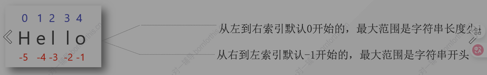

## 1. 字符串的定义

字符串是由字母、数字和特殊字符组成的序列



## 2. 创建字符串

### 2.1 基础创建

创建类型分为：

1. name：`‘yhy’`

2. number: `“18”`
3. paragraph : ` '''Hello,Bornforthis!Hello,World!'''`

### 2.2 单引号，双引号和三引号

其中单引号和双引号效果相同,但三个单引号或三个双引号连环可以使字符串跨行连接

```python
paragraph = '''hello
,nihao'''
paragraph_2 = """hello

,nihao"""
```

这是能正常运行的

效果为：

```python
/Users/yhy/Coder/.venv/bin/python /Users/yhy/Coder/experiment/06.py 
hello
,nihao
hello

,nihao

Process finished with exit code 0
```

而单个单引号或双引号组跨行则不能正常运行,但在每一行末尾加一个`\`就可以

以下为失败示例：

```python
paragraph = 'hello
,nihao'
paragraph_2 = "hello
,nihao"
print(paragraph)
print(paragraph_2)
```

发现报错代码：

```python
/Users/yhy/Coder/.venv/bin/python /Users/yhy/Coder/experiment/06.py 
  File "/Users/yhy/Coder/experiment/06.py", line 1
    paragraph = 'hello
                ^
SyntaxError: unterminated string literal (detected at line 1)

Process finished with exit code 1

```

那么既然单引号和双引号效果相同，那么为什么要存在单引号和双引号两个等效符合呢？

我们在编程中常用英语，在英语语法中我们常见到：`I'm ···`这一句式，那么在这一句式存在的情况下，单引号做字符串倒入时由于句子中有单引号，会自动识别为字符串结尾，发生错乱。

```python
name1 = "I'm Lilei"
name2 = 'I'm Lilei'
```

注意到，以双引号做引入时则没有这一问题。

因此，单双引号，包括三个引号的导入便是为了尽最大可能解决这种情况，毕竟，我们无法保证我们的内容是否一定不会出现单引号和双引号。

> **结论**：单双引号混用可以最大程度保证字符串内容在编程语言的合法性

那么，如何使下列输出内容按其原有格式运行呢？

```markdown
我们有时候不仅仅要看选择项以内的答案，也要去思考选择项以外的答案。——AI悦创

浅者见浅，深者见深——黄家宝

起的最早的是理想主义者，跑的最快的是骗子，而胆子最大的是那些冒险家，害怕错过一切，疯狂往里冲的是韭菜，而真正的成功者，可能还没有入场。

先实现功能，再去优化，否则一切会很乱。——AI悦创

凡是你不能清晰写下来的东西，都是你还没有真正理解的东西
```

方法一：

```python
name ='我们有时候不仅仅要看选择项以内的答案，也要去思考选择项以外的答案。——AI悦创\
\
浅者见浅，深者见深——黄家宝\
\
起的最早的是理想主义者，跑的最快的是骗子，而胆子最大的是那些冒险家，害怕错过一切，疯狂往里冲的是韭菜，而真正的成功者，可能还没有入场。\
\
先实现功能，再去优化，否则一切会很乱。——AI悦创\
\
凡是你不能清晰写下来的东西，都是你还没有真正理解的东西'
print(name)
```

我们发现：结果为：

```python
/Users/yhy/Coder/.venv/bin/python /Users/yhy/Coder/experiment/05.py 
我们有时候不仅仅要看选择项以内的答案，也要去思考选择项以外的答案。——AI悦创浅者见浅，深者见深——黄家宝起的最早的是理想主义者，跑的最快的是骗子，而胆子最大的是那些冒险家，害怕错过一切，疯狂往里冲的是韭菜，而真正的成功者，可能还没有入场。先实现功能，再去优化，否则一切会很乱。——AI悦创凡是你不能清晰写下来的东西，都是你还没有真正理解的东西

Process finished with exit code 0
```

其输出结果无法换行

方法二：用三引号输出多行

```python
a = '''我们有时候不仅仅要看选择项以内的答案，也要去思考选择项以外的答案。——AI悦创

浅者见浅，深者见深——黄家宝

起的最早的是理想主义者，跑的最快的是骗子，而胆子最大的是那些冒险家，害怕错过一切，疯狂往里冲的是韭菜，而真正的成功者，可能还没有入场。

先实现功能，再去优化，否则一切会很乱。——AI悦创

凡是你不能清晰写下来的东西，都是你还没有真正理解的东西'''
print(a)
```

结果为：

```python
/Users/yhy/Coder/.venv/bin/python /Users/yhy/Coder/experiment/04.py 
我们有时候不仅仅要看选择项以内的答案，也要去思考选择项以外的答案。——AI悦创

浅者见浅，深者见深——黄家宝

起的最早的是理想主义者，跑的最快的是骗子，而胆子最大的是那些冒险家，害怕错过一切，疯狂往里冲的是韭菜，而真正的成功者，可能还没有入场。

先实现功能，再去优化，否则一切会很乱。——AI悦创

凡是你不能清晰写下来的东西，都是你还没有真正理解的东西

Process finished with exit code 0
```

成功完成换行输出

由此，我们发现：三引号可以完美完成同一个字符串中所有行内格式的复制，而单双引号则单纯输出内容
