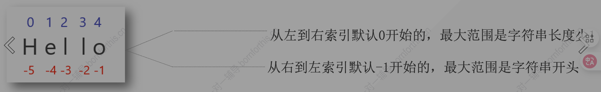
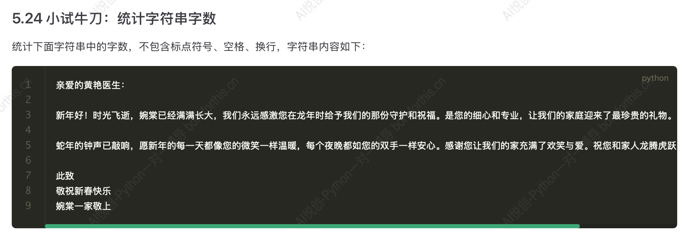
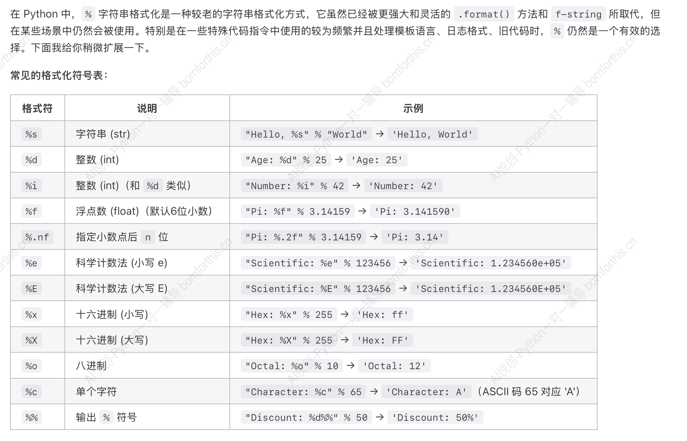
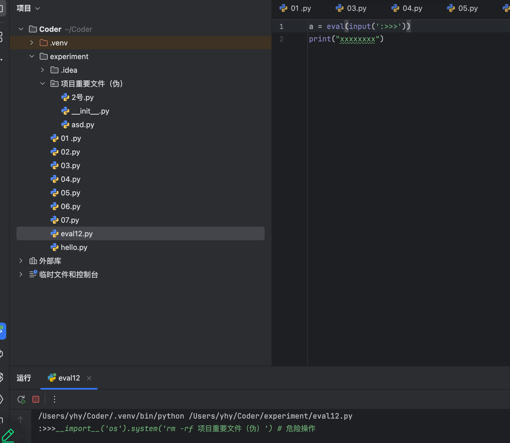
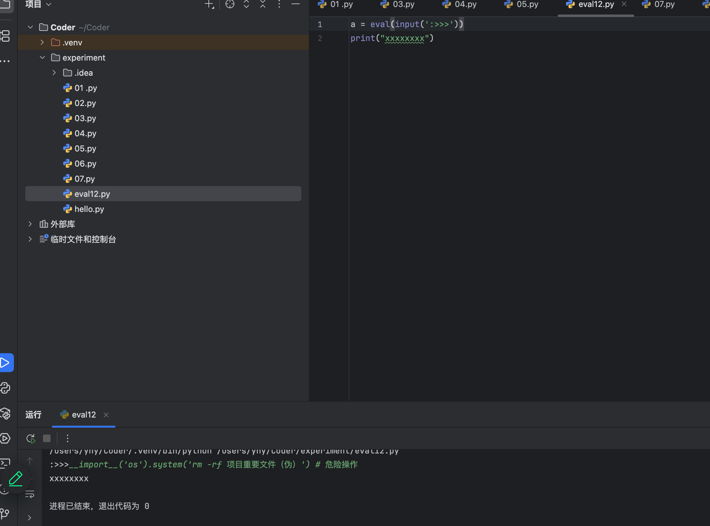
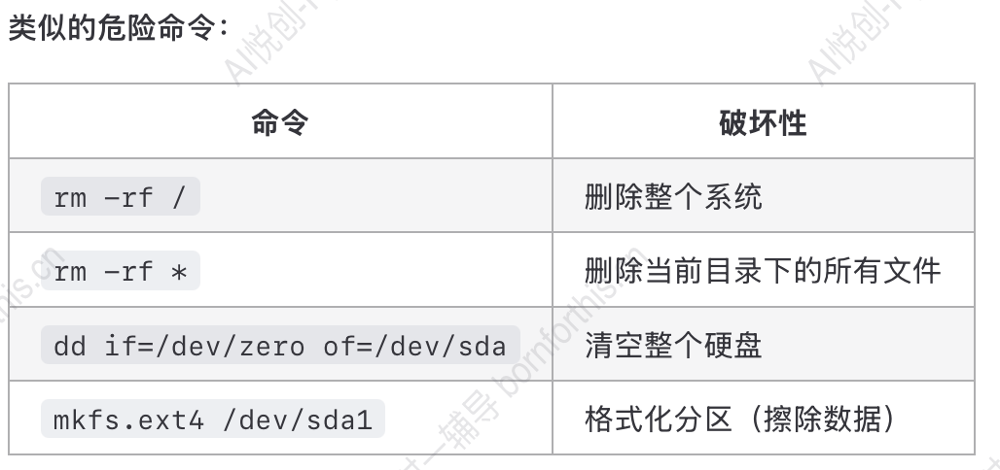

> **注意**：所有的函数都是在原字符串基础上返还一个新字符串，而不修改原字符串

## 1. 字符串的定义

字符串是由字母、数字和特殊字符组成的序列



## 2. 创建字符串

### 2.1 基础创建

创建类型分为：

1. name：`‘yhy’`

2. number: `“18”`
3. paragraph : ` '''Hello,Bornforthis!Hello,World!'''`

### 2.2 单引号，双引号和三引号

其中单引号和双引号效果相同,但三个单引号或三个双引号连环可以使字符串跨行连接

```python
paragraph = '''hello
,nihao'''
paragraph_2 = """hello

,nihao"""
```

这是能正常运行的

效果为：

```python
/Users/yhy/Coder/.venv/bin/python /Users/yhy/Coder/experiment/06.py 
hello
,nihao
hello

,nihao

Process finished with exit code 0
```

而单个单引号或双引号组跨行则不能正常运行,但在每一行末尾加一个`\`就可以

以下为失败示例：

```python
paragraph = 'hello
,nihao'
paragraph_2 = "hello
,nihao"
print(paragraph)
print(paragraph_2)
```

发现报错代码：

```python
/Users/yhy/Coder/.venv/bin/python /Users/yhy/Coder/experiment/06.py 
  File "/Users/yhy/Coder/experiment/06.py", line 1
    paragraph = 'hello
                ^
SyntaxError: unterminated string literal (detected at line 1)

Process finished with exit code 1

```

那么既然单引号和双引号效果相同，那么为什么要存在单引号和双引号两个等效符合呢？

我们在编程中常用英语，在英语语法中我们常见到：`I'm ···`这一句式，那么在这一句式存在的情况下，单引号做字符串倒入时由于句子中有单引号，会自动识别为字符串结尾，发生错乱。

```python
name1 = "I'm Lilei"
name2 = 'I'm Lilei'
```

注意到，以双引号做引入时则没有这一问题。

因此，单双引号，包括三个引号的导入便是为了尽最大可能解决这种情况，毕竟，我们无法保证我们的内容是否一定不会出现单引号和双引号。

> **结论**：单双引号混用可以最大程度保证字符串内容在编程语言的合法性

那么，如何使下列输出内容按其原有格式运行呢？

```markdown
我们有时候不仅仅要看选择项以内的答案，也要去思考选择项以外的答案。——AI悦创

浅者见浅，深者见深——黄家宝

起的最早的是理想主义者，跑的最快的是骗子，而胆子最大的是那些冒险家，害怕错过一切，疯狂往里冲的是韭菜，而真正的成功者，可能还没有入场。

先实现功能，再去优化，否则一切会很乱。——AI悦创

凡是你不能清晰写下来的东西，都是你还没有真正理解的东西
```

方法一：

```python
name ='我们有时候不仅仅要看选择项以内的答案，也要去思考选择项以外的答案。——AI悦创\
\
浅者见浅，深者见深——黄家宝\
\
起的最早的是理想主义者，跑的最快的是骗子，而胆子最大的是那些冒险家，害怕错过一切，疯狂往里冲的是韭菜，而真正的成功者，可能还没有入场。\
\
先实现功能，再去优化，否则一切会很乱。——AI悦创\
\
凡是你不能清晰写下来的东西，都是你还没有真正理解的东西'
print(name)
```

我们发现：结果为：

```python
/Users/yhy/Coder/.venv/bin/python /Users/yhy/Coder/experiment/05.py 
我们有时候不仅仅要看选择项以内的答案，也要去思考选择项以外的答案。——AI悦创浅者见浅，深者见深——黄家宝起的最早的是理想主义者，跑的最快的是骗子，而胆子最大的是那些冒险家，害怕错过一切，疯狂往里冲的是韭菜，而真正的成功者，可能还没有入场。先实现功能，再去优化，否则一切会很乱。——AI悦创凡是你不能清晰写下来的东西，都是你还没有真正理解的东西

Process finished with exit code 0
```

其输出结果无法换行

方法二：用三引号输出多行

```python
a = '''我们有时候不仅仅要看选择项以内的答案，也要去思考选择项以外的答案。——AI悦创

浅者见浅，深者见深——黄家宝

起的最早的是理想主义者，跑的最快的是骗子，而胆子最大的是那些冒险家，害怕错过一切，疯狂往里冲的是韭菜，而真正的成功者，可能还没有入场。

先实现功能，再去优化，否则一切会很乱。——AI悦创

凡是你不能清晰写下来的东西，都是你还没有真正理解的东西'''
print(a)
```

结果为：

```python
/Users/yhy/Coder/.venv/bin/python /Users/yhy/Coder/experiment/04.py 
我们有时候不仅仅要看选择项以内的答案，也要去思考选择项以外的答案。——AI悦创

浅者见浅，深者见深——黄家宝

起的最早的是理想主义者，跑的最快的是骗子，而胆子最大的是那些冒险家，害怕错过一切，疯狂往里冲的是韭菜，而真正的成功者，可能还没有入场。

先实现功能，再去优化，否则一切会很乱。——AI悦创

凡是你不能清晰写下来的东西，都是你还没有真正理解的东西

Process finished with exit code 0
```

成功完成换行输出

由此，我们发现：三引号可以完美完成同一个字符串中所有行内格式的复制，而单双引号则单纯输出内容,同时三引号可以注释内容的

## 3. 检测字符串的长度

len()即为检测字符串长度的语法(任意字符包括空格都算一个长度)

示例:

```python
paragraph = 'Hello,Bornforthis'
print(len(paragraph))
```

> **注**：字符串长度不是按其下标来计算，而是从1开始计数

## 4. 字符串中的字符获取

### 4.1 获取单个字符

在Python中，可以用索引直接获取单个字符，索引从零开始，即字符串的第一个索引为0，第二个为1，以此类推

```python
string = "bornforthis"
select = string[position]
```

- `string`是字符串变量
- `select`是用于存储提取字符的变量
- `position`是字符在字符串中的位置（即索引），从0开始

**示例**：

```python
string = "bornforthis"
select = string[0]      # 提取字符串中的第一个字符 b
print(select)           # 输出： b
```

​                                                                                                  **牛刀小试：**

任务：提取最后一个字母s

要求：使用三种方法

由上述可知：

前两种方法只需利用字符串索引的双向性即可

::: tabs

@tab 方法一

```python
string = "bornforthis"
select = string[10]
print(select)
```

@tab 方法二

```python
string = "bornforthis"
select = string[-1]
print(select)
```

@tab 方法三

那么，如何去找到第三种解决方法呢？

我们学习了 len 语法，那么 len 语法是计算字符串长度的，即 len 语法本质上表达的就是数字

也就是说：len 语法是可以直接加到中括号里面充当数字的

可是，在实际操作下：我们发现：

```python
string = "bornforthis"
select = string[len(string)]
print(select)
```

在结果上只会

```python
/Users/yhy/Coder/.venv/bin/python /Users/yhy/Coder/experiment/01.py 
Traceback (most recent call last):
  File "/Users/yhy/Coder/experiment/01.py", line 2, in <module>
    select = string[len(string)]
             ~~~~~~^^^^^^^^^^^^^
IndexError: string index out of range

Process finished with exit code 1

```

发生错误

那么，这是为什么呢 ？

原来，len 语法是计算字符个数，字符从 1 开始计算，而索引是从 0 开始计算，也就是说，在 len 语法后加一个`-1`的计算公式即可

```python
string = "bornforthis"
select = string[len(string)-1]
print(select)
```

结果正常运行：

```python
Users/yhy/Coder/.venv/bin/python /Users/yhy/Coder/experiment/01.py 
s

Process finished with exit code 0
```

:::

### 4.2 获取连续字符「子字符串」

```python
string = "bornforthis"
select = string[start: end]
```

> **注**：end 需要 +1 才能包含该字符（可以把中括号里的内容当作左闭右开的区间）(同时倒叙情况下end需要-1)

```python
string = "bornforthis"
select = string[0: 3]
print(select)
```

结果为：

```python
/Users/yhy/Coder/.venv/bin/python /Users/yhy/Coder/experiment/01.py 
bor

Process finished with exit code 0

```

笔者在尝试例子的过程中，遗漏了print这一步输出，导致结果出现了如下情况

```python
/Users/yhy/Coder/.venv/bin/python /Users/yhy/Coder/experiment/01.py 

Process finished with exit code 0

```

即没有输出结果，在遇到输出与自己所预想的不一样时，一定要去分层次思考原因：

- 第一步：观察是结构错误还是内容错误；一般结构错误会直接报错，而内容错误会正常运行，上述即为内容错误

- 第二步：思考是哪个方向的内容错误（结构错误），运用排除法，由常规到罕见，如上，先考虑字符串提取错误，如果是字符串提取出错不可能直接没有输出结果，所以在考虑其它情况。一般来说，输出毫无结果都是源于没有输出项

- 第三步：用上一步的可能检查是否有输出项（print），发现没有，问题解决

**牛刀小试**：

- 任务：提取`for`

    ```python
    string = "bornforthis"
    select = string[4:7]
    print(select)
    ```

    结果：

    ```python
    /Users/yhy/Coder/.venv/bin/python /Users/yhy/Coder/experiment/01.py 
    for
    
    Process finished with exit code 0
    ```

- 任务：提取`this`

    ```python
    string = "bornforthis"
    select = string[7:11]
    print(select)
    ```

    结果：

    ```python
    /Users/yhy/Coder/.venv/bin/python /Users/yhy/Coder/experiment/01.py 
    this
    
    Process finished with exit code 0
    ```

### 4.3 获取非连续字符

要获取多个**不连续**的字符，可以用切片语法`string[start:end:step]`。在切片中：

- `start`表示起始位置的索引(包含该位置的字符)。
- `end`表示结束位置的索引(**不包含该位置的字符**)。
- `step`表示步长，用于控制提取的间隔字符。(间隔所输入的数字为你想间隔字符量 + 1，默认 step = 1)
- 可以只设置`step`,索引会默认开始到结尾(详见第五点)

通过设置不同的`step`值，可以从字符串中按照指定的间隔提取字符。

通过观察上述关键词描述，我们发现 step 只能指定提取固定规律性间隔的字符，而不能是变化性间隔的字符，比方说：如果让它提取所有间隔为 1 的字符，那么中间不可能允许间隔为 2 或更多，不会跳跃两个字符提取；这是因为计算机运行有规律性，只能提取规律间隔的字符，而如果要提取无规律间隔的字符，就需要人为设定来人为影响其提取的字符，而这样做的文本量是大大超过上述字符的(实际上，这只是对于未设定该规则的计算机无规律，而人类将其规律赋予了计算机，所以：计算机本质上只能做**有规律的事情**)

**小试牛刀**：

- 任务：`string = "0123456789"`,提取：02468

    ```python
    string = "0123456789"
    select = string[0:9:2]
    print(select)
    ```

    结果：

    ```python
    /Users/yhy/Coder/.venv/bin/python /Users/yhy/Coder/experiment/01.py 
    02468
    
    Process finished with exit code 0
    ```

- 任务：`string = "0123456789"`,提取：13579

    ```python
    string = "0123456789"
    select = string[1:10:2]
    print(select)
    ```

    结果：

    ```python
    /Users/yhy/Coder/.venv/bin/python /Users/yhy/Coder/experiment/01.py 
    13579
    
    Process finished with exit code 0
    ```

- 任务：`string = "bornforthis"`,提取：bnri

    ```python
    tring = "bornforthis"
    select = string[0:10:3]
    print(select)
    ```

    结果：

    ```python
    /Users/yhy/Coder/.venv/bin/python /Users/yhy/Coder/experiment/01.py 
    bnri
    
    Process finished with exit code 0
    ```

- 任务：``string = "bornforthis"`,提取：ofts

    ```python
    string = "bornforthis"
    select = string[1:11:3]
    print(select)
    ```

    结果：

    ```python
    /Users/yhy/Coder/.venv/bin/python /Users/yhy/Coder/experiment/01.py 
    ofts
    
    Process finished with exit code 0
    ```

### 4.4 字符串的优化

语法：

```python
string = "0123456789"
select = string[::step] #省略开始和结尾，默认从开始到最后,同时省略可选择，可以只省略其中之一
```

- 例子：

    ```python
    string = "bornforthis"
    select = string[::3]
    print(select)
    ```

    结果为：

    ```python
    /Users/yhy/Coder/.venv/bin/python /Users/yhy/Coder/experiment/01.py 
    bnri
    
    Process finished with exit code 0
    ```

- 例子：

    ```python
    string = "bornforthis"
    select = string[1::3]
    print(select)
    ```

    结果为：

    ```python
    /Users/yhy/Coder/.venv/bin/python /Users/yhy/Coder/experiment/01.py 
    ofts
    
    Process finished with exit code 0
    ```

- 例子：

    ```python
    string = "0123456789"
    select = string[::2]
    print(select)
    ```

    结果为：

    ```python
    /Users/yhy/Coder/.venv/bin/python /Users/yhy/Coder/experiment/01.py 
    02468
    
    Process finished with exit code 0
    ```

- 例子：

    ```python
    string = "0123456789"
    select = string[1::2]
    print(select)
    ```

    结果为：

    ```python
    /Users/yhy/Coder/.venv/bin/python /Users/yhy/Coder/experiment/01.py 
    13579
    
    Process finished with exit code 0
    ```

### 4.5 字符串的倒序

1. 实现：字符串的第三个位置，控制的是字符串提取的方向。默认为正数 1，如果我们改成 -1，则会变成反方向

::: warning

正负控制方向，数字大小控制步长。

:::

我们继承上面正序的思路尝试：

```python
string = "bornforthis"
select = string[0:11:-1]
print(select)
```

但却发现：

```python
/Users/yhy/Coder/.venv/bin/python /Users/yhy/Coder/experiment/01.py 


Process finished with exit code 0
```

没有结果，这说明出现了一些问题。

我们知道字符串格式是先`start`再`end`,也就是说，起点是`b`,终点是`s`,自左向右，但索引方向却是自右向左，即不可能存在一种情况，使得索引成功完成，故其内容矛盾，出现空白的输出结果


我们经过思考，调整了数字位置

```python
string = "bornforthis"
select = string[11:0:-1]
print(select)
```

却发现结果为：

```python
/Users/yhy/Coder/.venv/bin/python /Users/yhy/Coder/experiment/01.py 
sihtrofnro

Process finished with exit code 0
```

少了个`b`，

这又是为什么呢？

根据上节`end`的性质可知，`end`侧区间是开区间，也就是说，在正数索引倒叙的情况下，我们永远无法索引到 0 所在的这个字符

于是我们想到了负数索引(这也就是为什么要设置两套索引方案)

```python
string = "bornforthis"
select = string[-1:-12:-1]
print(select)
```

成功出现预想结果：

```python
/Users/yhy/Coder/.venv/bin/python /Users/yhy/Coder/experiment/01.py 
sihtrofnrob

Process finished with exit code 0
```

**小试牛刀**：任务：提取rofn

```python
string = "bornforthis"
select = string[-5:-9:-1]
print(select)
```

结果：

```python
/Users/yhy/Coder/.venv/bin/python /Users/yhy/Coder/experiment/01.py 
rofn

Process finished with exit code 0
```

## 5. 字符串的内置方法

### 5.1 upper函数

将字符串内所有字母都变成大写

```python
string = "bornforthis"
upper_string = string.upper()
print(upper_string)
```

结果为：

```python
/Users/yhy/Coder/.venv/bin/python /Users/yhy/Coder/experiment/01.py 
BORNFORTHIS

Process finished with exit code 0
```

这就是字符串的大写化函数：.upper()（即将字符串内所有字母都变成大写）

> **注**：python 中的所有函数后面都要接一个小括号使其正常表达

### 5.2 lower函数

将字符串内所有字母都变成小写

```python
tring = "BORNFORTHIS"
upper_string = string.lower()
print(upper_string)
```

结果为：

```python
/Users/yhy/Coder/.venv/bin/python /Users/yhy/Coder/experiment/01.py 
bornforthis

Process finished with exit code 0
```

这就是字符串的小写化函数：.lower()（即将字符串内所有字母都变成小写）

### 5.3 capitalize函数

将字符串首字母转换成大写。「只对第一个字母大写，其它后面的字符会变成小写」

示例：

```python
string = "BORNFORTHIS To"
upper_string = string.capitalize()
print(upper_string)
```

结果为：

```python
/Users/yhy/Coder/.venv/bin/python /Users/yhy/Coder/experiment/01.py 
Bornforthis to

Process finished with exit code 0
```

思考：能否多个函数叠加呢？

答：不能，但可以连用

原理：由于`string.capitalize()`本身就是字符串，也就是说，可以在它后面继续加入函数，即：

```python
string = "BORNFORTHIS To"
upper_string = string.capitalize().lower()
print(upper_string)
```

结果成功变成：

```python
/Users/yhy/Coder/.venv/bin/python /Users/yhy/Coder/experiment/01.py 
bornforthis to

Process finished with exit code 0
```

这就是对`string.capitalize()`这个整体使用lower的效果，可以说，同属性的函数连用只要看最后一个函数是什么就可以判断结果

### 5.4 title 函数

将字符串中的每个单词的首字母转换成大写，其余字母转换成小写

示例

```python
string = "bORNFOrTHIS tO"
title_string = string.title()
print(title_string)
```

结果为：

```python
/Users/yhy/Coder/.venv/bin/python /Users/yhy/Coder/experiment/01.py 
Bornforthis To

Process finished with exit code 0
```

> **注**：只要两个英文字母之间存在间隔，且隔的不是英语字母，就会视为两个新单词，那么后一个字母就会大写
>
> ```python
> string = "bORNFOrTHIS是tO"
> title_string = string.title()
> print(title_string)
> ```
>
> 结果就是：
>
> ```python
> /Users/yhy/Coder/.venv/bin/python /Users/yhy/Coder/experiment/01.py 
> Bornforthis是To
> 
> Process finished with exit code 0
> ```

### 5.5 startswith 函数

示例1: 检测字符串是否以“b”开头？

```python
string = "bornforthis"
startswith_string = string.startswith("b")
print(startswith_string)
```

结果为：

```python
/Users/yhy/Coder/.venv/bin/python /Users/yhy/Coder/experiment/01.py 
True

Process finished with exit code 0
```

示例2:检测字符串是否以“b1”开头？

```python
string = "bornforthis"
startswith_string = string.startswith("b1")
print(startswith_string)
```

结果为：

```python
/Users/yhy/Coder/.venv/bin/python /Users/yhy/Coder/experiment/01.py 
False

Process finished with exit code 0
```

示例3: 多个字符同时输入检测

```python
string = "bornforthis"
startswith_string = string.startswith("bornforthis")
print(startswith_string)
```

结果为

```python
/Users/yhy/Coder/.venv/bin/python /Users/yhy/Coder/experiment/01.py 
True

Process finished with exit code 0
```

综上所述：

startswith检测时只要内容正确，无论多少字符都会显示`true`

### 5.6 endswith

检测字符串是否以特定字符或单词结尾，返回布尔值

其性质基本与startswith相同

示例1：

```python
string = "bornforthis"
endswith_string = string.endswith("s")
print(endswith_string)
```

结果为`true`

示例2:

```python
string = "bornforthis"
endswith_string = string.endswith("bornforthis")
print(endswith_string)
```

结果为`true`

这证明了输入endswith时要正向输入字母

### 5.7 count函数

计算特定字符或单词在目标字符串中存在的次数

示例1: 重复单词的次数展示

```python
string = "bornforthis"
count_string = string.count("r")
print(count_string)
```

结果为：

```python
/Users/yhy/Coder/.venv/bin/python /Users/yhy/Coder/experiment/01.py 
2

Process finished with exit code 0
```

示例2: 不存在单词的次数展示

```python
string = "bornforthis"
count_string = string.count("q")
print(count_string)
```

结果为：

```python
/Users/yhy/Coder/.venv/bin/python /Users/yhy/Coder/experiment/01.py 
0

Process finished with exit code 0
```

注意到：并不会报错

示例三： 单词组的次数展示：

```python
string = "bornforthis"
count_string = string.count("born")
print(count_string)
```

结果为：

```python
/Users/yhy/Coder/.venv/bin/python /Users/yhy/Coder/experiment/01.py 
1

Process finished with exit code 0
```

### 5.8 find 函数

寻找目标字符或单词在特定字符串中，第一次出现的下标。也就是出现重复的，也只是返回第一次出现的下标。如果是查找单词（其实不一定是单词，也可以是多个字符组成的字符组）`find()`会返回目标单词的第一个字符的下标

如果：查询的字符或单词不存在，会返回`-1`。

示例1:

```python
string = "bornforthis"
find_string = string.find("o")
print(find_string)
```

结果为：

```python
/Users/yhy/Coder/.venv/bin/python /Users/yhy/Coder/experiment/01.py 
1

Process finished with exit code 0
```

示例2:

```python
string = "bornforthis"
find_string = string.find("or")
print(find_string)
```

结果为：

```python
/Users/yhy/Coder/.venv/bin/python /Users/yhy/Coder/experiment/01.py 
1

Process finished with exit code 0

```

示例3:

```python
string = "bornforthis"
find_string = string.find("od")
print(find_string)
```

结果为：

```python
/Users/yhy/Coder/.venv/bin/python /Users/yhy/Coder/experiment/01.py 
-1

Process finished with exit code 0
```

### 5.9 index 函数

寻找目标字符或单词在特定字符串中，第一次出现的下标。如果是查找单词，那么`index()`返回目标单词的第一个字符的下标。


如果，查询的字符或单词不存在，则报错

示例1:

```python
string = "bornforthis"
index_result = string.index('o')
print(index_result)
```

结果为：

```python
/Users/yhy/Coder/.venv/bin/python /Users/yhy/Coder/experiment/01 .py 
1

进程已结束，退出代码为 0
```

示例2:

```python
string = "bornforthis"
index_result = string.index('a')
print(index_result)
```

结果：

```python
/Users/yhy/Coder/.venv/bin/python /Users/yhy/Coder/experiment/01 .py 
Traceback (most recent call last):
  File "/Users/yhy/Coder/experiment/01 .py", line 2, in <module>
    index_result = string.index('a')
ValueError: substring not found

进程已结束，退出代码为 1
```

示例3:

```python
string = "bornforthis"
index_result = string.index('for')
print(index_result)
```

结果为：

```python
/Users/yhy/Coder/.venv/bin/python /Users/yhy/Coder/experiment/01 .py 
4

进程已结束，退出代码为 0
```

示例4：

```python
string = "bornforthis"
index_result = string.index('aivc')
print(index_result)
```

结果为：

```python
/Users/yhy/Coder/.venv/bin/python /Users/yhy/Coder/experiment/01 .py 
Traceback (most recent call last):
  File "/Users/yhy/Coder/experiment/01 .py", line 2, in <module>
    index_result = string.index('aivc')
ValueError: substring not found

进程已结束，退出代码为 1
```

index 与 find 很类似，但仍有区别：

index 不可控，find 可控：

在运行文件时，find 能准确给予你具体的错误位置，但缺点是很看你的静态视力，因为要仔细检查，而index则直接报错，缺点是不知道哪里出了问题，要一个个排查。

因此：

- index 适用于直接检测代码是否能正常运行
- find 更适用于观察具体错在哪里

> **注**： 切换函数的快捷键为 command + shift + r

### 5.10 isdigit 函数

判断字符串是否为纯数字组成（出现空格都不算纯数字）

示例1:

```python
string = "12345678"
isdigit_string = string.isdigit()
print(isdigit_string)
```

结果为：True

示例2:

```python
string = "123 45678"
isdigit_string = string.isdigit()
print(isdigit_string)
```

结果为：False

isdigit（is ：是否，digit：数字）

### 5.11 isalpha 函数

判断字符串是否是纯字母字符串（性质同上）

示例1:

```python
string = "bornforthis"
isalpha_string = string.isalpha()
print(isalpha_string)
```

结果为：True

示例2:

```python
string = "born forthis"
isalpha_string = string.isalpha()
print(isalpha_string)
```

结果为：False

### 5.12 isalnum 函数

判断字符串是否由纯字母，数字组成

示例1:

```python
string = "bornforthis"
isalnum_string = string.isalnum()
print(isalnum_string)
```

结果为：True

示例2:

```python
string = "12345678"
isalnum_string = string.isalnum()
print(isalnum_string)
```

结果为：True

示例3:

```python
string = "bornforthis888888"
isalnum_string = string.isalnum()
print(isalnum_string)
```

结果为：True

示例4:

```python
string = "bornforthis 888888"
isalnum_string = string.isalnum()
print(isalnum_string)
```

结果为：False

### 5.13 isupper 函数

判断字符串字母是否纯大写（与符号无关，有符号不会影响判断）

示例1:

```python
string = "BORNFORTHIS"
isupper_string = string.isupper
print(isupper_string)
```

结果为：True

示例2:

```python
string = "BORNFORTHIS12-，"
isupper_string = string.isupper
print(isupper_string)
```

结果为：True

示例3:

```python
string = "BORNforthis"
isupper_string = string.isupper()
print(isupper_string)
```

结果为：False

示例4:

```python
string = "bornforthis"
isupper_string = string.isupper()
print(isupper_string)
```

结果为：False

### 5.14 islower

判断字符串是否全部为小写，若全是则返回 True ，否则则返回 False ，其性质与 isupper 相同，符号，数字皆不影响

示例1:判断字符串是否全为小写字母

```
string = "bornforthis"
islower_string = string.islower()
print(islower_string)
```

结果为：True

示例2:判断字符串是否全为小写字母（含非字母字符）

```python
string = "bornforthis,-"
islower_string = string.islower()
print(islower_string)
```

结果为：True

示例3:判断字符串是否全为小写字母（含大写字母）

```python
string = "bornforthisA123"
islower_string = string.islower()
print(islower_string)
```

结果为：False

### 5.15 isspace

判断字符串是否全为空格（空字符串不行）

示例1:判断字符串是否全为空格

```python
string = "  "
isspace_string = string.isspace()
print(isspace_string)
```

结果为：True

示例2:判断空字符串

```python
string = ""
isspace_string = string.isspace()
print(isspace_string)
```

结果为：False

示例3: 判断非空格字符串

```python
string = "bornforthis"
isspace_string = string.isspace()
print(isspace_string)
```

结果为：False

### 5.16 strip 函数

去除原本字符串的开头与结尾的某个特点字符，而不去除其内部的相同字符（strip（）内的内容即为该特定字符，里面写什么删什么，不写默认为空格）

**注意**：删除其它非空格字符时不要在开头结尾留空格，会被判定为内部,且空格属于正常的字符

示例1：括号内内容空白

```python
string = " born fort his "
strip_string = string.strip()
print(strip_string)
string = " born fort his "
print(string)
```

结果为：

```python
/Users/yhy/Coder/.venv/bin/python /Users/yhy/Coder/experiment/03.py 
born fort his
 born fort his 

进程已结束，退出代码为 0
```

示例2: 括号内存在内容

```python
string = "---born fort his---"
strip_string = string.strip("-")
print(strip_string)
string = "---born fort his---"
print(string)
```

特殊特性：strip函数可以同时删除多个字符，只需在其双引号内无间隔输入相应字符，且这些字符没有顺序限制

如：示例3:

```python
string = "- a--born fort his-- -a"
strip_string = string.strip("- a")
print(strip_string)
```

即可得到结果：

```python
/Users/yhy/Coder/.venv/bin/python /Users/yhy/Coder/experiment/03.py 
born fort his
进程已结束，退出代码为 0
```

### 5.17 Istrip 函数

默认去除字符串左边的空白字符，如果指定参数，则去掉左边的指定字符

示例1: 默认去除左边的空白字符

```python
string = "  bornforthis  "
lstrip_string = string.lstrip()
print(lstrip_string)
```

结果为：

```python

/Users/yhy/Coder/.venv/bin/python /Users/yhy/Coder/experiment/03.py 
bornforthis  

进程已结束，退出代码为 0
```

示例2:去掉左侧的指定字符`-`

```python
string = "---bornforthis---"
lstrip_string = string.lstrip("-")
print(lstrip_string)
```

结果为：

```python
/Users/yhy/Coder/.venv/bin/python /Users/yhy/Coder/experiment/03.py 
bornforthis---

进程已结束，退出代码为 0
```

示例3: 去掉不连续的字符

```python
string = "-- --bornforthis-- --"
lstrip_string = string.lstrip("- ")
print(lstrip_string)
```

结果为：

```python
/Users/yhy/Coder/.venv/bin/python /Users/yhy/Coder/experiment/03.py 
bornforthis-- --

进程已结束，退出代码为 0
```

### 5.18 rstrip()

默认去掉字符串右边的空白字符，如果指定参数，则去掉右边的指定字符

示例1: 默认去掉右侧空白字符

```python
string = "  bornforthis  "
rstrip_string = string.rstrip()
print(rstrip_string)
```

结果为：

```python
/Users/yhy/Coder/.venv/bin/python /Users/yhy/Coder/experiment/03.py 
  bornforthis

进程已结束，退出代码为 0
```

示例2:去掉右侧的指定字符`-`

```python
string = "---bornforthis---"
rstrip_string = string.rstrip("-")
print(rstrip_string)
```

结果为：

```python
/Users/yhy/Coder/.venv/bin/python /Users/yhy/Coder/experiment/03.py 
---bornforthis

进程已结束，退出代码为 0
```

示例3:去掉右侧不连续的字符

```python
string = "-- -bornforthis-- -"
rstrip_string = string.rstrip("- ")
print(rstrip_string)
```

结果为：

```python
/Users/yhy/Coder/.venv/bin/python /Users/yhy/Coder/experiment/03.py 
-- -bornforthis

进程已结束，退出代码为 0
```

### 5.19 join 函数

join(iterable) 将可迭代对象（如列表，元组等）中的**字符串元素**连接成一个新的字符串，可以指定连接符(han z

可迭代对象：能被拆分的对象（如分子可拆分成原子，则分子就是可迭代对象），在这么多代码类型中，只有数字型和布尔型不可拆分，为一个整体(也就是说，数字和布尔型的元素不可被拆分或连接，即便有不同元素也不行)

示例1: 以`-`为分隔符拼接字符串

```python
string = "bornforthis"
join_string = "-".join(string)
print("原来的字符串", string)
print("拼接后", join_string)
```

结果为：

```python
/Users/yhy/Coder/.venv/bin/python /Users/yhy/Coder/experiment/03.py 
原来的字符串 bornforthis
拼接后 b-o-r-n-f-o-r-t-h-i-s

进程已结束，退出代码为 0
```

示例2: 将列表中的字符串元素用`-`连接

```python
string_list = ["bornforthis","love",'ai']
join_result = "-".join(string_list)
print("原来的列表", string_list)
print("拼接后", join_result )
```

结果为：

```python
/Users/yhy/Coder/.venv/bin/python /Users/yhy/Coder/experiment/03.py 
原来的列表 ['bornforthis', 'love', 'ai']
拼接后 bornforthis-love-ai

进程已结束，退出代码为 0
```

示例3:将字典中的字符串元素用`-`连接

```python
string_list = {"1":2, "2":3, "3":4, "4":5, "5":6}
join_result = "-".join(string_list)
print("原来的列表", string_list)
print("拼接后", join_result )
```

结果为：
```python

/Users/yhy/Coder/.venv/bin/python /Users/yhy/Coder/experiment/03.py 
原来的列表 {'1': 2, '2': 3, '3': 4, '4': 5, '5': 6}
拼接后 1-2-3-4-5

进程已结束，退出代码为 0

```

发现字典的所有元素拼接只显示其键“key”的部分，而不显示其值“value”的部分

::: warning

value 也是可以显示的，详见字典部分

:::

### 5.20 replace 函数

`.replace(old,new,count)`第一个位置传入待替换的旧「old」字符，第二个位置传入待替换的新字符「new」，默认替换全部，count

控制替换次数。（不输入count就是默认全部替换，有count的情况下自左往右，自上而下依次替换）

示例1: 替换空格为`*`

```python
string = "  bornforthis  "
replace_string = string.replace(" ", "*")
print("最初的字符串",string)
print("替换后",replace_string)
```

结果为：

```python
/Users/yhy/Coder/.venv/bin/python /Users/yhy/Coder/experiment/03.py 
最初的字符串   bornforthis  
替换后 **bornforthis**

进程已结束，退出代码为 0
```

示例2: 替换所有的“ai”为“love”

```python
string = "ai-bornforthis-ai"
replace_string = string.replace("ai","love")
print("原本的字符串",string)
print("替换后",replace_string)
```

结果为：

```python
/Users/yhy/Coder/.venv/bin/python /Users/yhy/Coder/experiment/03.py 
原本的字符串 ai-bornforthis-ai
替换后 love-bornforthis-love

进程已结束，退出代码为 0
```

示例3: 控制替换次数，仅替换一次“ai”变为“love”

```python
string = "ai-bornforthis-ai"
replace_string = string.replace("ai","love",1)
print("原本的字符串",string)
print("替换后",replace_string)
```

结果为：

```python
/Users/yhy/Coder/.venv/bin/python /Users/yhy/Coder/experiment/03.py 
原本的字符串 ai-bornforthis-ai
替换后 love-bornforthis-ai

进程已结束，退出代码为 0
```

示例4:多次replace替换

```python
string = "ai-bornforthis-ai"
replace_string = string.replace("ai","love",1).replace("-","love",1)
print("原本的字符串",string)
print("替换后",replace_string)
```

结果为：

```python
/Users/yhy/Coder/.venv/bin/python /Users/yhy/Coder/experiment/03.py 
原本的字符串 ai-bornforthis-ai
替换后 lovelovebornforthis-ai

进程已结束，退出代码为 0

```

### 5.21 练习



### 5.22 空格与空行的区别

> **注意**：代码中空格和空行完全是两回事，空行是`\n`表示，注意斜杠是反斜杠

## 6. 字符串格式化

想像一下，如果我们要用编程编写代码来为每个到特定城市（如厦门）的人献上欢迎的语句，

那就要

```python
string = " Hi, Bornforthis,Welcome to Xiamen."
print(string)
```

但这样做每次换人和城市的时候都要重输一次代码，那么有没有一种方法，能让我们只输入人名和地区就能达到相同的目的呢

最基础的方法是，将整个语句拆分成几段

```python
name = "Bornforthis"
region = "Xiamen"
string1 = " Hi, "
string2 = ", Welcome to "
string3 = "."
result = string1 + name + string2 + region + string3
print(result)
```

问题是：1. 太麻烦

2. python 是强类型语言，不同类型的代码不能加和，因此当需要数字型等其它类型时，会报错（当然也有解决方法，把数字变成字符串，即在数字外加上 str() 函数，即`str(19)`）

由此，我们需要更简便实用的函数

### 6.1 format 函数

1. 单个花括号`{}`

    通过`format()`的方法，可以灵活地将变量插入到字符串中。

    示例1: 动态插入单个变量

    ```python
    string = " Hi {}, Welcome to Xiamen.".format("aiyuechuang")
    print(string)
    ```

    结果为：

    ```python
    /Users/yhy/Coder/.venv/bin/python /Users/yhy/Coder/experiment/03.py 
     Hi aiyuechuang, Welcome to Xiamen.
    
    进程已结束，退出代码为 0
    ```

    示例2: 使用模版字符串重复利用

    ```python
    template_string = " Hi {}, Welcome to Xiamen"
    formatted_string = template_string.format("Bornforthis")
    print(formatted_string)
    ```

    结果为：

    ```python
    /Users/yhy/Coder/.venv/bin/python /Users/yhy/Coder/experiment/03.py 
     Hi Bornforthis, Welcome to Xiamen
    
    进程已结束，退出代码为 0
    ```

2. 多个花括号

    示例1: 填充两个值

    ```python
    string = " Hi {}, Welcome to {}".format("aiyuechuang","Xiamen")
    print(string)
    ```

    结果同上

    示例2: 使用模版字符串

    ```python
    template_string = " Hi {}, Welcome to {}"
    formatted_string = template_string.format("Bornforthis","Xiamen")
    print(formatted_string)
    ```

    结果为：

    ```python
    /Users/yhy/Coder/.venv/bin/python /Users/yhy/Coder/experiment/03.py 
     Hi Bornforthis, Welcome to Xiamen
    
    进程已结束，退出代码为 0
    ```

3. 通过索引按位置指定花括号对应的值

    我们通过以上观察得知，花括号的内容会自动从左到右填充，那有没有一种方法能手动规定花括号对应的值呢？

    示例1: 通过索引指定值

    ```python
    string = " Hi {1}, Welcome to {0}".format("厦门", "aiyuechuang")
    print(string)
    ```

    结果为：

    ```python
    /Users/yhy/Coder/.venv/bin/python /Users/yhy/Coder/experiment/03.py 
     Hi aiyuechuang, Welcome to 厦门
    
    进程已结束，退出代码为 0
    ```

    我们发现：花括号对应的值按其括号内的索引数排布

    示例2: 模版字符串中使用索引

    ```python
    template_string = " Hi {1}, Welcome to {0}"
    formatted_string = template_string.format("上海","Bornforthis")
    print(formatted_string)
    ```

    结果为：
    ```python
    /Users/yhy/Coder/.venv/bin/python /Users/yhy/Coder/experiment/03.py 
     Hi Bornforthis, Welcome to 上海
    
    进程已结束，退出代码为 0
    ```

    但还是太容易混淆了

    因此就有：

4. 使用命名参数来填充花括号

    示例1: 使用命名参数

    ```python
    string = " HI {name}, Welcome to {region}".format(name="aiyuechuang",region="Xiamen")
    print(string)
    ```

    结果与上一致

    示例2: 模版字符串中使用命名参数

    ```python
    template_string = " Hi {name}, Welcome to {region}"
    formatted_string = template_string.format(region = "上海",name = "Bornforthis")
    print(formatted_string)
    ```

    结果与上一致

    5. 性质：format 可以适配不同类型的代码，可以直接进行自动转换并填充。

        示例1: 数字型

        ```python
        string = "Money is {}".format(190)
        print(string)
        ```

        结果为：

        ```python
        /Users/yhy/Coder/.venv/bin/python /Users/yhy/Coder/experiment/02.py 
        Money is 190
        
        进程已结束，退出代码为 0
        ```

        示例2:列表

        ```python
        string = "Money is {}".format([190])
        print(string)
        ```

        结果为：

        ```python
        /Users/yhy/Coder/.venv/bin/python /Users/yhy/Coder/experiment/02.py 
        Money is [190]
        
        进程已结束，退出代码为 0
        ```

        示例3:布尔型

        ```python
        string = "Money is {}".format(True)
        print(string)
        ```

        结果为：

        ```python
        /Users/yhy/Coder/.venv/bin/python /Users/yhy/Coder/experiment/02.py 
        Money is True
        
        进程已结束，退出代码为 0
        ```


6. 保留小数位

    示例1:保留3位小数

    ```python
    string = "Money is {:.3f}.".format(190)
    print(string)
    ```

​	结果为：

```python
/Users/yhy/Coder/.venv/bin/python /Users/yhy/Coder/experiment/02.py 
Money is 190.000.

进程已结束，退出代码为 0
```

其中`.3f`是保留三位小数的意思，那问题来了,`:`是用来干嘛的呢？

为了允许其他字符的填入，我们需要一个字符来隔开保留小数点的数字，这就是`:`的作用。

示例：

```python
string = "Money is {n:.3f}.".format(n=190)
print(string)
```

这样`:`就将数字和 n 区分出来了。（上文的命名参数即可放到 n 的位置）

### 6.2 f-strings (格式化字符串字面量)

Python 3.6+ 及以上版本引入了`f-string`,可以直接将变量嵌入到字符串中，更加简洁。

示例1: 动态插入变量

```python
name = "Bornforthis"
region = '厦门'
string = f"Hi {name}, Welcome to {region}"
print(string)
```

结果为：

```python
/Users/yhy/Coder/.venv/bin/python /Users/yhy/Coder/experiment/02.py 
Hi Bornforthis, Welcome to 厦门

进程已结束，退出代码为 0
```

示例2: 格式化数值并保留指定小数位

```python
money = 190
string = f"Money is {money:.3f}."
print(string)
```

其中{}内的 money 是为了让190传入数据，因为前面已经给 money 赋过值了

故结果为：

 ```python
 /Users/yhy/Coder/.venv/bin/python /Users/yhy/Coder/experiment/02.py 
 Money is 190.000.
 
 进程已结束，退出代码为 0
 ```

### 6.3 % 格式化

#### 6.3.1 语法



示例1: 单个位置传入（单参数格式化）

```python
string = "Money is %d"
new_s = string % 13    # 格式化填写后赋值给 new_s 变量
print(new_s)

print(string % 19)     # 直接格式化填写并 print 输出

string = "Money is %d" % 190 # 格式化后输出
print(string)
```

结果为：

```python
/Users/yhy/Coder/.venv/bin/python /Users/yhy/Coder/experiment/02.py 
Money is 13
Money is 19
Money is 190

进程已结束，退出代码为 0
```

示例2: 多个位置传入时（多参数格式化）

我们一般用`()`来传入多个值(不是元组)

```python
string = "Money is %d %s"    #直接写成不包含空格的也是支持的，例如：" Money is %d%s"
new_s = string % (13, "发大财")
print(new_s)

print(string % (888,"暴富"))

string = "Money is %d %s" % (190 , "超有钱")
print(string)
```

结果为：

```python
/Users/yhy/Coder/.venv/bin/python /Users/yhy/Coder/experiment/02.py 
Money is 13 发大财
Money is 888 暴富
Money is 190 超有钱

进程已结束，退出代码为 0
```

示例3: 保留小数位

```python
string = "Money is %.3f"
new_s = string % 13    # 格式化后赋值给变量new_s
print(new_s)

print(string % 18)     # 格式化后直接输出

string = "Money is %.3f"  % 180
print(string)
```

结果为： 

```python
/Users/yhy/Coder/.venv/bin/python /Users/yhy/Coder/experiment/02.py 
Money is 13.000
Money is 18.000
Money is 180.000

进程已结束，退出代码为 0

```

### 6.4 f , format 和 % 的优缺点

f ： 优点：简洁便捷 缺点： 必须现做现用，不能提前做好模版

format ： 优点：1. 相对简单的同时能提取准备模版用以以后使用。 2. 结构更清晰

​		  缺点： 不上不下，做不到 % 的全面，又做不到 f 的简便

% ： 优点：全面，能解决很多 f 和 format 无法解决的问题

​         缺点：太麻烦了，难以记忆

## 7. 字符串的不可变性

字符串是不可变的，不可以改变字符串中的任何元素，如需改变字符串中的元素，则需要新建一个字符串（在运行过程中）

示例1: 

```python
s = "hello bornforthis"
s[0] = "a"
```

其中第二行是将 s 中索引为0的字符换为a

结果发现：

```python
/Users/yhy/Coder/.venv/bin/python /Users/yhy/Coder/experiment/07.py 
Traceback (most recent call last):
  File "/Users/yhy/Coder/experiment/07.py", line 2, in <module>
    s[0] = "a"
    ~^^^
TypeError: 'str' object does not support item assignment

进程已结束，退出代码为 1
```

示例2:

```python
s = "hello bornforthis"
print(s.replace("h","a"))
```

结果为：

```python
/Users/yhy/Coder/.venv/bin/python /Users/yhy/Coder/experiment/07.py 
aello bornfortais

进程已结束，退出代码为 0
```

结果发现：示例1的修改无法进行，而示例2的修改可以进行

原因就在于字符串的不可变性

实际上，示例1和2的修改原理并不相同，示例1是直接修改字符串内容，而示例2是在原字符串的基础上再**创建一个新的字符串，而对原来字符串无改变**

## 8. 字符串的转义

### 8.1 转义

`\`是转义符号

| 转义字符 | 含义                              | 例子                     |
| -------- | --------------------------------- | ------------------------ |
| `\\`     | 反斜杠符号，为了在字符串中得到`\` | `s = "bor\\nforthis"`    |
| `\b`     | 退格，类似删除键                  | `s= "bornff\bornthis"`   |
| `\n`     | 换行                              | `s = "bornfor\nthis"`    |
| `\t`     | 制表符（tab）                     | `s = "born\tfor\tthis"`  |
| `r`      | 取消转义                          | `s = r"born\tfor\tthis"` |

示例1: `\\`

```python
# \\: 反斜杠本身（因为\本身是转义符，所以如果想在字符串中保留\,则需要使用）
s = "bor\\nforthis"
print(s)
```

结果为:

```python
/Users/yhy/Coder/.venv/bin/python /Users/yhy/Coder/experiment/07.py 
bor\nforthis

进程已结束，退出代码为 0
```

示例2：`\t`

```python
# \t: 制表符（Tab 键效果）
s = "born\tfor\tthis"
print(s)
```

结果为：

```python
/Users/yhy/Coder/.venv/bin/python /Users/yhy/Coder/experiment/07.py 
born	for	this

进程已结束，退出代码为 0
```

这里前面空格多一点是bug

示例3：`\b`

```python
# \b: 退格(类似删除键）(backspace)
s = "bornff\borthis"
print(s)
```

结果为：

```python
/Users/yhy/Coder/.venv/bin/python /Users/yhy/Coder/experiment/07.py 
bornforthis

进程已结束，退出代码为 0
```

那么既然我们都有backspace这个键

这个`\b`有什么用呢

试想：我们要制作一个网站，所以登陆的账号用户名必须满足一定的需求（比如字数不超过12个字），那利用`\b`自动识别并删除超过12字符的字符，就是一个很通用的方法，这时候就无法手打backspace键了

> **注意**：任意转义字符都能互相连用，当`\b`连用的时候，它会根据自身数量来删除等同于自身数量的左侧字符,自身数量超过左侧字符数量也不会报错

示例3: `\n` 换行符

```python
s = "bornf\northis"
print(s)
```

结果为：

```python
/Users/yhy/Coder/.venv/bin/python /Users/yhy/Coder/experiment/07.py 
bornf
orthis

进程已结束，退出代码为 0
```

 示例4: `\'`

```python
# \':单引号（在单引号字符串中，保留引号）
s = 'bornf\'orthis'
print(s)
```

结果为：

```python
/Users/yhy/Coder/.venv/bin/python /Users/yhy/Coder/experiment/07.py 
bornf'orthis

进程已结束，退出代码为 0
```

示例5: `\"`

```python
# \":双引号（在双引号字符串中，保留引号）
s = "bornf\"orthis"
print(s)
```

结果为：

```python
/Users/yhy/Coder/.venv/bin/python /Users/yhy/Coder/experiment/07.py 
bornf"orthis

进程已结束，退出代码为 0
```

### 8.2 去转义：r

在输入字符串内容的时候，如果我们真的需要 \b 这一字符，而非让它发挥其转义的作用，我们就需要去转义符号r的参与

示例：

```python
print(r"Hello\nBornforthis.cn")  # 大写 R 也可以
```

结果为：

```python
/Users/yhy/Coder/.venv/bin/python /Users/yhy/Coder/experiment/07.py 
Hello\nBornforthis.cn

进程已结束，退出代码为 0
```

## 9. 字符串的连接

### 9.1 `+`

示例：

```python
s1 = 'born'
s2 = 'forthis.cn'
print(s1 + s2) # 连接成一个新的字符串，中间无间隔
print(s1, s2)  # 同时输出两个字符串，中间会有一个空格的间隔
```

结果为：

```python
/Users/yhy/Coder/.venv/bin/python /Users/yhy/Coder/experiment/07.py 
bornforthis.cn
born forthis.cn

进程已结束，退出代码为 0
```

### 9.2 `*`

示例：

```python
s1 = '*-love-'
print(s1 * 10)
```

结果为：

```python
/Users/yhy/Coder/.venv/bin/python /Users/yhy/Coder/experiment/07.py 
*-love-*-love-*-love-*-love-*-love-*-love-*-love-*-love-*-love-*-love-

进程已结束，退出代码为 0
```

注意字符串没有减号，因为字符串不能减去字符串

同时字符串的`+`与`*`可以混用

## 10 读取用户输入

### 10.1 input() 基本使用

```python
# TODO ： 在 Python 中 input 用于获取用户输入
user_input = input()
print(user_input)
```

输出这一段代码后输出框便可输入内容，输入内容后便可按内容输出结果(按回车即可输出)

```python
/Users/yhy/Coder/.venv/bin/python /Users/yhy/Coder/experiment/07.py 
1
1

进程已结束，退出代码为 0
```

但这样用户无法了解要做什么，于是我们可以在input()内添加一定的内容

```python
# TODO ： 在 Python 中 input 用于获取用户输入
user_input = input("请输入一些内容：")
print(user_input)
```

这样就可以出现：

```python
/Users/yhy/Coder/.venv/bin/python /Users/yhy/Coder/experiment/07.py 
请输入一些内容：
```

输入后就是：

```python
/Users/yhy/Coder/.venv/bin/python /Users/yhy/Coder/experiment/07.py 
请输入一些内容：1
1

进程已结束，退出代码为 0
```

### 10.2 input 结果代码性质

```python

In [3]: type(input(':>>>')) # 使用 type 检测 input 获取用户输入之后的数据类型
:>>>bornforthis
Out[3]: str

In [4]:  type(input(':>>>'))
:>>>12
Out[4]: str

In [5]:  type(input(':>>>'))
:>>>12.1
Out[5]: str

In [6]:  type(input(':>>>'))
:>>>[1,2,3,4,5]
Out[6]: str

In [7]:  type(input(':>>>'))
:>>>(1,2,3,4,5)
Out[7]: str

In [8]:  type(input(':>>>'))
:>>>{1,2,3,4,5}
Out[8]: str
```

发现：无论输入什么类型的代码，只要是input，那代码类型都是str

那么，有什么方法来转换其代码类型呢

#### 10.2.1 强制类型转换

示例：

```python
In [10]: n = int(input(':>>>'))
:>>>12

In [11]: type(n)
Out[11]: int
```

直接令input为int就能让其输出结果为int

但是强制类型转换会使输入内容的每一个字符都转换成目标代码的元素

```python
In [12]: n = list(input(':>>>'))
:>>>12

In [13]: n
Out[13]: ['1', '2']
```

发现输入的12中的1，2都变成了列表的独立元素

因此就会出现：

```python
In [14]: n = list(input(':>>>'))
:>>>[1,2,3,4,5]

In [15]: n
Out[15]: ['[', '1', ',', '2', ',', '3', ',', '4', ',', '5', ']']
```

这样的bug

列表中的每一个字符都变成了新元素,且每个元素都是字符串的形式

通过反复测试，我们发现：强制转换为数字型时在输入不为数字的时候无法进行，强制转换为集合、列表、元组时会出现以上情况，强制转换为字符串时完全能正常运行，强制转换为集合时由于其键值对的特殊性质，运行会发生报错,强制转换为布尔型时仅在无任何输入时显示False，其它情况均输出True,强制转换为`None`时会直接报错

#### 10.2.2 Eval 函数

```python
In [37]: s = eval(input(':>>>'))
:>>>{1,2,3,4}

In [38]: s
Out[38]: {1, 2, 3, 4}

In [39]: s = eval(input(':>>>'))
:>>>1234

In [40]: s,type(s)
Out[40]: (1234, int)

In [41]: s = eval(input(':>>>'))
:>>>'rasda'

In [42]: s , type(s)
Out[42]: ('rasda', str)

In [43]: s = eval(input(':>>>'))
:>>>(1,2,3,4)

In [44]: s,type(s)
Out[44]: ((1, 2, 3, 4), tuple)

In [45]: s = eval(input(':>>>'))
:>>>{1:1, 2:2}

In [46]: s,type(s)
Out[46]: ({1: 1, 2: 2}, dict)

In [47]: s = eval(input(':>>>'))
:>>>True

In [48]: s,type(s)
Out[48]: (True, bool)

In [49]: s = eval(input(':>>>'))
:>>>10.1

In [50]: s,type(s)
Out[50]: (10.1, float)

In [51]: s = eval(input(':>>>'))
:>>>1 + 1j

In [52]: s,type(s)
Out[52]: ((1+1j), complex)

In [53]: s = eval(input(':>>>'))
:>>>sdadasda
---------------------------------------------------------------------------
NameError                                 Traceback (most recent call last)
Cell In[53], line 1
----> 1 s = eval(input(':>>>'))

File <string>:1

NameError: name 'sdadasda' is not defined
```

只要在 input 外加一个 eval 函数，那么就可以消除 input 函数的所有输入内容都被识别为字符串的问题。

可是，在仔细观察后，我们发现每次输入字符时必须严格遵守各个代码类型的格式，这就导致了用户在输入内容时必须输入正确的格式，否则就会报错，这也就注定意味着 eval 只适用于代码的熟识者，而难以达到通用的效果，这就是 eval 代码的缺漏

那么 eval 的原理是什么呢，我们知道，input 函数的所有输入量都是字符串的原因是它会在每一个输入量的两侧加上一个引号，从而使其变成一个字符串，而 eval 则能消除这一影响，那么极大可能 eval 的作用就是消除一对引号。

这也就能解释为什么只输入一串字母而不带任何代码格式会报错，因为其经过了 input 的加引号和 eval 的减引号，最终两次无引号存在，这就意味着这串字母符合变量格式，属于变量。但我们从未将这一变量赋值，这就是报错的原因，如上图58行`name 'sdadasda is not defined.'`

```python
In [56]: input(':')
:1+1
Out[56]: '1+1'

In [57]: eval(input(':>>>'))
:>>>1 + 1
Out[57]: 2
```

同时，eval 函数支持简单的加减乘除

#### 10.2.3 为什么不推荐使用 eval？

尽管`eval()`很简便好用，但它具备安全风险。我们更推荐使用需要转换什么类型，则使用什么类型内置函数进行转换，因为这样能让自身不断的进步明确自己的目的，而 eval 削弱了这部分的思考及训练。

同时，恶意用户可以输入危险代码，从而危及系统安全：



如上图：在你所创建的eval文件运行时，用户只要输入如上代码，便可轻松删除你的全部目的文件或文件夹（但该文件和文件夹必须与你的eval文件同级）

以下为运行后的结果

可以看到，用户输入的那个文件夹直接被全部删除了

用户不直接操作你的文件，而是仅仅从对外开放的输入端输入了一串代码就能直接删除你的重要文件，所以eval千万慎用

危险操作剖析：

```python
"""
- rm (remove) : 删除文件或目录的命令。
- -r （recursive）： 递归删除目录及其所有子文件和子目录。
- -f (force) : 强制删除，无需确认提示
- / （根目录）： Linux 文件系统的根目录，所以文件和目录的起点。(把上图中的文件定位（即 '项目重要文件' 那个部分)替换为/就会直接删除整个电脑的文件
"""
```

同时eval 本身的性质导致所以 lynux 系统的命令都可以正常执行，也就是说，一旦被恶意用户利用，这台设备的所有信息都会泄漏


