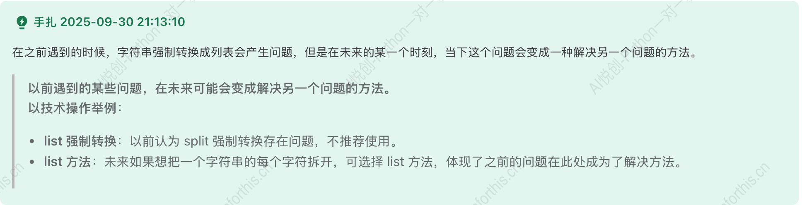
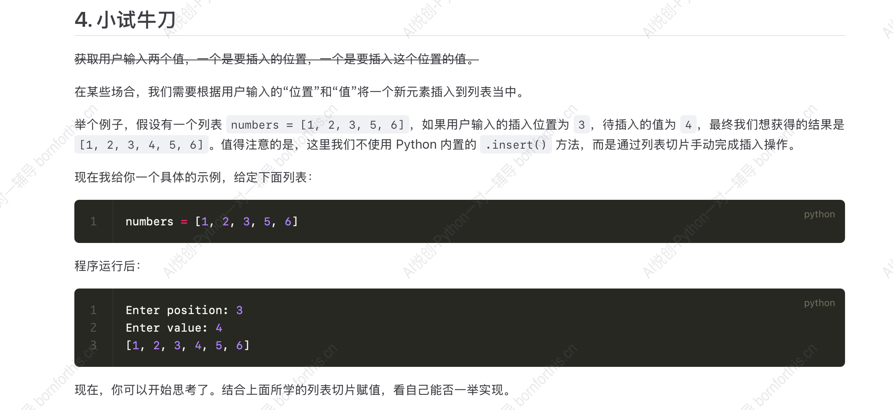
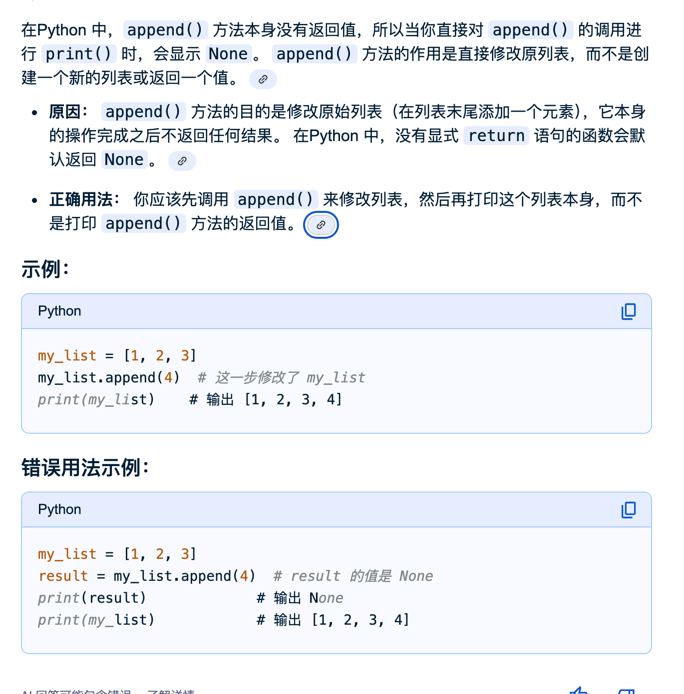
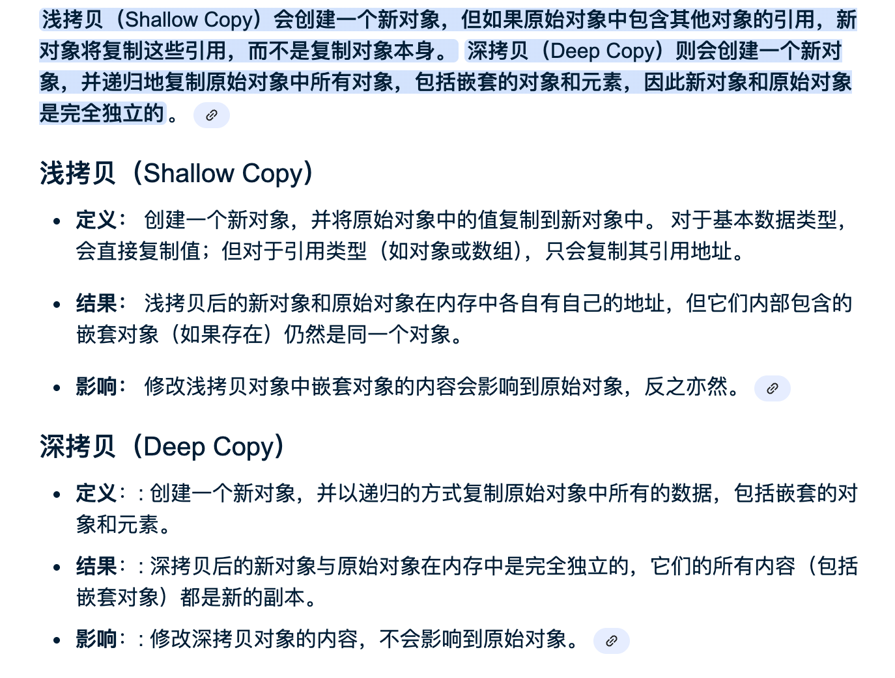
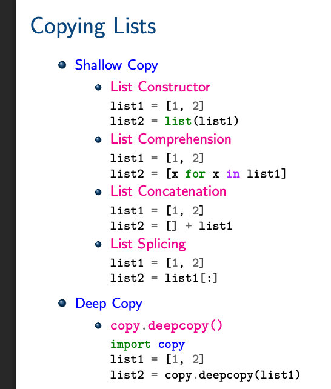
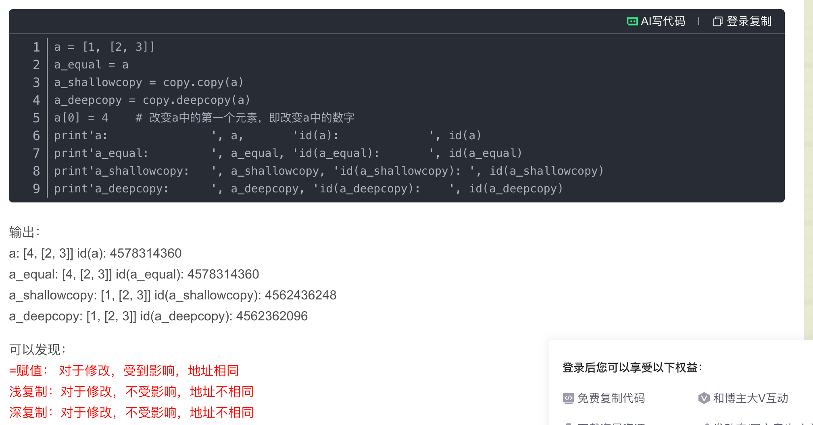
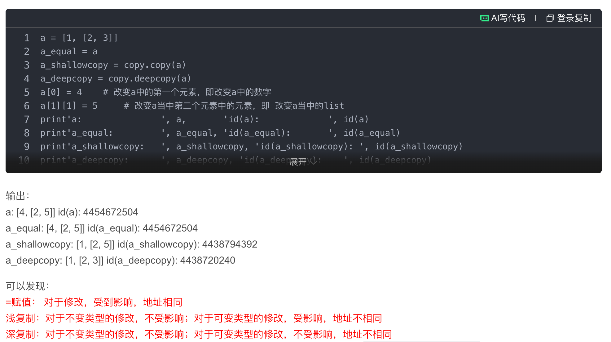

## 1. 列表的结构

### 1.1 列表的基本语法

- 使用中括号`[]`表示列表
- 列表中的元素用`,`隔开
- 请确保使用英文输入法下的逗号

如下为两个基本列表：

```python
student1 = ['aiyuechuang',18,'class01',202405]
student2 = ['bornforthis',19,'class02',202402]
```

### 1.2 列表的三大特性

1. 有序性：列表中的元素是按一定顺序存储的，可以通过索引访问。
2. 支持任意数据类型：列表可以存储不同且任意的数据类型
3. 可变性： 列表中的元素在运行过程中可被修改，后续会提及这一特性

### 1.3 字符串和列表的强制转换

在字符串的`input`环节我们提及过，当用list强制转换时，会自动识别输入的每一个字符并将它们隔离作为列表的一个元素（决定字符性质的字符不算，如字符串的第一对引号）

如：

```python
a = list(input())
print(a)
```

```python
/Users/yhy/Coder/.venv/bin/python /Users/yhy/Coder/experiment/06.py 
'asda'
["'", 'a', 's', 'd', 'a', "'"]

Process finished with exit code 0

```

也就是说：我们可以利用这个性质，将字符串的每一个字符自动拆解，从而避免遗漏。

> 以前遇到的一些问题，可能成为将来解决某些问题的方案

## 2. 获取列表的某些元素

### 2.1 单个字符元素

```python
grade = [98,99,95,80]
#98
print(grade[0])
#178
print(grade[0]+grade[3])
```

### 2.2 提取多个连续字符元素

```python
grade = [0,1,2,3,4,5,6,7,8,9]
# [2,3,4,5]
print(grade[2:6])
# [7,8,9]
print(grade[7:10])
```

结果为：

````python
/Users/yhy/Coder/.venv/bin/python /Users/yhy/Coder/experiment/06.py 
[2, 3, 4, 5]
[7, 8, 9]

Process finished with exit code 0

````

观察发现：与字符串的提取规则并无区别，但提取多个元素时，输出结果会保留列表

### 2.2 提取多个不连续字符元素

```python
grade = [0,1,2,3,4,5,6,7,8,9]
# [1,3,5]
print(grade[1:6:2])
# [0,2,4，6，8]
print(grade[0:9:2])
# [8,7,6]
print(grade[-2:-5:-1])
# [9,7,5,3,1]
print(grade[-1:-10:-2])
```

结果为:

```python
[1, 3, 5]
[0, 2, 4, 6, 8]
[8, 7, 6]
[9, 7, 5, 3, 1]

Process finished with exit code 0
```

## 3. 列表的切片赋值

### 3.1 列表的部分覆盖

```python
In [2]: list("Python")
Out[2]: ['P', 'y', 't', 'h', 'o', 'n']

In [3]: name = list("Python")

In [4]: name[2:]
Out[4]: ['t', 'h', 'o', 'n']

In [5]: name[2:] = list('abc')

In [6]: name
Out[6]: ['P', 'y', 'a', 'b', 'c']
```

如上表所示：

我们的name[2:]本质上就是`[‘t’,'h','o','n']`,而list(‘abc’)已经如上表所示，我们拿list(‘abc’)直接覆盖name[2:]就会导致name中的后四元素直接被覆盖，而前两个元素不受影响，从而达到部分覆盖的效果

::: tips

```python
In [8]: number = [1,5]

In [9]: number[1:1]
Out[9]: []

```

如上表：我们发现Out9的输出结果为空列表而并非报错

这是因为：左侧为闭区间，指定的元素为number中的5 ，右边为开区间，无法览索到 5 ，因为索引只能取整数的特性，它从本质上指定的是1 ，那么这就导致，start和end 发生了反转，与步长方向相反，由字符串中反向索引章节中的描述，此时应当取到空列表而非报错

:::

## 4. 小试牛刀



方法1:

```python
numbers = [1,2,3,5,6]
c = int(input("Enter position:"))
a = numbers[0:c]
b = numbers[c:]
d = int(input("Enter value:"))
new_numbers = a+[d]+b
print(new_numbers)
```

方法2:

```python
numbers = [1,2,3,5,6]
c = int(input("Enter position:"))
d = int(input("Enter value:"))
numbers[c:c]=[d]
print(numbers)
```

## 5. Insert 函数

`.insert(index, element)`是一个列表的基本方法，用于在列表的指定位置插入某个元素

- Index: 指定要插入元素的位置。索引从0开始，如果指定的索引超出了列表的当前长度不会报错，而是将元素添加到列表的末尾
- element：要插入的元素，可以是任意类型数据(数字，字符串，对象等)

示例：

```python
numbers = [1,2,3,5,6]
numbers.insert(3,4)
print(numbers)
```

结果为：

```python
/Users/yhy/Coder/.venv/bin/python /Users/yhy/Coder/experiment/04.py 
[1, 2, 3, 4, 5, 6]

Process finished with exit code 0
```

## 6. Len 函数

在列表中，len()不再记录字符个数，而是记录元素的个数，本质上这与其索引逻辑有关

示例：

```python
student_list =['李雷','韩梅梅','马冬梅','AI悦创','黄婉棠']
print(len(student_list))
```

结果为：

```python
/Users/yhy/Coder/.venv/bin/python /Users/yhy/Coder/experiment/04.py 
5

Process finished with exit code 0
```

## 7. 列表中修改元素

### 7.1 修改单个元素

```python
name = ['Lilei','hanmeimei']
print('before:',name)

name[0] = 'madongmei'
print('after:',name)
```

结果为：

```python
/Users/yhy/Coder/.venv/bin/python /Users/yhy/Coder/experiment/04.py 
before: ['Lilei', 'hanmeimei']
after: ['madongmei', 'hanmeimei']

Process finished with exit code 0

```

### 7.2 修改多个元素

1. 修改前后索引长度相同：

```python
numbers = [0,1,2,3,4,5,6,7,8,9,10]
print('before:',numbers)
numbers[1:5] = ['one','two','three','four']
print('after:',numbers)
```

结果为：

```python
/Users/yhy/Coder/.venv/bin/python /Users/yhy/Coder/experiment/04.py 
before: [0, 1, 2, 3, 4, 5, 6, 7, 8, 9, 10]
after: [0, 'one', 'two', 'three', 'four', 5, 6, 7, 8, 9, 10]

Process finished with exit code 0
```

2. 修改前后索引长度不等：

```python
numbers = [0,1,2,3,4,5,6,7,8,9,10]
print('before:',numbers)
numbers[1:5] = ['one','two','three']
print('after:',numbers)
```

结果为：

```python
numbers = [0,1,2,3,4,5,6,7,8,9,10]
print('before:',numbers)
numbers[1:5] = ['one','two','three']
print('after:',numbers)
```

发现不等情况下会识别开始点和结束点自动替换

3. 修改值不是列表：

```python
numbers = [0,1,2,3,4,5,6,7,8,9,10]
print('before:',numbers)
numbers[1:5] = 'asd'
print('after:',numbers)
```

结果为：

```python
/Users/yhy/Coder/.venv/bin/python /Users/yhy/Coder/experiment/04.py 
before: [0, 1, 2, 3, 4, 5, 6, 7, 8, 9, 10]
after: [0, 'a', 's', 'd', 5, 6, 7, 8, 9, 10]

Process finished with exit code 0

```

发现如果输入字符串会将其中每一个字符都单作一个字符串元素纳入新的列表之中

而如果输入数字：

```python
numbers = [0,1,2,3,4,5,6,7,8,9,10]
print('before:',numbers)
numbers[1:5] = 123
print('after:',numbers)
```

结果就会报错

经过测试：我们发现：元组，列表，字符串,集合,字典均可以替换元素

## 8. append()

append 函数是专门对于列表的函数，用于在列表最后直接添加一个元素，但注意是直接对原列表修改，而不是创造一个新列表

因此，值得注意的是：



甚至可以直接：

```python
a = [1,2,3]
a.append(1)
print(a)
```

结果为：

```python
/Users/yhy/Coder/.venv/bin/python /Users/yhy/Coder/experiment/05.py 
[1, 2, 3, 1]

Process finished with exit code 0

```

## 9.  vbcshallow copy 和 deep copy



复制分类：



值得注意的是，当改变的元素为不可变类型时，shallow 和 deep 没有区别，都是不会影响源代码

但当改变的元素为可变类型时，sallow开始与deep存在上述区别

当不可变类型时：



当为可变类型时：




