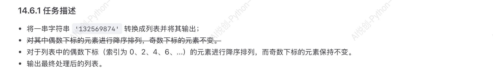

## 1. 列表的结构

### 1.1 列表的基本语法

- 使用中括号`[]`表示列表
- 列表中的元素用`,`隔开
- 请确保使用英文输入法下的逗号

如下为两个基本列表：

```python
student1 = ['aiyuechuang',18,'class01',202405]
student2 = ['bornforthis',19,'class02',202402]
```

### 1.2 列表的三大特性

1. 有序性：列表中的元素是按一定顺序存储的，可以通过索引访问。
2. 支持任意数据类型：列表可以存储不同且任意的数据类型
3. 可变性： 列表中的元素在运行过程中可被修改，后续会提及这一特性

### 1.3 字符串和列表的强制转换

在字符串的`input`环节我们提及过，当用list强制转换时，会自动识别输入的每一个字符并将它们隔离作为列表的一个元素（决定字符性质的字符不算，如字符串的第一对引号）

如：

```python
a = list(input())
print(a)
```

```python
/Users/yhy/Coder/.venv/bin/python /Users/yhy/Coder/experiment/06.py 
'asda'
["'", 'a', 's', 'd', 'a', "'"]

Process finished with exit code 0

```

也就是说：我们可以利用这个性质，将字符串的每一个字符自动拆解，从而避免遗漏。

> 以前遇到的一些问题，可能成为将来解决某些问题的方案

## 2. 获取列表的某些元素

### 2.1 单个字符元素

```python
grade = [98,99,95,80]
#98
print(grade[0])
#178
print(grade[0]+grade[3])
```

### 2.2 提取多个连续字符元素

```python
grade = [0,1,2,3,4,5,6,7,8,9]
# [2,3,4,5]
print(grade[2:6])
# [7,8,9]
print(grade[7:10])
```

结果为：

````python
/Users/yhy/Coder/.venv/bin/python /Users/yhy/Coder/experiment/06.py 
[2, 3, 4, 5]
[7, 8, 9]

Process finished with exit code 0

````

观察发现：与字符串的提取规则并无区别，但提取多个元素时，输出结果会保留列表

### 2.2 提取多个不连续字符元素

```python
grade = [0,1,2,3,4,5,6,7,8,9]
# [1,3,5]
print(grade[1:6:2])
# [0,2,4，6，8]
print(grade[0:9:2])
# [8,7,6]
print(grade[-2:-5:-1])
# [9,7,5,3,1]
print(grade[-1:-10:-2])
```

结果为:

```python
[1, 3, 5]
[0, 2, 4, 6, 8]
[8, 7, 6]
[9, 7, 5, 3, 1]

Process finished with exit code 0
```

## 3. 列表的切片赋值

### 3.1 列表的部分覆盖

```python
In [2]: list("Python")
Out[2]: ['P', 'y', 't', 'h', 'o', 'n']

In [3]: name = list("Python")

In [4]: name[2:]
Out[4]: ['t', 'h', 'o', 'n']

In [5]: name[2:] = list('abc')

In [6]: name
Out[6]: ['P', 'y', 'a', 'b', 'c']
```

如上表所示：

我们的name[2:]本质上就是`[‘t’,'h','o','n']`,而list(‘abc’)已经如上表所示，我们拿list(‘abc’)直接覆盖name[2:]就会导致name中的后四元素直接被覆盖，而前两个元素不受影响，从而达到部分覆盖的效果

::: tips

```python
In [8]: number = [1,5]

In [9]: number[1:1]
Out[9]: []

```

如上表：我们发现Out9的输出结果为空列表而并非报错

这是因为：左侧为闭区间，指定的元素为number中的5 ，右边为开区间，无法览索到 5 ，因为索引只能取整数的特性，它从本质上指定的是1 ，那么这就导致，start和end 发生了反转，与步长方向相反，由字符串中反向索引章节中的描述，此时应当取到空列表而非报错

:::

## 4. 小试牛刀


方法1:

```python
numbers = [1,2,3,5,6]
c = int(input("Enter position:"))
a = numbers[0:c]
b = numbers[c:]
d = int(input("Enter value:"))
new_numbers = a+[d]+b
print(new_numbers)
```

方法2:

```python
numbers = [1,2,3,5,6]
c = int(input("Enter position:"))
d = int(input("Enter value:"))
numbers[c:c]=[d]
print(numbers)
```

## 5. Insert 函数

`.insert(index, element)`是一个列表的基本方法，用于在列表的指定位置插入某个元素

- Index: 指定要插入元素的位置。索引从0开始，如果指定的索引超出了列表的当前长度不会报错，而是将元素添加到列表的末尾
- element：要插入的元素，可以是任意类型数据(数字，字符串，对象等)

示例：

```python
numbers = [1,2,3,5,6]
numbers.insert(3,4)
print(numbers)
```

结果为：

```python
/Users/yhy/Coder/.venv/bin/python /Users/yhy/Coder/experiment/04.py 
[1, 2, 3, 4, 5, 6]

Process finished with exit code 0
```

## 6. Len 函数

在列表中，len()不再记录字符个数，而是记录元素的个数，本质上这与其索引逻辑有关

示例：

```python
student_list =['李雷','韩梅梅','马冬梅','AI悦创','黄婉棠']
print(len(student_list))
```

结果为：

```python
/Users/yhy/Coder/.venv/bin/python /Users/yhy/Coder/experiment/04.py 
5

Process finished with exit code 0
```

## 7. 列表中修改元素

### 7.1 修改单个元素

```python
name = ['Lilei','hanmeimei']
print('before:',name)

name[0] = 'madongmei'
print('after:',name)
```

结果为：

```python
/Users/yhy/Coder/.venv/bin/python /Users/yhy/Coder/experiment/04.py 
before: ['Lilei', 'hanmeimei']
after: ['madongmei', 'hanmeimei']

Process finished with exit code 0

```

### 7.2 修改多个元素

1. 修改前后索引长度相同：

```python
numbers = [0,1,2,3,4,5,6,7,8,9,10]
print('before:',numbers)
numbers[1:5] = ['one','two','three','four']
print('after:',numbers)
```

结果为：

```python
/Users/yhy/Coder/.venv/bin/python /Users/yhy/Coder/experiment/04.py 
before: [0, 1, 2, 3, 4, 5, 6, 7, 8, 9, 10]
after: [0, 'one', 'two', 'three', 'four', 5, 6, 7, 8, 9, 10]

Process finished with exit code 0
```

2. 修改前后索引长度不等：

```python
numbers = [0,1,2,3,4,5,6,7,8,9,10]
print('before:',numbers)
numbers[1:5] = ['one','two','three']
print('after:',numbers)
```

结果为：

```python
numbers = [0,1,2,3,4,5,6,7,8,9,10]
print('before:',numbers)
numbers[1:5] = ['one','two','three']
print('after:',numbers)
```

发现不等情况下会识别开始点和结束点自动替换

3. 修改值不是列表：

```python
numbers = [0,1,2,3,4,5,6,7,8,9,10]
print('before:',numbers)
numbers[1:5] = 'asd'
print('after:',numbers)
```

结果为：

```python
/Users/yhy/Coder/.venv/bin/python /Users/yhy/Coder/experiment/04.py 
before: [0, 1, 2, 3, 4, 5, 6, 7, 8, 9, 10]
after: [0, 'a', 's', 'd', 5, 6, 7, 8, 9, 10]

Process finished with exit code 0

```

发现如果输入字符串会将其中每一个字符都单作一个字符串元素纳入新的列表之中

而如果输入数字：

```python
numbers = [0,1,2,3,4,5,6,7,8,9,10]
print('before:',numbers)
numbers[1:5] = 123
print('after:',numbers)
```

结果就会报错

经过测试：我们发现：元组，列表，字符串,集合,字典均可以替换元素

## 8. 添加或删除元素

### 8.1 append()

```python
inventory = ['钥匙','毒药']
print('before:',inventory)
inventory.append('解药')
print('after:',inventory)
```

结果为：

```python
/Users/yhy/Coder/.venv/bin/python /Users/yhy/Coder/experiment/03.py 
before: ['钥匙', '毒药']
after: ['钥匙', '毒药', '解药']

Process finished with exit code 0

```

append 函数是专门对于列表的函数，用于在列表最后直接添加一个元素，但注意是直接对原列表修改，而不是创造一个新列表

因此，值得注意的是：


甚至可以直接：

```python
a = [1,2,3]
a.append(1)
print(a)
```

结果为：

```python
/Users/yhy/Coder/.venv/bin/python /Users/yhy/Coder/experiment/05.py 
[1, 2, 3, 1]

Process finished with exit code 0

```

注意append只能单次添加单个元素

故不能输入：

```python
a = [1,2,3]
print(a.append(1,2))
```

会发生严重报错

只能输入单个元素的合法代码

### 8.2 extend 函数

extend与append功能相似，但其是将一个可迭代对象（如另一个列表）中的所有元素逐个添加到原列表的末尾。 这意味着它会直接修改原始列表，而不是创建一个新列表。 

示例1：

```python
inventory = ['钥匙','毒药','解药']
inventory.extend(['迷药','感冒药'])
print(inventory)
```

结果为：

```python
/Users/yhy/Coder/.venv/bin/python /Users/yhy/Coder/experiment/03.py 
['钥匙', '毒药', '解药', '迷药', '感冒药']

Process finished with exit code 0
```

示例2：

```python
list1 = [1, 2, 3]
list2 = [4, 5, 6]
list1.extend(list2)
print(list1)
# 输出：[1, 2, 3, 4, 5, 6]
```

与 `append()` 的区别

- `extend()`：: 将一个序列中的每个元素都添加进来，形成多个元素。 
- `append()`：: 将参数作为一个整体，作为一个单一元素添加到列表的末尾。 

```python
list1 = [1, 2]
list2 = [3, 4]

list1.extend(list2)
print(list1) # 输出：[1, 2, 3, 4]

list3 = [1, 2]
list3.append(list2)
print(list3) # 输出：[1, 2, [3, 4]]
```

### 8.3 delete()

Delete 函数用于删除列表中的内容

示例：

```python
# 删除指定索引的元素
student_list = ['李雷','韩梅梅','马冬梅']
del student_list[0] # 删除索引 0 处的元素("李雷")
print(student_list)
# 删除整个列表
student_list = ['李雷','韩梅梅','马冬梅']
del student_list #删除整个列表
print(student_list) # 后续访问该已删除列表就会报错
```

报错结果：

```python
/Users/yhy/Coder/.venv/bin/python /Users/yhy/Coder/experiment/03.py 
Traceback (most recent call last):
  File "/Users/yhy/Coder/experiment/03.py", line 8, in <module>
    print(student_list) # 后续访问该已删除列表就会报错
          ^^^^^^^^^^^^
NameError: name 'student_list' is not defined

Process finished with exit code 1
```

### 8.4 pop()

pop 函数默认删除列表后的最后一个元素，也可以传参数指定要删除元素的下标，删除时会返回删除的元素

示例:

```python
student_list = ['李雷','韩梅梅','马冬梅']

# 删除并返回最后一个元素
removed = student_list.pop()
print('删除的元素:',removed)
print(student_list)

# 删除索引 0 处的元素
student_list.pop(0)
print(student_list)
```

结果为：

```python
/Users/yhy/Coder/.venv/bin/python /Users/yhy/Coder/experiment/03.py 
删除的元素: 马冬梅
['李雷', '韩梅梅']
['韩梅梅']

Process finished with exit code 0
```

与上方相同，pop 也是直接修改原函数，但它能返回被删除的元素

那么，相比于delete，pop的优势在哪呢，细节如下：

```python
from asyncio import current_task

stack = []
# 入栈
stack.append('task1')
stack.append('task2')

# 出栈并获取元素
current_task = stack.pop()
print(current_task) # 'task2'

# 有序处理列表中的元素
# todo： 比如你有一个待办事项列表，想在列表的末尾添加新的任务，
#  并从末尾弹出'最紧急'或'最近添加'的那个任务去做。此时 pop() 返回的就是刚移除的的任务项，你可以立即根据这个返回值来执行对应的逻辑。
todo_list = ['写报告','复习资料','预约会议']
current_task = todo_list.pop() #删除并获取'预约会议'
print(f"正在处理任务: {current_task}")

# 从特定位置删除并获取元素
# todo: 如果给pop()传入一个索引，它就会删除并返回该位置的元素
#  对于存储了结构化数据或需要在特定位置"取走一个元素"再做分析的情形，会非常方便
students = ['Alice','Bob','Charlie','David']
# 比如要把队列中的第一个人 pop 出来做一些操作
first_student = students.pop(0)
print(first_student)

# 在中途需要转移元素的情况
to_process = ['文件A','文件B','文件C']
processed = []

while to_process:
    file = to_process.pop() #获取并删除列表最后一个
    # 对 file 做一些处理操作
    processed.append(file)
print(processed)
#['文件C','文件B','文件A']
```

### 8.5 remove()

```python
# todo: 如果你需要根据元素的内容来删除元素，而不想费心去查找索引，
#  就可以使用 remove()。它会删除列表中的第一个匹配的元素
#  例如：remove('aivc') 则指定删除列表中的 'aivc' 元素
student_list =['李雷','韩梅梅','马冬梅']
student_list.remove('韩梅梅')
print(student_list)

# 需要注意的是，如果列表中没有匹配到指定的值，就会抛出 ValurError 异常
student_list = ['李雷','韩梅梅','马冬梅']
student_list.remove('小悦')
print(student_list)

```

报错结果为:

```python
Traceback (most recent call last):
  File "/Users/yhy/Coder/experiment/03.py", line 10, in <module>
    student_list.remove('小悦')
    ~~~~~~~~~~~~~~~~~~~^^^^^^^^
ValueError: list.remove(x): x not in list

```

## 9. 列表的拼接

示例：

```python
# 两个列表可以用 + 拼接，得到一个新的列表对象，例如：
number1 = [0,1,2,3,4]
number2 = [5,6,7,8,9]
print(number1+number2)
```

结果为：

```python
/Users/yhy/Coder/.venv/bin/python /Users/yhy/Coder/experiment/03.py 
[0, 1, 2, 3, 4, 5, 6, 7, 8, 9]

Process finished with exit code 0

```


## 10.shallow copy 和 deep copy


复制分类：


值得注意的是，当改变的元素为不可变类型时，shallow 和 deep 没有区别，都是不会影响源代码

但当改变的元素为可变类型时，sallow开始与deep存在上述区别

当不可变类型时：


当为可变类型时：


## 11.列表的特殊性质

当`a = [b,c,d]`时，我们在代码中可以直接用

`b,c,d =a`来表示b,c,d就是a中的b,c,d

```python
def main(a): #a = [b,c,d]
    b,c,d =a
```

通过这种方式即可直接调用b，c，d

## 12. 判断某元素是否存在于列表之中「Value in Sequence」

```python
inventory = ['钥匙','毒药','解药']
print('解药' in inventory)
print('迷药'in inventory)
```

这是一个通用的方法，字符串,列表，元组，集合均可以使用这个方法，而字典只会判断键（key）在不在其中，值不会判断

## 13.获取列表中的元素的重复次数

```python
numbers = [0,1,1,2,3,4,1]
print(numbers.count(1))
```

结果为：

```python
/Users/yhy/Coder/.venv/bin/python /Users/yhy/Coder/experiment/03.py 
3

Process finished with exit code 0
```

## 14, 获取列表中某个元素第一次出现的位置—— index()

`index()`方法返回某个元素在列表中第一次出现的索引，语法: 列表.index(元素)，如果元素不存在，则会报错：

```python
numbers = [0,1,1,2,3,4,1]
print(numbers.index(1))
print(numbers.index(5))
```

结果为：

```python
/Users/yhy/Coder/.venv/bin/python /Users/yhy/Coder/experiment/03.py 
1
Traceback (most recent call last):
  File "/Users/yhy/Coder/experiment/03.py", line 3, in <module>
    print(numbers.index(5))
          ~~~~~~~~~~~~~^^^
ValueError: 5 is not in list

Process finished with exit code 1

```

## 15.列表排序

python 提供了多种方式对列表进行排序，常见的有`list.sort()`和内置函数`sorted`。两者最大的区别在于:

- `list.sort()`:原地排序，会直接修改调用该方法的列表本身，不会返回新列表。
- `sorted(irerable)`:非原地排序，会新建一个列表，并返回排序后的结果，原列表或可迭代对象不变

```python
numbers = [2,1,4,3,7,6,5,0,9,8]
numbers.sort()
print(numbers)

numbers = [2,1,4,3,7,6,5,0,9,8]
numbers.sort(reverse = True)
print(numbers)
```

结果为：

```python
/Users/yhy/Coder/.venv/bin/python /Users/yhy/Coder/experiment/03.py 
[0, 1, 2, 3, 4, 5, 6, 7, 8, 9]
[9, 8, 7, 6, 5, 4, 3, 2, 1, 0]

Process finished with exit code 0

```

## 16. 小试牛刀



尝试：

```python
a = list('132569874')
a[::2].sort(reverse=True)
print(a)
```

结果发现：

```python
/Users/yhy/Coder/.venv/bin/python /Users/yhy/Coder/experiment/02.py 
['1', '3', '2', '5', '6', '9', '8', '7', '4']

Process finished with exit code 0

```

a 并未因其修改而发生改变，但我们学过：

```python
a = [1,2,3]
a[0] = 2
print(a)
```

结果却发生了修改，变为：

```python
/Users/yhy/Coder/.venv/bin/python /Users/yhy/Coder/experiment/01 .py 
[2, 2, 3]

Process finished with exit code 0

```

这是为什么呢？

仔细观察发现，上方的修改比下方少了个赋值符号，但本质上都是从原列表进行的修改，也就是说，在无赋值符号时，对原列表进行修改的操作似乎并不会直接影响到原列表。那么这么处理的意义在于何处呢

我们不妨想象一下：

```python
a = list('132569874')
b = a[::2].sort(reverse=True)
c = a[0]
```

我们在上述过程中想取b，c分别为a的两个部分的取值，如果直接将提取内容修改并覆盖到原列表中，就会污染c的值，在实际的代码书写中，我们极可能出现上百行代码，此时如果有任何一个像b一样的修改发生，后续的一切关于a的取值都会受影响且难以检测，这对于程序来说是致命且极易发生的，为了避免这一情况发生，直接覆盖到原代码的操作仅被限制在赋值符号`=`输入时发生，因为基本所有情况下使用赋值符号就是为了修改原数据，这样就可以避免出现上述问题