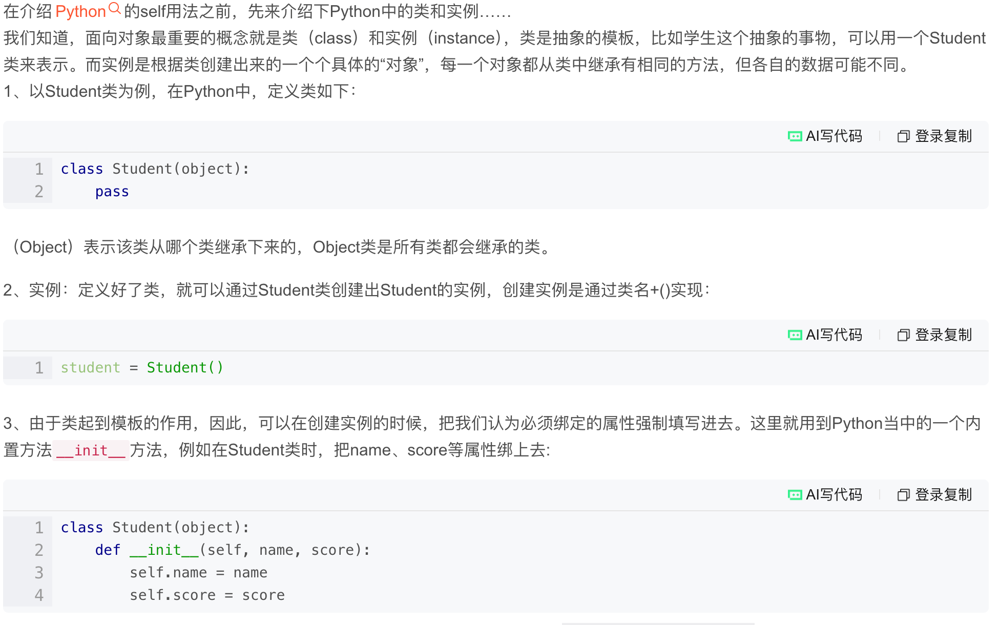
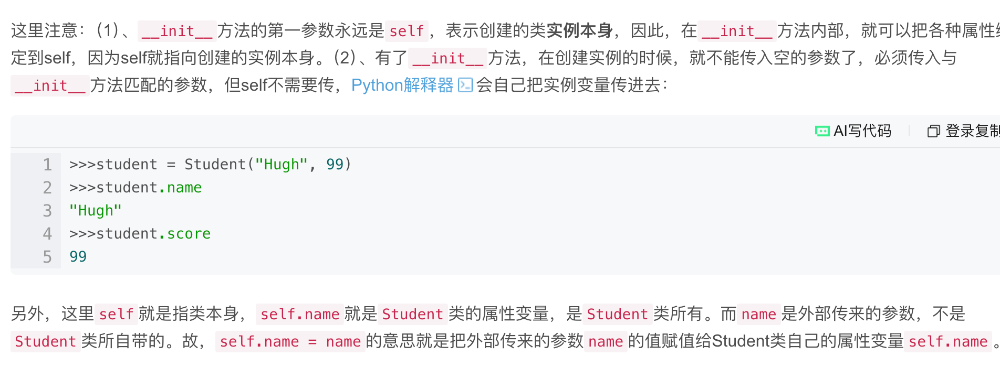

在 Python 中，`class` 关键字用于定义一个类，它是一种创建对象的模板或蓝图，用于组织和封装数据与功能。类定义了对象的属性（数据）和方法（行为），创建类后，你可以从这个类中实例化出多个具体对象，每个对象都拥有类中定义的属性和方法，可以独立运作。`class` 是面向对象编程（OOP）的核心，支持继承、封装和多态等特性，有助于构建模块化和可重用的代码。 

`class` 主要作用

- **蓝图和模板**：`class` 提供了一种定义数据结构的方式，可以看作是创建对象的蓝图。例如，一个 `Car` 类可以用来创建各种具体的汽车对象。
- **封装数据和行为**：类将相关的属性（如 `Car` 类的颜色、品牌等）和方法（如 `Car` 类的加速、刹车等）绑定在一起，形成一个独立的单元。
- **创建对象**：通过 `class` 定义，你可以创建该类的具体实例，这些实例就是对象。例如，`my_car = Car()` 就是一个从 `Car` 类创建的 `my_car` 对象。
- **实现面向对象编程**：`class` 是实现面向对象编程（OOP）的基础，它支持：
    - **继承**：允许一个新类继承现有类的属性和方法，以实现代码重用。
    - **封装**：隐藏对象的内部细节，只暴露必要的接口，确保数据的安全性。
    - **多态**：允许不同的对象对相同的方法调用做出不同的响应。 

关键概念

- **属性（Attributes）**：类中存储数据的数据项，可以是类变量或实例变量。
- **方法（Methods）**：在类中定义的函数，用于执行特定的操作或行为，可以操作对象的属性。
- **实例化（Instantiation）**：创建类的一个具体对象的过程。
- **`__init__`方法**：一个特殊的方法，称为构造函数，在创建新对象时会自动调用，用于初始化对象的属性。
- **`self`**：在方法中，`self` 指代实例本身，用来访问和修改实例的属性。 

```python
class Dog:
    # 这是类属性，所有实例共享
    species = "Canis familiaris"
	dc 
    # 这是初始化方法（构造函数）(当且仅当在实例化执行时执行)
    def __init__(self, name, breed):
        # 实例属性
        self.name = name
        self.breed = breed

    # 这是实例方法
    def bark(self):
        print(f"{self.name} says Woof!")

    def describe(self):
        return f"{self.name} is a {self.breed}"

```

创建实例：
```python
# 创建 Dog 类的两个实例（实例化）
my_dog = Dog("Buddy", "Golden Retriever")  #这里就是init的参数
your_dog = Dog("Lucy", "Labrador")

# 访问实例属性
print(my_dog.name)
print(your_dog.breed)

```

调用实例：
```python
# 调用实例方法
my_dog.bark()
print(your_dog.describe())
```

- `my_dog.bark()` 会执行 `Dog` 类中 `bark` 方法，因为 `self` 指向 `my_dog`，所以输出会是 `Buddy says Woof!`。 

`public`、`protected`和`private`是访问修饰符，用于控制类成员（变量和函数）的访问权限。`public`成员可以从类内外任何地方访问；`private`成员只能在类内部访问；`protected`成员可以在类内部以及从该类派生的子类中访问。 

```
public
```

- **访问权限**：可以在类的内部和外部访问。
- **用途**：用于类对外暴露的接口，如需要让外部代码直接调用的方法。 

```
private
```

- **访问权限**：只能在定义它的类内部访问。
- **用途**：用于隐藏类的内部实现细节，保护数据不被外部直接修改，是实现封装的关键。 

```
protected
```

- **访问权限**：可以在类内部以及从该类派生的子类中访问。
- **用途**：在继承关系中，允许子类访问父类的成员，同时限制外部其他类的访问。 

| 修饰符      | 访问范围                 |
| :---------- | :----------------------- |
| `public`    | 类的内部和外部都可访问   |
| `private`   | 仅在类内部可访问         |
| `protected` | 类的内部和派生类中可访问 |

- 在 Python 中，可以通过名称约定来定义成员的可访问性，而不是像其他一些语言那样使用关键字。public 成员是默认的，直接命名即可；protected 成员可以通过在名称前加上单个下划线 `_` 来表示，表示该成员不希望被外部直接访问，但子类可以访问；private 成员通过在名称前加上两个下划线 `__` 来表示，Python 会进行“名称混淆”（name mangling），使得它不容易被外部和子类直接访问。 
- **public** 
- **定义方式：** 直接在类中定义，不加任何前缀。
- **可访问性：** 可以在类的外部、内部以及子类中直接访问。 


- **protected **

- **定义方式：** 在成员名称前加上一个下划线 `_`。

- **可访问性：** 在 Python 中，这种方式是一种约定，表示该成员不希望(在python中仅仅是不希望)在类的外部被直接访问，但可以被子类继承和访问。 

    

- **private **

- **定义方式：** 在成员名称前加上两个下划线 `__`。

- **可访问性：** Python 会对 `__` 前缀的成员进行名称混淆，将其变成 `_ClassName__memberName` 的形式，这样外部就无法直接通过 `__memberName` 访问了。(你也可以利用这个机制来用上述变化后的形式直接调用private的member)

示例：

```python
class MyClass:
    def __init__(self):
        self.public_var = 10
        self._protected_var = 20
        self.__private_var = 30

    def my_method(self):
        print(self.public_var)
        print(self._protected_var)
        print(self.__private_var)

obj = MyClass()
print(obj.public_var)
print(obj._protected_var)
# print(obj.__private_var) # 这行会报错
# 实际上，可以通过名称混淆的方式访问：
print(obj._MyClass__private_var)

```

python protected 的特殊性：可在类外部调用

- **不建议**直接在类外部通过实例来访问以 `_` 开头的受保护成员，因为这违反了使用下划线的约定。
- 但是，Python 的设计允许这样做，它不会像其他一些语言那样阻止这种访问。这种灵活性也意味着开发者需要自行判断和承担后果，因为直接访问受保护成员可能导致代码不可靠或难以维护。
- 如果需要强制进行访问，可以直接通过 `_` 开头的变量名进行调用，例如 `my_instance._protected_member`。 




