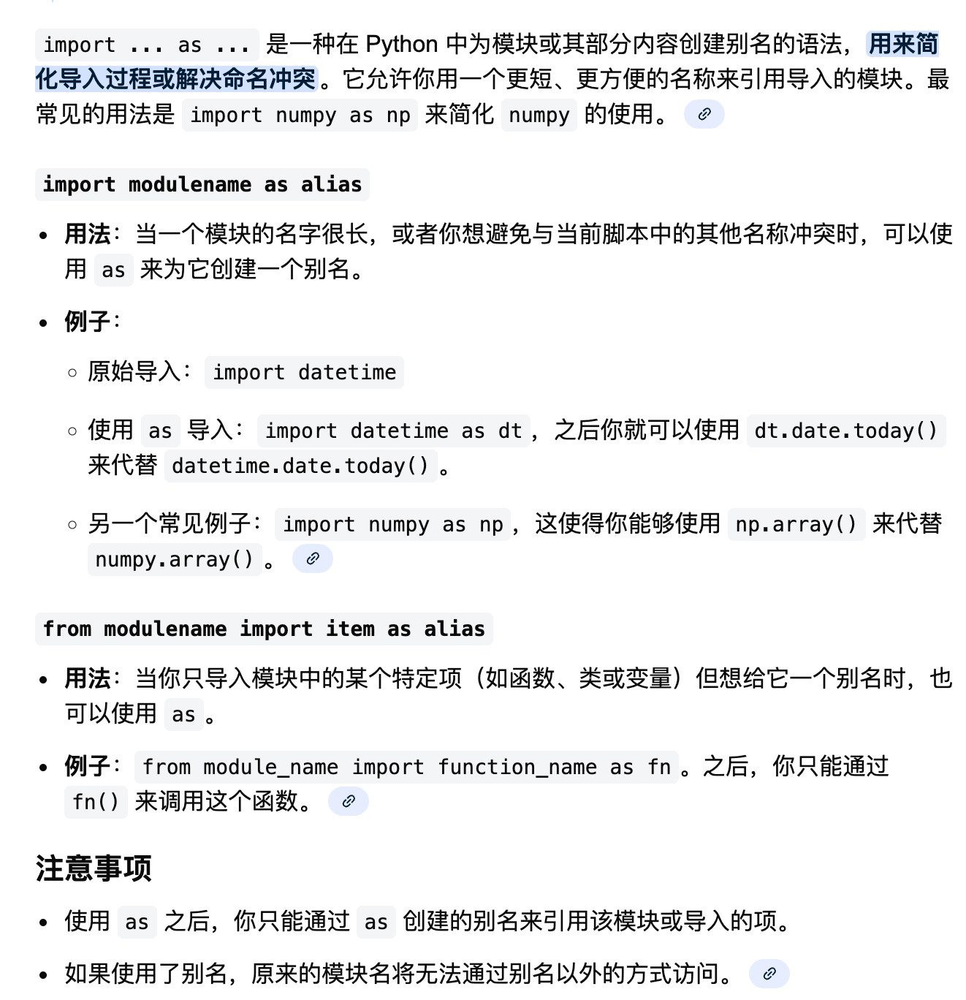

## import

`import` 是 Python 中的一个关键字，用于将其他模块或库中的代码导入到当前程序中使用，使你可以调用其中定义的函数、类和变量。主要用法包括 `import module_name`（导入整个模块）和 `from module_name import function_name`（仅导入特定部分）。 

主要用法

- **导入整个模块：** 使用 `import module_name` 来导入一个完整的模块。访问该模块中的内容时，需要使用 `module_name.function_name` 的格式。
    - **示例：** `import datetime`
- **导入模块的特定部分：** 使用 `from module_name import function_name` 来只导入模块中的特定函数或类，这样可以直接使用该函数名。
    - **示例：** `from datetime import date`
- **导入多个模块：** 可以用逗号分隔一次导入多个模块。
    - **示例：** `import module1, module2`
- **导入所有内容（不推荐）：** 使用 `from module_name import *` 可以导入模块中所有内容，但这通常不推荐，因为它可能导致命名空间混乱。 

工作原理

- 当 `import` 语句执行时，Python 会搜索指定的模块，并将其代码加载到当前程序中。
- 导入的模块会创建一个命名空间，以避免不同模块中同名函数或变量的冲突。
- `import module_name` 会创建一个模块对象，而 `from module_name import function_name` 会将指定对象的引用复制到当前作用域

import 可以联动不同文件下的函数

值得注意的是，当第一次导入某个模块时，python会自动运行一次该模块内容（内置函数等不会运行，但构造函数和print这种行为会运行），而此后无论如何导入该模块的任意部分内容，python都不会再运行了

