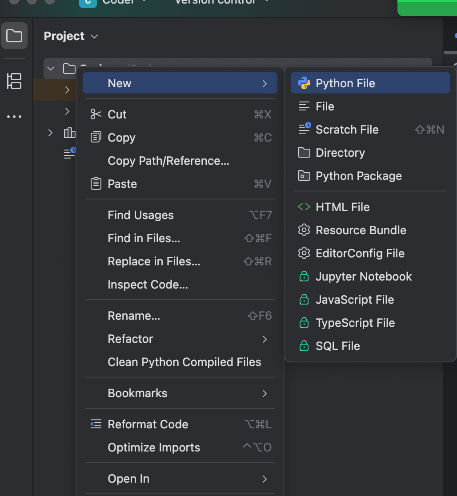

---
title:
icon: blog
date: 2025-08-13 21:57:05
author:
category:
    - 你的分类1
    - 你的分类2
tag:
    - 你的标签1
    - 你的标签2
isOriginal: true
sticky: false
star: false
article: true
timeline: true
image: false
navbar: true
sidebarIcon: true
comment: true
lastUpdated: true
editLink: true
backToTop: true
toc: true
---

## 1. pycharm基础配置

1. 新建文件夹

2. 新建python文件

python文件的好处：会自动加上.py后缀

> **venv是python基础设置，不要更改**
