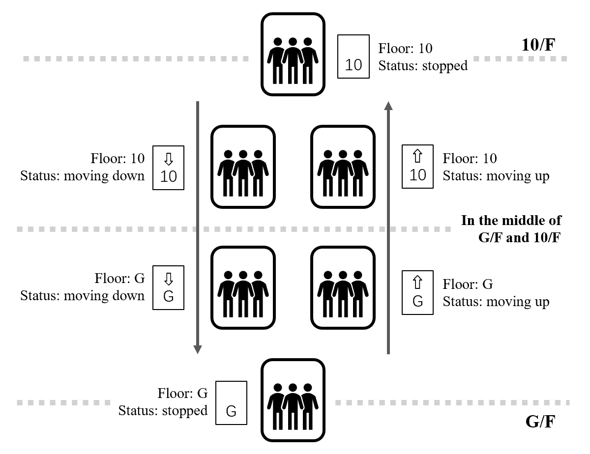
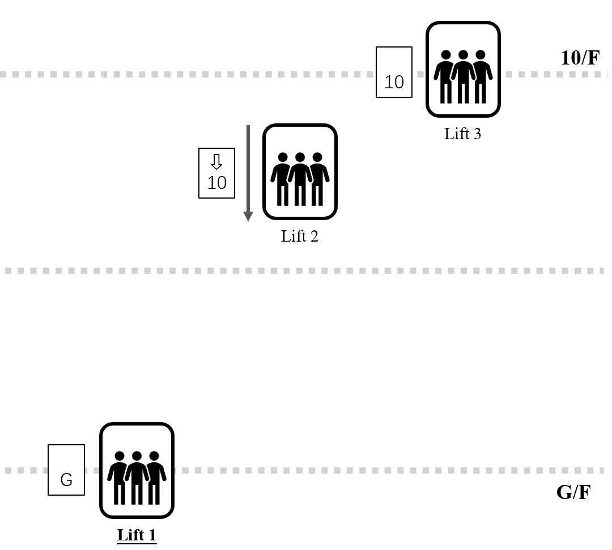
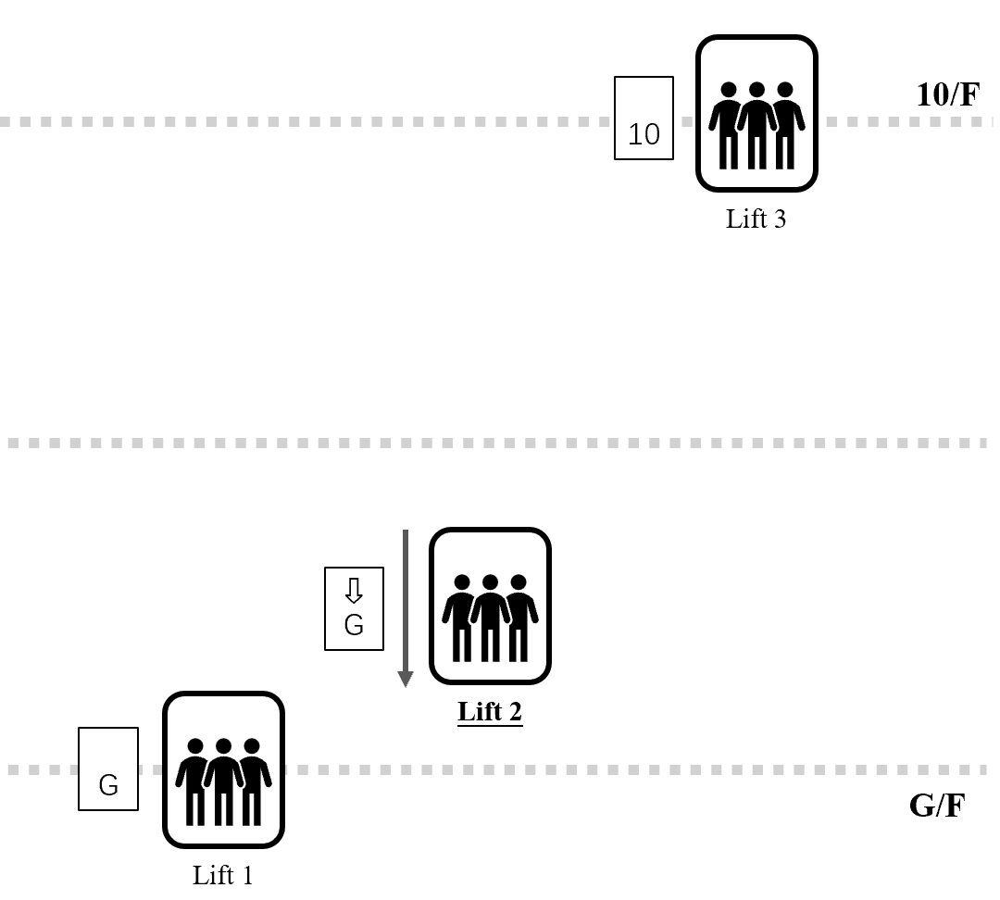
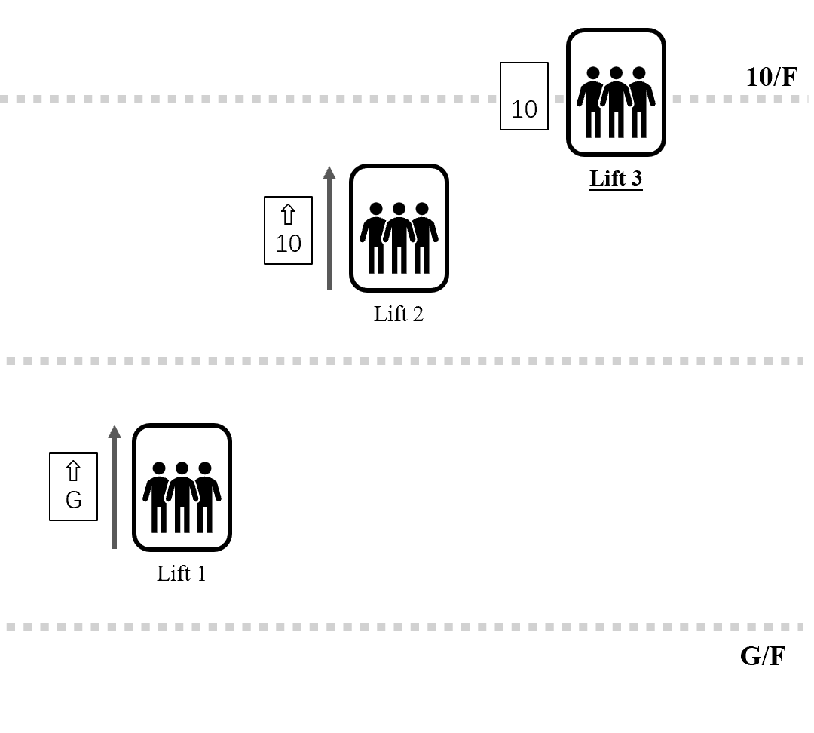

#### Background

The three lifts transport people between the ground floor (G/F) and the 10th floor (10/F). They do not stop at other floors.

Let's suppose each lift has a screen showing its current floor and status. Floor, which is a string, can be either `G` or `10`. Status, which is also a string, can be one of `moving up`, `moving down` or `stopped`. These are similar to the information that the screens for those real lifts show.

Here are some examples of what the floor and status of a lift mean:

| Floor | Status      | Meaning                                                 |
| ----- | ----------- | ------------------------------------------------------- |
| G     | moving up   | The lift is moving up, and is closer to G/F than 10/F   |
| G     | moving down | The lift is moving down, and is closer to G/F than 10/F |
| G     | stopped     | The lift is stopped at G/F                              |


You can also refer to the figure below for better understanding: 

#### Your Task

Suppose someone calls the lift at **G/F**. Given the floor and status of each lift, you need to write a Python program to figure out which lift is going to pick them up.

**It is strongly recommeded that you start from the skeleton code ([lab4_skeleton.zip](https://course.cse.ust.hk/comp1023/labs/lab4/skeleton/lab4_skeleton.zip)) provided so that the grading process can be more smooth.**

The decision rules are as follows:

- If a lift is already going down and is closer to G/F than 10/F, it will pick the person up, even if some other lift is stopped at G/F. In this way, some energy can be saved.
- Otherwise, the lift that needs the shortest time to arrive at G/F will pick the person up. For example, a lift that is stopped at G/F takes less time than a lift that is moving down from 10/F, and a lift that is moving down from 10/F takes less time than a lift that is moving up from G/F.


Here are some additional assumptions:

- If two lifts have the same floor and the same status, we assume they are at the same height.
- If there is a tie, the one with the smallest lift number will pick the person up. For example, if all lifts are stopped at G/F, then lift 1 will pick the person up.
- All lifts move at the same speed. If they arrive at 10/F, they stop for the same amount of time. No one calls the lift at 10/F.
- Only one lift will pick the person up.


If you have any questions regarding the problem statement, please post a question on Piazza.

#### More Examples

Scenario 1:



Scenario 2:



Scenario 3:



#### Hints

<details style="box-sizing: border-box;"><summary style="box-sizing: border-box; display: list-item; cursor: pointer;">You can click on this line if you want some hints (for reference only)</summary><p style="box-sizing: border-box; margin-top: 0px; margin-bottom: 0.5rem;">You may try to define and figure out a "time" or "distance" for each lift first, and then compare the time/distance to get the final answer.</p></details>

End of Lab Work

### Resources & Sample I/O

- Skeleton code: [lab4_skeleton.zip](https://course.cse.ust.hk/comp1023/labs/lab4/skeleton/lab4_skeleton.zip)

#### Sample I/O

- Public testcases: [lab4_testcases.zip](https://course.cse.ust.hk/comp1023/labs/lab4/skeleton/lab4_testcases.zip)

Note: If you run the finished program on your local computer, your output may differ from the output files provided in the testcases zip in formatting. This is ok as long as you can pass the tests on ZINC. Running your program on your own computer should give you something like this:

```
Current floor of lift 1 (G/10): 10
Status of lift 1 (moving up/moving down/stopped): stopped
Current floor of lift 2 (G/10): 10
Status of lift 2 (moving up/moving down/stopped): moving up
Current floor of lift 3 (G/10): 10
Status of lift 3 (moving up/moving down/stopped): moving down
Result:
Lift 3 will come to pick you up.
```

End of Resources & Sample I/O

### Submission & Deadline

The lab assignment is due on 11th October 2025, 23:59. We will use the online grading system [ZINC](https://zinc.cse.ust.hk/) to grade your lab work. You are required to upload **a ZIP archive** containing the following files to ZINC:

- `lift.py`

You can submit your code to ZINC as many times as you like before the deadline. Only your last submission will be graded. After the due date, we will regrade your work using hidden test cases. We do this to ensure that students don't just hardcode the answers, like printing the correct outputs without really solving the problems. The hidden test cases will be similar in difficulty to the provided test cases but will use different inputs (this might not apply to the programming assignment). Also, please keep in mind that getting full marks with the provided test cases before the deadline doesn't guarantee you will get full marks with the hidden test cases after the deadline, since the inputs will be different.

End of Submission & Deadline

### Changelog

No changes have been made.

End of Changelog

### Frequently Asked Questions

##### My code doesn't work / there is an error, here is the code. Can you help me fix it?

As the lab assignment is a major course assessment, to be fair, we should not finish the tasks for you. We might provide you with some hints, but we won't debug for you.

##### Can I assume the user always gives a valid input?

Yes. You can assume that the user is a good guy :)

End of Frequently Asked Questions

##### Menu

- [Review](https://course.cse.ust.hk/comp1023/labs/lab4/#review)
- [Introduction](https://course.cse.ust.hk/comp1023/labs/lab4/#introduction)
- [Lab Work](https://course.cse.ust.hk/comp1023/labs/lab4/#labwork)
- [Resources & Sample I/O](https://course.cse.ust.hk/comp1023/labs/lab4/#resources)
- [Submission & Deadline](https://course.cse.ust.hk/comp1023/labs/lab4/#grading)
- [Changelog](https://course.cse.ust.hk/comp1023/labs/lab4/#changelog)
- [FAQs](https://course.cse.ust.hk/comp1023/labs/lab4/#faq)

##### Page maintained by

- SHI Haochen
- ✉ [hshiah@connect.ust.hk](mailto:hshiah@connect.ust.hk)
- DING Yuyi
- ✉ [ydingbj@connect.ust.hk](mailto:ydingbj@connect.ust.hk)
- Last Modified:
- 10/01/2025 20:20:19

##### Homepage

- [Course Homepage](http://course.cse.ust.hk/comp1023)

Maintained by COMP 1023 Teaching Team © 2025 HKUST Computer Science and Engineering