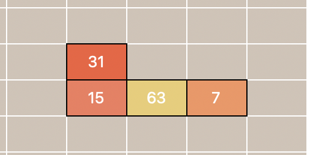
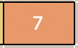
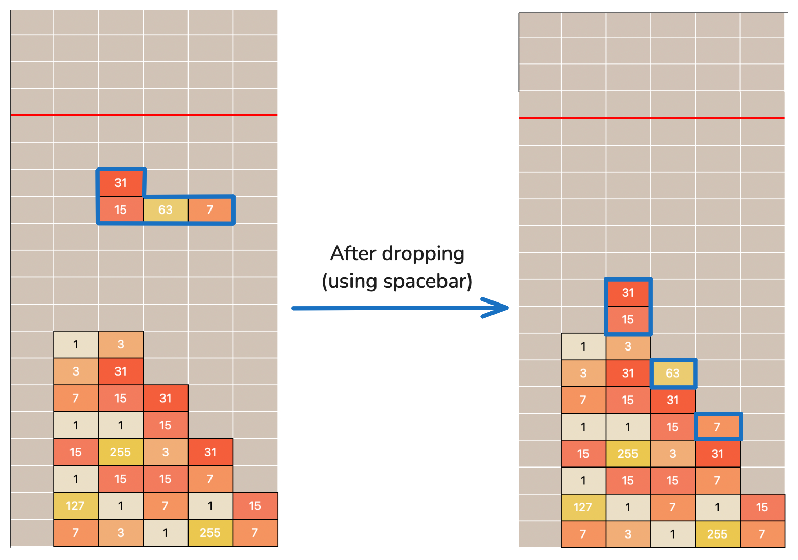
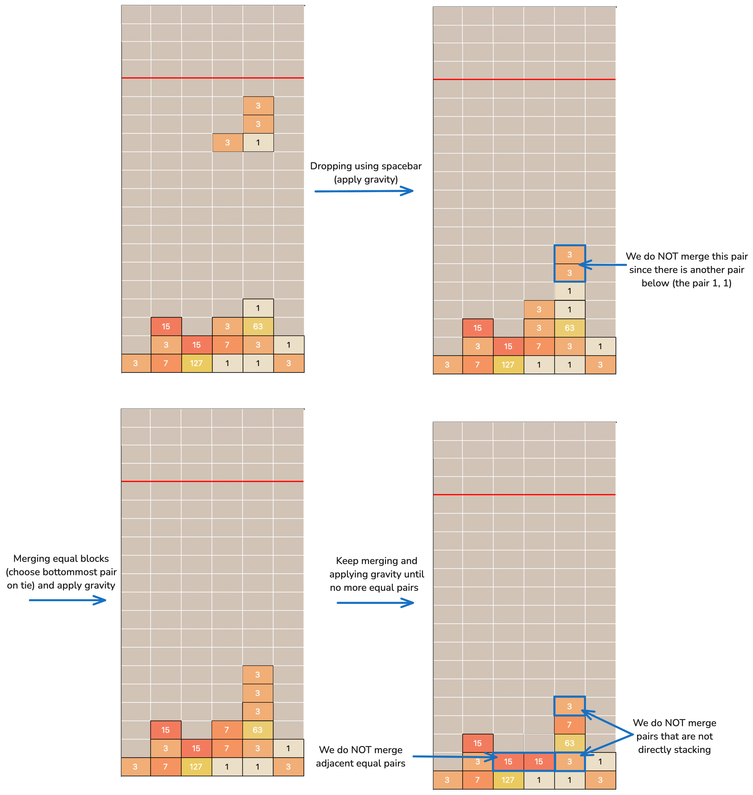
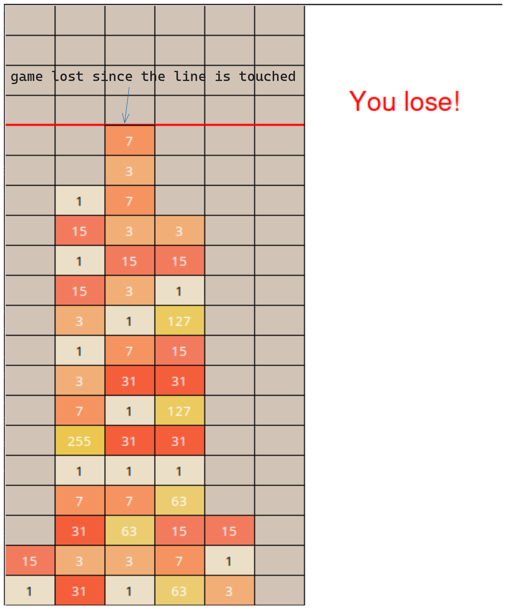
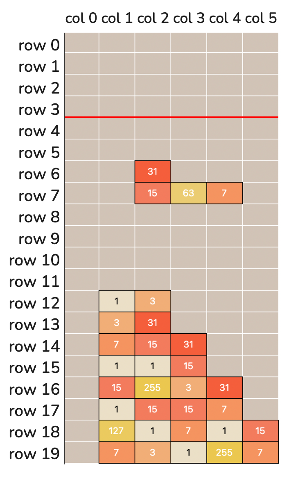
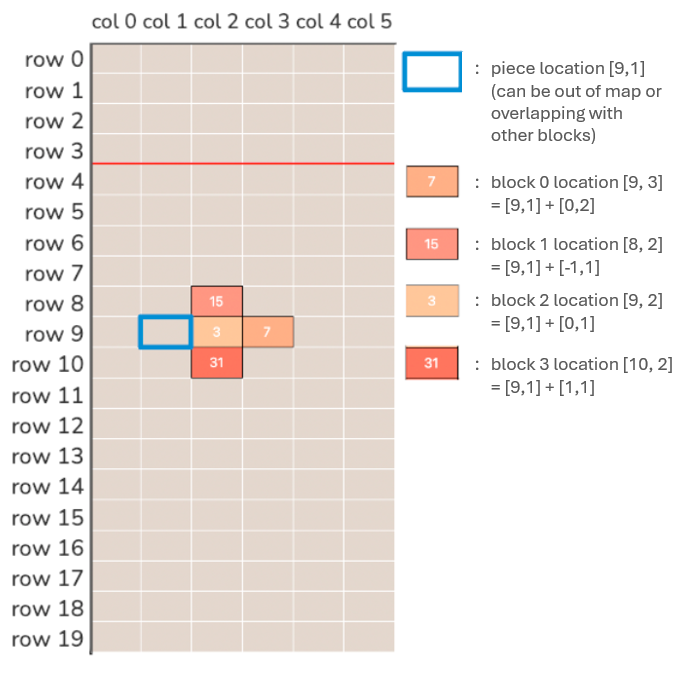

### Introduction

In this assignment, you will make use of Python programming to implement a simple game called 1023 Game. The game is inspired by both the [2048 game](https://en.wikipedia.org/wiki/2048_(video_game)) and the [Tetris game](https://en.wikipedia.org/wiki/Tetris).

#### Piece



In the 1023 Game, a piece is a connected group of 4 blocks, just like the Tetris game. There are 7 types of pieces in our game. The player can control the movement of each piece. More information about the movement in the "Gameplay" section.

#### Block



A block is the smallest unit in the 1023 Game. Each block has a value of 1, 3, 7, 15, ..., 1023 (each number is two times the previous number plus one: $3 = 2*1 + 1$, $7 = 2*3 +1$ ...). The values can be changed through merging when a block stacks on top of another block of equal value. More information about the merging rule is in the "Gameplay" section.

#### Movement

Before we start implementing the game, let's first understand the gameplay of the 1023 Game. As shown in the screenshot below, this game is played on a 20x6 grid. The player can move the pieces left, right, down, or rotate them. The player can also drop the piece to the bottom of the grid.

A proposed move is considered valid if none of the blocks of the piece move into the position of another block already on the grid (no overlapping blocks) or is out of bounds. If the move is considered invalid, the move will be ignored, and nothing happens. Some important rules about the movement of the piece:

1. The blocks do not fall automatically. That is, unlike Tetris, if the player does nothing, the piece will stay at the original position.
2. The pieces can be moved with the 'a', 's', 'd' keys on the keyboard. In the graphical user interface (GUI) mode of the game, controlling with the arrow keys is also possible. The 'w' key and the up arrow key are used for rotating the piece. Pieces do not move upwards.
3. Press the space bar on the keyboard to drop the piece to the bottom of the grid. When blocks of equal value stack vertically, they merge. Unlike Tetris, gravity (dropping down) is applied to each block individually, not to the entire piece as a whole. 
4. Since pieces will not fall automatically, the player has to press the space bar to drop the piece and continue the game. Even if the piece is already at the bottom, the space bar still needs to be pressed to proceed to the next piece.


#### Merging

In this game, we have a special rule for merging blocks. When two blocks of equal values are stacked vertically, they will merge into a new block. The value of the new block is the sum of the values of the two blocks plus 1. After merging, the two blocks are replaced with the new block (with a value equal to two times the original value plus one) at the position of the lower block. For example, when two blocks of 15 are stacked, they will merge into a block of 31 (= 15 + 15 + 1) at the position of the lower block (higher row index number). **The result is \**NOT\** directly adding the values of the two blocks.**

One special case is that when there are multiple blocks of equal value stacked together, the pair of blocks closest to the bottom will be merged first. Refer to the example below for a better understanding. 

#### Gameplay

The game starts with an empty grid. The game will keep generating new pieces with 4 blocks, each with a value randomly chosen from `[1, 3, 7, 15, 31, 63, 127, 255]`. The player can move the piece or drop the piece, and the game proceeds with the mechanics specified above.

The goal of the player is to create a block with a value of 1023 through merging, and if they do so before losing the game, they win.

The game will end when the player reaches the goal (has a block with a value of 1023) or any block **touches** the red limit line of the grid (that is, if there is any block in the top five rows) after merging checking, and all blocks of the current piece have fallen. If any block touches the line after the block merging process, the game ends, and the player loses. The limit line is represented by the red line in the images above. You can also observe the red limit line when you run your game. An example of a game lost is shown below.



An example game play video recording is shown below.

#### Technical Details

In this section, we will provide some technical details about the game implementation.

1. **Game board**: The game board is a 20x6 grid, and will be stored as a 2D list of values. A cell is referenced in the list as `game_board[row_number][col_number]`. Each cell contains a block value that can be used for merging. In this game, possible beginning block values are either `1 or 3 or 7 or 15 or 31 or 63 or 127 or 255`. Also, in this assignment, we will be following Python's convention of 0-based indexing.

    For easier implementation, the game board will **NOT** store data of the floating piece.

    For example, in the example below, we have `game_board[18][1] = 127`, but `game_board[6][2] = 0`.

    

2. **Piece shape and location**: The shapes of the pieces are stored in the list `shapes` (initialization is contained in the top portion of the provided skeleton program), accessed using `shapes[piece_number][rotation_number][block_number][dimension]`. Each element in the 4D list is an `int`, the row or column offset of the block.

    For example, `shapes[6][3] = [[0, 2], [-1, 1], [0, 1], [1, 1]]`, 6 corresponds to the T-shaped piece (shape 6), and 3 means the piece is rotated 3 times. The offsets of the first block (block 0) are `[0, 2]`. This means that the first block is at the same row as the piece's location (each piece has an anchor location), and 2 columns to the right of the piece's location.

    The location of a piece is stored as a pair of integers, the row and column of the piece, in a list of two integers `[r, c]`. It is the reference point for the blocks of the piece. The location of the piece itself may overlap with other blocks, or even outside the grid. When a piece is moved, the location of the piece is updated, and the new location is used to calculate the new position of the blocks using the offsets. All pieces start at position `[0, 1]` (row index: 0 and column index: 1).

    An example is provided here for better understanding (shape 6 rotation 3).

    

    Suppose we want to calculate the position of the third block (block number 2) of the piece (shape number 6, rotation number 3). We can get the row offset by `shapes[6][3][2][0]`, which should be 0, and the column offset by `shapes[6][3][2][1]`, which should be 1. These offsets are then added to the piece's position at [row 9, column 1] to get the position of the block [row 9 + 0, column 1 + 1] = [row 9, column 2] or position [9, 2].

    Consider the piece `shapes[6][3][2][1]`.

    - The first index (piece_number) `6` indicates the piece shape. Shape number 6 corresponds to the T-shaped piece.
    - The second index (rotation_number) `3` indicates that the piece is rotated 3 times.
    - The third index (block_number) `2` indicates block number 2 of the piece.
    - The fourth index (dimension) `1` indicates the column offset of the block. Index of `0` contains the row offset instead. The dimension index is always either `0` (for row) or `1` (for column).

3. **Rotation**: The player can rotate the piece using the 'w' key or the up arrow key. The rotation is stored with an integer indicating the number of 90-degree rotations performed. However, in order to keep the numbers small and stop them from growing indefinitely, the rotation number is kept as `0 or 1 or 2 or 3`. After 3 rotations, if the player rotates the piece again, the rotation number will be reset to 0, since the piece returns to its original orientation.

4. **CLI and GUI**: We provide two versions of the game, one is the command-line interface (CLI), which is a text-based version of the game, using input statements and print statements to control the pieces' movement and show the current status. You can launch the CLI version by running the `cli.py` file.

    Another version is the graphical user interface (GUI) version, which is a more user-friendly version with graphics displayed on the screen. You can launch the GUI version by running the `gui.py` file. All examples above are based on the GUI version.

    In this assignment, you **only** have to implement the game logic in `game.py`.

    `cli.py` and `gui.py` are provided to you. Feel free to modify `cli.py` and `gui.py` if you want to improve the user experience. **However, you should make sure your game can be played normally when it is run with the unmodified code provided in the skeleton code.**

    Some of you may find it easier to debug using the CLI version since you are more familiar with the code structure and language features like `input()` and `print()`, and some of you may find it easier to use the GUI since you can better visualize the effect of the code. It does not matter whether you use the CLI or GUI version to debug or run your code. After you have implemented the game logic, the game should be able to run normally in both versions.

#### How to Start

To begin your implementation:

1. Make sure VS Code and Python 3.13.5 are both installed and set up (see [lab 1](https://course.cse.ust.hk/comp1023/labs/lab1) for the details) on your computer.
2. Download the whole zipped package for this assignment [here](https://course.cse.ust.hk/comp1023/assignments/pa1/skeleton.zip).
3. Unzip the zip file into a directory. You should be able to see the directory "pa1" after unzipping. Open the directory "pa1" using VS Code (i.e., "File"->"Open Folder...").
4. You should be able to see in the "EXPLORER" window of VS Code the files in the folder. There is the `game.py` file with Tasks that you need to work on. Modify only the `game.py` file - do not change any part of the `cli.py` and `gui.py` files!
5. Implement the tasks in the `game.py` file according to the comments in the file and the description in the ["Description"](https://course.cse.ust.hk/comp1023/assignments/pa1/#description) part below. If you want to see whether you have implemented the tasks correctly, you can choose the **`cli.py`** file or **`gui.py`** under VS Code and then click the "run" button. If you run cli.py, the plain text mode is run. If you run gui.py, the GUI mode is run. The only difference between these two modes is in the way the 1023 game is displayed (text mode vs GUI mode). Before you have finished with the correct implementation of the tasks in the `game.py` file, it is normal to see error messages.
6. After implementing each Task, you could **run `cli.py` or `gui.py`** and see if that task has been implemented correctly. Repeat this for all the Tasks until you have implemented them all correctly.
7. **Do not run `game.py`, it will show you nothing!**

If you have any questions regarding the programming assignment, such as needing clarification on the requirements, please post your inquiries on the course Piazza (https://piazza.com/ust.hk/fall2025/comp1023l01l10/home). However, please refrain from posting your code to prevent other students from copying it, which could lead to issues of plagiarism.

### Description

The following are tasks of the assignment. Please go through the tasks in the order listed. There are **more specific requirements in the comments of the relevant functions in the skeleton code**. This description is provided to give you a general overview of each function.

All tasks below should be implemented in the `game.py` file. All numbers used should be of type `int`.

#### Task 1: Initialize Game Board

```py
def init_gameboard():
```

**Description -** In this task, you have to implement the `init_gameboard` function to create a 20x6 empty gameboard. In other words, complete Python code in the function init_gameboard() such that the function returns a 2D list (a list of lists) of 20 rows and 6 columns in each row, with each item in the 2D list having a value of 0 of type `int`. Edit the code inside the function `init_gameboard()` specified between `### TASK 1 STARTS HERE ###` and `### TASK 1 ENDS HERE ###` to return the game board list of lists.

The lists inside the game board should be independent. That is, changing an element in a row should not affect the values of the other lists.

To generate a list of lists **independently**, use simple `for` loops or `list comprehension` compactly. A simple `for` loop to generate a 2x2 2D array with zeros:

```py
a = []
for i in range(2):
    a.append([0, 0])
print(a)        # prints [[0, 0], [0, 0]]
```


Please note, however, that the `list` inside the `append` function **must be a list of values and not variables defined elsewhere**. For example, `[0, 0]` in `a.append([0, 0])` can be replaced with `[0 for i in range (2)]` but not `b = [0, 0]; a.append(b)`.

#### Task 2: Biased Random Value Selection

```py
def default_random_number_generator():
```

**Description -** To make the game more interesting, we would like our game to generate blocks with random values. However, if the probability of generating a piece with a large value (like 255) is high, the game would be too easy. Therefore, we would like to favor generating blocks with smaller values. **Edit** the code inside the function `default_random_number_generator()`, including changing the example `return` statement, if necessary, and return an appropriate integer.

In this task, you have to modify the code between `### TASK 2 STARTS HERE ###` and `### TASK 2 ENDS HERE ###` in the `default_random_number_generator` function to generate a randomly selected number from the specified list that is more likely to be smaller (more likely to be within the smaller half subset than the larger half). To achieve this, you can generate 2 random numbers and take the minimum of the two numbers as the result. Return only an integer from this list: `1, 3, 7, 15, 31, 63, 127, 255`.

The `randint` function of the `random` library can be used to generate random integers between two numbers (inclusively). For example, if you want to randomly pick a number from among `0, 1, 2, 3, 4`:

```py
import random
x = random.randint(0, 4)
print(x)          # generates a random integer between 0 and 4 inclusively
```


To pick the smaller of two given integers, the `min(a, b)` function can be used.

```py
a, b = 0, 1
print(min(a, b)) # prints 0
```


#### Task 3: Valid Position Checking

```py
def is_valid_move(game_board, current_shape, current_location, current_rotation):
```

**Description -** In this task, you have to implement the `is_valid_move` function to check if the piece can be placed in the given location. You are given the gameboard and the new position of the piece. Return True if the move is valid (no block is out of bounds in any side and no piece of the block is in a position where there is already another block) or return False otherwise. Edit the code inside the function `is_valid_move()` between `### TASK 3 STARTS HERE ###` and `### TASK 3 ENDS HERE ###` including changing the example `return` statement, if necessary. The function should return a `Boolean` type, `True` or `False`.

A method to check validity is to iteratively go through each block (4 blocks in each shape) in a loop and calculate if that specific block's location on the grid is valid. Valid if not out of bounds and there is not already a block at that position. The `current_location` input parameter to the function represents the anchor coordinate of the position to check. Each block's location equals to the anchor position coordinate plus the offset from the specific rotation of the shape.

For example, for shape 0 (`current_shape` == 0) and rotation 0 (`current_rotation` == 0), the coordinate offsets of the relevant four blocks are: `[[0, 0], [0, 1], [0, 2], [0, 3]]` (14th line of the skeleton program about the `shapes` variable initialization). If `current_location = [5, 5] `, then the coordinates of the four blocks to check are : `[5+0,5+0], [5+0,5+1], [5+0,5+2], [5+0,5+3]`, or the coordinates to check are: `[5,5], [5,6], [5,7], [5,8]`. Validity checks would include whether any of these coordinates are out of bounds (rows between 0 and 19 inclusive, columns between 0 and 5 inclusive) and if there is already a block in that coordinate. To check if there is already a block in that coordinate, check if the specific `game_board[row][column]` value of that block is not zero.

Do NOT modify the input parameters inside the function.

#### Task 4-6: Move Piece

```py
def move_left(game_board, current_shape, current_location, current_rotation):

def move_right(game_board, current_shape, current_location, current_rotation):

def move_down(game_board, current_shape, current_location, current_rotation):
```

**Description -** Implement the `move_left`, `move_right`, and `move_down` functions to move the piece to the left, right, and down, respectively. Keep the piece in the original position if the move is invalid. You may use the `is_valid_move` function to help with your implementation. Edit the code inside the functions `move_left()`, `move_right()`, and `move_down()` between `### TASK x STARTS HERE ###` and `### TASK x ENDS HERE ###` (x is the task number), including changing the example `return` statements, if necessary, and return two values: location and rotation. The syntax to `return` two variables, `x1` and `x2`, would be `return x1, x2`. Please note that location is a list of two integers and rotation is an integer.

In each of the functions `move_left`, `move_right`, and `move_down`, check if the piece with the proposed new location and unchanged rotation is valid. If valid, return the new location and rotation values. If invalid, return the original location and rotation values. The original location and rotation values are the input parameters to the functions.

Do NOT modify the game_board parameter inside these functions.

#### Task 7: Rotate Piece

```py
def rotate(game_board, current_shape, current_location, current_rotation):
```

**Description -** In this task, you have to implement the `rotate` function to rotate the piece (rotate means to increase rotation by 1 modulo 4). Keep the piece in the original orientation if the new position is invalid. You may use the `is_valid_move` function to help with your implementation. Edit the code inside the function `rotate()` between `### TASK 7 STARTS HERE ###` and `### TASK 7 ENDS HERE ###`, including changing the example `return` statement, if necessary, and return two values: location and rotation in similar syntax to `return x1, x2`.

Check if the **proposed** rotation with unchanged location is valid. Return new values if valid, return original values otherwise.

Do NOT modify the game_board parameter inside this function.

#### Task 8: Gravity and Merge

```py
def gravity_and_merge(game_board):
```

**Description -** In this task, you have to implement the `gravity_and_merge` function according to the mechanisms described above in the "Introduction" section. The parameter of the function is the gameboard only, with the new piece already inserted to the gameboard. The function should directly update the gameboard. Edit the code inside the function `gravity_and_merge()` between `### TASK 8 STARTS HERE ###` and `### TASK 8 ENDS HERE ###`.

There are two sets of actions in this task: gravity and merging:

- **Gravity**

    Gravity refers to moving blocks of the "floating" piece (with empty cells below) to the empty cell (largest row number) closest to the game board's bottom.

- **Merging**

    Merging is described in the section headed "Introduction" above. Merging is performed from bottom up, not top down.


A possible algorithm can be:

```
Loop through each column:
  Repeat this 20 times (or number of rows): 
    Loop through each row, but from bottom to top, and check each cell to:
      Take the cell value above if the current cell is empty and reset the above cell (gravity); or
      Merge if the current cell value equals the cell value above and reset the above cell value (merge); or
      Do nothing
```


#### Task 9: Get Game Status

```py
def get_game_status(game_board):
```

**Description -** In this task, you have to implement the `get_game_status` function to check the game status. You should `return "Lose"` or `return "Win"` or `return "Playing"`. The game is considered to be "Win" if there is a block with a value of 1023 on the gameboard. The game is considered to be "Lose" if the blocks touch the line after the block merging process. To be specific, that is to check if any of the top five rows of the game board contain non zero values. Otherwise, the game is considered to be "Playing". If there is a block with a value of 1023 and a block in the top five rows at the same time, the game is considered to be "Lose".

Do NOT modify the game_board parameter inside this function.

#### Optional Task: Custom Random Value Selection

```py
def custom_random_number_generator():
```

**Description -** In this optional task, you can implement the `custom_random_number_generator` function to create your own random number generator to make the game more interesting. You can use any method to generate a random number. You can also use this function for debugging purposes. **This task will NOT be graded.**