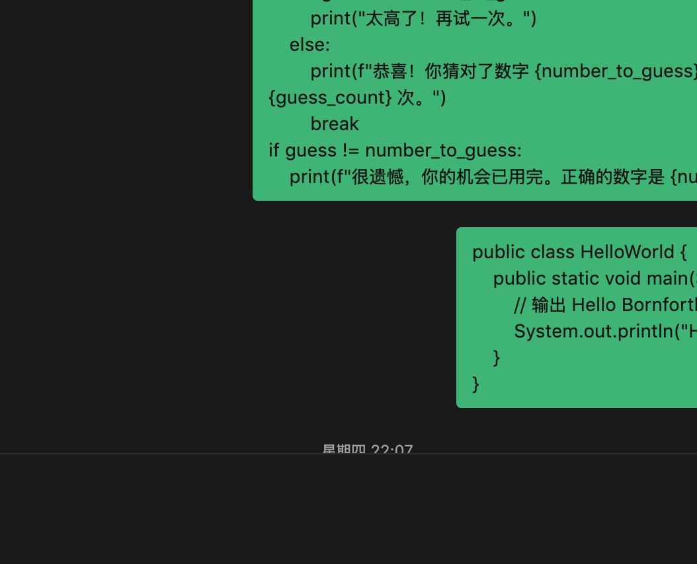
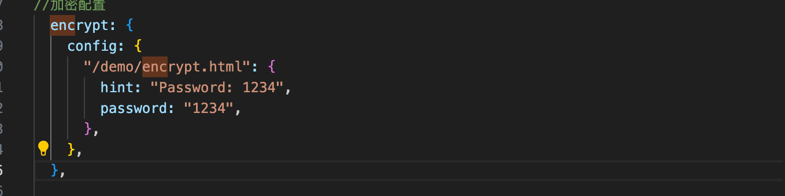

## 1. 标题编写

n个#+空格+1.+空格即为标题n（n最大为6），建议从两个#开始，因为有总标题，>加空格即为开启注解

::: preview 演示

# 标题一

## 标题二

### 标题三

#### 标题四

##### 标题五

###### 标题六

> 文章中不需要标题一，一般从标题二开始就行（不需要标题一的格式`# title` 标题一会被识别为文本标题而不显示出来。

:::

## 2. 代码块

::: preview 代码块添加语法(代码块的输出方式是```加上markdown)

1. Markdown 语法

```markdown
# 标题一
## 标题二
### 标题三
#### 标题四
##### 标题五
###### 标题六
```

2. python 代码

```python
import random

number_to_guess = random.randint(1, 100)
guess_count = 0
max_tries = 10

print("猜数字游戏开始！尝试猜测一个在 1 到 100 之间的数字。你有 10 次机会。")

while guess_count < max_tries:
    guess_str = input("请输入你的猜测：")
    if not guess_str.isdigit():
        print("请输入一个有效数字！")
        continue
    guess = int(guess_str)
    guess_count += 1

    if guess < number_to_guess:
        print("太低了！再试一次。")
    elif guess > number_to_guess:
        print("太高了！再试一次。")
    else:
        print(f"恭喜！你猜对了数字 {number_to_guess}！你总共猜了 {guess_count} 次。")
        break
if guess != number_to_guess:
    print(f"很遗憾，你的机会已用完。正确的数字是 {number_to_guess}。")
```

3. java代码

```java
public class HelloWorld {
    public static void main(String[] args) {
        // 输出 Hello Bornforthis 到控制台
        System.out.println("Hello, Bornforthis!");
    }
}
```

:::

注意：preview用处是看源代码用的，纯粹的语言笔记无需添加

## 3. 链接插入

::: preview 链接插入演示

`[链接名称](链接)`


[computergreenhand](https://computergreenhand.com/)

:::

## 4. 图片插入

::: preview 图片插入演示

方法一

``

.jpg)

> **注**:任何网站都需要一个防盗链：如你进入我的网站沿用我的图片，结果在非我网站处无法显示而是出现到我网站的链接，这就是防盗链的功效
>
> **原因**：任何进入和浏览网站图片与文章都是会扣网站所有者流量的，如果任他人沿用，就会扣自己流量给他人网站添色
>
> **原理**：防盗链会识别该图片所在处是否位于原网站域名，若是则显示，不是就放出原网站的链接并停止显示

方法二：也可以直接option加1截图，这个方法堪称万金油，但要注意在Typora中图片必须放在单独且空白的一行，不然会出错


方法三：直接在其他网站上右键复制，再直接粘贴就行



:::

## 5. 有序序列

::: preview 有序序列演示

1. 小明
2. 小红
3. 小飞
    1. 1
    2. 2
    3. 3
4. 小鹏

与语雀几乎相同,注意想回到原来序列打enter（renturn），创建子序列用tab

:::

## 6. 无序序列

::: preview 无序序列演示

- 小明
    - 小红
    - 小鹏
- 小亮

与有序序列同理

:::

## 7. 数学公式

### 7.1 基础演示

::: preview 

$$xxx$$ 
$$
xxx
$$
可以通过在`$`字符之前使用`/`或在`$`字符之后添加空格来完成转义：

$a=1$是一个TeX方程，而\$a=1$不是

> **注意**：单个`$`所表示的方程可以用于混在句子之中，但`$$`所表示的方程只能单独一行

### 7.2 行内语法

Euler's identity $e^{i\pi}+1=0$ is a beautiful formula in $\mathbb{R}^2$

> **注意**：\mathbb是一个整体，使其用大括号包围的数字或字母表现镂空的效果

### 7.3 显示语法

$$
\frac {\partial^r} {\partial \omega^r} \left(\frac {y^{\omega}} {\omega}\right)= \left(\frac {y^{\omega}}
{\omega}\right) \left\{(\log y)^r + \sum_{i=1}^r \frac {(-1)^i r \cdots (r-i+1) (\log y)^{r-i}} {\omega^i} \right\}
$$

- [Tex教程](https://www.overleaf.com/learn/latex/Learn_LaTeX_in_30_minutes)

- [Tex速查表](https://mdit-plugins.github.io/zh/tex.html#tex-tutorial)

:::

## 8. 任务列表

::: preview 任务列表演示

- [x] 计划A
- [ ] 计划B

:::

## 9. 选项卡

:::: preview 选项卡演示

::: tabs

@tab 教学

1

```python
print("1")
```


@tab 实操

2

@tab 可以放更多的`@tab`

:::

> **注意**：preview前跟的冒号数只要前后一致就行，但一定注意不能与内容中出现的冒号连续数相同，会因此导致系统无法分辨

---

::: tabs#travel

@tab 计划 A#北京

去北京

@tab 计划 B#上海

去上海

:::

---

::: tabs#travel

@tab 北京

- 天安门
- 朝阳区
- 人民大会堂

@tab 上海

- 上海滩
- 东方明珠

:::

> **注意**：`#`在此作用非同小可，起到一个绑定的作用，在井号后的关键词，如果在后续tab后重复出现，两者内容就会互相绑定，同时显现，同时三冒号后的tab所关系的关键词需要重复输入井号才能绑定，而@后的tab所关系的关键词则不需要

::::

## 10. 代码块分组

:::: preview 代码块分组演示

::: code-tabs

@tab 代码1

```python
print('hello bornforthis')
```

@tab 代码2

```python
a=1
b=1
print(a+b)
```

@tab 代码3

```python
a=b=1
print(a)
print(b)
```

:::

---

::: code-tabs#shell

@tab Python

```python
a,b,c=1,2,3
```

@tab pnpm

```bash
pnpm add -D 组建名称
```

:::

---

::: code-tabs#shell

@tab Python

```python
print(a,b,c)
```

@tab pnpm

```bash
pnpm add -D vuepress-theme-hope
```

:::

::::

## 11. 行内代码

::: preview 行内代码区分

pnpm install xxxx 此为行内代码，与正文一致，无法区分

`pnpm install xxxx`  这就不是

:::

## 12. 提示容器

:::: preview 提示容器演示

::: important

重要容器

:::

::: info

信息容器

:::

::: note

注释容器

:::

::: tip

提示容器

:::

::: warning

警告容器

:::

::: caution

危险容器

:::

::: details

详情容器

:::

> **注**：在`details`  `tip` 等容器字符后加空格并填写文字可将容器标题改为自己的文字

::: caution 1

:::

::::

## 13. 标记

::: preview 标记演示

你好，==William==

:::

## 14. 剧透

::: preview 剧透演示

你好，!!William!!

:::

## 15. 自定义对齐

:::: preview 自定义对齐演示

::: left

左对齐的内容

:::

::: center

居中的内容

:::

::: right

右对齐的内容

:::

::: justify

两端对齐的内容

:::

::::

## 16. 文章加密

文章：`theme.ts`



其中第三行双引号的对标要加密的文章，如果不写就默认给所有文章加密

`hint`是提示

`password`是密码

> **注**：找不到没关系：用`command+f`打开搜索界面，其中f是find的简写

